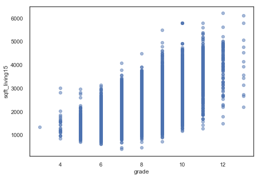
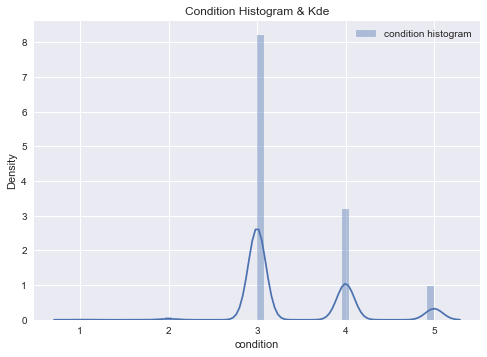

<h1>Table of Contents<span class="tocSkip"></span></h1>
<div class="toc"><ul class="toc-item"><li><span><a href="#Final-Project-Submission,-Module-1" data-toc-modified-id="Final-Project-Submission,-Module-1-1"><span class="toc-item-num">1&nbsp;&nbsp;</span>Final Project Submission, Module 1</a></span><ul class="toc-item"><li><span><a href="#Prep:--Import-libraries" data-toc-modified-id="Prep:--Import-libraries-1.1"><span class="toc-item-num">1.1&nbsp;&nbsp;</span>Prep:  Import libraries</a></span></li></ul></li><li><span><a href="#OSEMiN-Framework" data-toc-modified-id="OSEMiN-Framework-2"><span class="toc-item-num">2&nbsp;&nbsp;</span>OSEMiN Framework</a></span><ul class="toc-item"><li><span><a href="#OSEMiN:--Obtain" data-toc-modified-id="OSEMiN:--Obtain-2.1"><span class="toc-item-num">2.1&nbsp;&nbsp;</span>OSEMiN:  Obtain</a></span><ul class="toc-item"><li><span><a href="#Import-the-data-set-and-get-an-initial-view-of-the-column-names-and-data-types" data-toc-modified-id="Import-the-data-set-and-get-an-initial-view-of-the-column-names-and-data-types-2.1.1"><span class="toc-item-num">2.1.1&nbsp;&nbsp;</span>Import the data set and get an initial view of the column names and data types</a></span></li><li><span><a href="#Look-at-some-basic-statistics" data-toc-modified-id="Look-at-some-basic-statistics-2.1.2"><span class="toc-item-num">2.1.2&nbsp;&nbsp;</span>Look at some basic statistics</a></span></li></ul></li><li><span><a href="#OSEMiN:--Scrub-(some-overlap-with-Exploration)" data-toc-modified-id="OSEMiN:--Scrub-(some-overlap-with-Exploration)-2.2"><span class="toc-item-num">2.2&nbsp;&nbsp;</span>OSEMiN:  Scrub (some overlap with Exploration)</a></span><ul class="toc-item"><li><span><a href="#Null-values" data-toc-modified-id="Null-values-2.2.1"><span class="toc-item-num">2.2.1&nbsp;&nbsp;</span>Null values</a></span><ul class="toc-item"><li><span><a href="#Waterfront:" data-toc-modified-id="Waterfront:-2.2.1.1"><span class="toc-item-num">2.2.1.1&nbsp;&nbsp;</span>Waterfront:</a></span></li><li><span><a href="#View-(number-of-times-house-was-viewed):" data-toc-modified-id="View-(number-of-times-house-was-viewed):-2.2.1.2"><span class="toc-item-num">2.2.1.2&nbsp;&nbsp;</span>View (number of times house was viewed):</a></span></li><li><span><a href="#Year-Renovated-(a-zero-means-that-the-house-has-not-been-renovated):" data-toc-modified-id="Year-Renovated-(a-zero-means-that-the-house-has-not-been-renovated):-2.2.1.3"><span class="toc-item-num">2.2.1.3&nbsp;&nbsp;</span>Year Renovated (a zero means that the house has not been renovated):</a></span></li><li><span><a href="#df-backup-2" data-toc-modified-id="df-backup-2-2.2.1.4"><span class="toc-item-num">2.2.1.4&nbsp;&nbsp;</span>df backup 2</a></span></li></ul></li><li><span><a href="#Modifying-data-types" data-toc-modified-id="Modifying-data-types-2.2.2"><span class="toc-item-num">2.2.2&nbsp;&nbsp;</span>Modifying data types</a></span><ul class="toc-item"><li><span><a href="#Changing-sqft_basement-from-string-to-float-(first-need-to-replace-the-&quot;?&quot;-with-0):" data-toc-modified-id="Changing-sqft_basement-from-string-to-float-(first-need-to-replace-the-&quot;?&quot;-with-0):-2.2.2.1"><span class="toc-item-num">2.2.2.1&nbsp;&nbsp;</span>Changing sqft_basement from string to float (first need to replace the "?" with 0):</a></span></li><li><span><a href="#Change-date-field-from-string-to-datetime-object,-so-that-the-data-can-be-evaluated-by-month-or-season:" data-toc-modified-id="Change-date-field-from-string-to-datetime-object,-so-that-the-data-can-be-evaluated-by-month-or-season:-2.2.2.2"><span class="toc-item-num">2.2.2.2&nbsp;&nbsp;</span>Change date field from string to datetime object, so that the data can be evaluated by month or season:</a></span></li><li><span><a href="#df-backup-3" data-toc-modified-id="df-backup-3-2.2.2.3"><span class="toc-item-num">2.2.2.3&nbsp;&nbsp;</span>df backup 3</a></span></li></ul></li><li><span><a href="#Initial-visualizations" data-toc-modified-id="Initial-visualizations-2.2.3"><span class="toc-item-num">2.2.3&nbsp;&nbsp;</span>Initial visualizations</a></span><ul class="toc-item"><li><span><a href="#Histograms-of-variable-distributions:" data-toc-modified-id="Histograms-of-variable-distributions:-2.2.3.1"><span class="toc-item-num">2.2.3.1&nbsp;&nbsp;</span>Histograms of variable distributions:</a></span></li><li><span><a href="#Using-a-scatter-matrix-to-get-an-overview-of-data:" data-toc-modified-id="Using-a-scatter-matrix-to-get-an-overview-of-data:-2.2.3.2"><span class="toc-item-num">2.2.3.2&nbsp;&nbsp;</span>Using a scatter matrix to get an overview of data:</a></span></li><li><span><a href="#Heatmaps-to-visualize-multicollinearity" data-toc-modified-id="Heatmaps-to-visualize-multicollinearity-2.2.3.3"><span class="toc-item-num">2.2.3.3&nbsp;&nbsp;</span>Heatmaps to visualize multicollinearity</a></span></li><li><span><a href="#Scatter-plot-function" data-toc-modified-id="Scatter-plot-function-2.2.3.4"><span class="toc-item-num">2.2.3.4&nbsp;&nbsp;</span>Scatter plot function</a></span></li><li><span><a href="#Running-some-scatter-plots-to-see-the-relationships-between-variables-more-clearly" data-toc-modified-id="Running-some-scatter-plots-to-see-the-relationships-between-variables-more-clearly-2.2.3.5"><span class="toc-item-num">2.2.3.5&nbsp;&nbsp;</span>Running some scatter plots to see the relationships between variables more clearly</a></span></li><li><span><a href="#Initial-model-runs-to-begin-to-understand-data-and-relationships" data-toc-modified-id="Initial-model-runs-to-begin-to-understand-data-and-relationships-2.2.3.6"><span class="toc-item-num">2.2.3.6&nbsp;&nbsp;</span>Initial model runs to begin to understand data and relationships</a></span></li><li><span><a href="#Observations" data-toc-modified-id="Observations-2.2.3.7"><span class="toc-item-num">2.2.3.7&nbsp;&nbsp;</span>Observations</a></span></li></ul></li><li><span><a href="#Dummy-variables" data-toc-modified-id="Dummy-variables-2.2.4"><span class="toc-item-num">2.2.4&nbsp;&nbsp;</span>Dummy variables</a></span><ul class="toc-item"><li><span><a href="#sqft_basement-(=0-if-no-basement-or-=1-if-sqft_basement->-0)" data-toc-modified-id="sqft_basement-(=0-if-no-basement-or-=1-if-sqft_basement->-0)-2.2.4.1"><span class="toc-item-num">2.2.4.1&nbsp;&nbsp;</span>sqft_basement (=0 if no basement or =1 if sqft_basement &gt; 0)</a></span></li><li><span><a href="#yr_renovated-(=1-if-yr_renovated-!=-0)" data-toc-modified-id="yr_renovated-(=1-if-yr_renovated-!=-0)-2.2.4.2"><span class="toc-item-num">2.2.4.2&nbsp;&nbsp;</span>yr_renovated (=1 if yr_renovated != 0)</a></span></li><li><span><a href="#A-note-on-ZIP-Codes-..." data-toc-modified-id="A-note-on-ZIP-Codes-...-2.2.4.3"><span class="toc-item-num">2.2.4.3&nbsp;&nbsp;</span>A note on ZIP Codes ...</a></span></li><li><span><a href="#Some-potentially-interesting-visualizations-to-guide-future-work:" data-toc-modified-id="Some-potentially-interesting-visualizations-to-guide-future-work:-2.2.4.4"><span class="toc-item-num">2.2.4.4&nbsp;&nbsp;</span>Some potentially interesting visualizations to guide future work:</a></span></li><li><span><a href="#Creating-new-dataframe-that-includes-the-dummy-variables-and-has-dropped-the-original-sqft_basement-and-yr_renovated-variables:" data-toc-modified-id="Creating-new-dataframe-that-includes-the-dummy-variables-and-has-dropped-the-original-sqft_basement-and-yr_renovated-variables:-2.2.4.5"><span class="toc-item-num">2.2.4.5&nbsp;&nbsp;</span>Creating new dataframe that includes the dummy variables and has dropped the original sqft_basement and yr_renovated variables:</a></span></li><li><span><a href="#df-backup-4" data-toc-modified-id="df-backup-4-2.2.4.6"><span class="toc-item-num">2.2.4.6&nbsp;&nbsp;</span>df backup 4</a></span></li></ul></li><li><span><a href="#Addressing-outliers" data-toc-modified-id="Addressing-outliers-2.2.5"><span class="toc-item-num">2.2.5&nbsp;&nbsp;</span>Addressing outliers</a></span><ul class="toc-item"><li><span><a href="#Looking-at-box-plots..." data-toc-modified-id="Looking-at-box-plots...-2.2.5.1"><span class="toc-item-num">2.2.5.1&nbsp;&nbsp;</span>Looking at box plots...</a></span></li><li><span><a href="#Computing-whiskers-for-box-plots-(upper-whisker-=-1.5*IQR-+-Q3)" data-toc-modified-id="Computing-whiskers-for-box-plots-(upper-whisker-=-1.5*IQR-+-Q3)-2.2.5.2"><span class="toc-item-num">2.2.5.2&nbsp;&nbsp;</span>Computing whiskers for box plots (upper whisker = 1.5*IQR + Q3)</a></span></li><li><span><a href="#ZIP-codes-with-high-average-home-prices" data-toc-modified-id="ZIP-codes-with-high-average-home-prices-2.2.5.3"><span class="toc-item-num">2.2.5.3&nbsp;&nbsp;</span>ZIP codes with high average home prices</a></span></li><li><span><a href="#Removing-outliers-above-the-upper-whisker-of-box-plots-of-variables-above" data-toc-modified-id="Removing-outliers-above-the-upper-whisker-of-box-plots-of-variables-above-2.2.5.4"><span class="toc-item-num">2.2.5.4&nbsp;&nbsp;</span>Removing outliers above the upper whisker of box plots of variables above</a></span></li><li><span><a href="#df-backup-5-(after-outliers-removed-but-before-log-transformation)" data-toc-modified-id="df-backup-5-(after-outliers-removed-but-before-log-transformation)-2.2.5.5"><span class="toc-item-num">2.2.5.5&nbsp;&nbsp;</span>df backup 5 (after outliers removed but <em>before</em> log transformation)</a></span></li><li><span><a href="#Seaborn-box-plots-of-data-with-outliers-removed" data-toc-modified-id="Seaborn-box-plots-of-data-with-outliers-removed-2.2.5.6"><span class="toc-item-num">2.2.5.6&nbsp;&nbsp;</span>Seaborn box plots of data with outliers removed</a></span></li><li><span><a href="#Histograms-of-distributions-with-outliers-removed" data-toc-modified-id="Histograms-of-distributions-with-outliers-removed-2.2.5.7"><span class="toc-item-num">2.2.5.7&nbsp;&nbsp;</span>Histograms of distributions with outliers removed</a></span></li><li><span><a href="#Log-transformation-of-skewed-variables" data-toc-modified-id="Log-transformation-of-skewed-variables-2.2.5.8"><span class="toc-item-num">2.2.5.8&nbsp;&nbsp;</span>Log transformation of skewed variables</a></span></li><li><span><a href="#Setting-df-=-df_2-(incorporating-dummy-variables,-log-transformation,-and-outliers-removed):" data-toc-modified-id="Setting-df-=-df_2-(incorporating-dummy-variables,-log-transformation,-and-outliers-removed):-2.2.5.9"><span class="toc-item-num">2.2.5.9&nbsp;&nbsp;</span>Setting df = df_2 (incorporating dummy variables, log transformation, and outliers removed):</a></span></li></ul></li><li><span><a href="#Exploring-Multicollinearity" data-toc-modified-id="Exploring-Multicollinearity-2.2.6"><span class="toc-item-num">2.2.6&nbsp;&nbsp;</span>Exploring Multicollinearity</a></span><ul class="toc-item"><li><span><a href="#Correlation-at-the-50%-level:" data-toc-modified-id="Correlation-at-the-50%-level:-2.2.6.1"><span class="toc-item-num">2.2.6.1&nbsp;&nbsp;</span>Correlation at the 50% level:</a></span></li><li><span><a href="#Correlation-at-the-70%-level:" data-toc-modified-id="Correlation-at-the-70%-level:-2.2.6.2"><span class="toc-item-num">2.2.6.2&nbsp;&nbsp;</span>Correlation at the 70% level:</a></span></li><li><span><a href="#Correlation/colinearity-at-the-75%-level:" data-toc-modified-id="Correlation/colinearity-at-the-75%-level:-2.2.6.3"><span class="toc-item-num">2.2.6.3&nbsp;&nbsp;</span>Correlation/colinearity at the 75% level:</a></span></li><li><span><a href="#Heatmaps-of-revised-dataframe-to-visualize-multicollinearity" data-toc-modified-id="Heatmaps-of-revised-dataframe-to-visualize-multicollinearity-2.2.6.4"><span class="toc-item-num">2.2.6.4&nbsp;&nbsp;</span>Heatmaps of revised dataframe to visualize multicollinearity</a></span></li><li><span><a href="#Scatter-plots-of-(potentially-correlated)-parameters:" data-toc-modified-id="Scatter-plots-of-(potentially-correlated)-parameters:-2.2.6.5"><span class="toc-item-num">2.2.6.5&nbsp;&nbsp;</span>Scatter plots of (potentially correlated) parameters:</a></span></li></ul></li></ul></li><li><span><a href="#OSEMiN:--Explore-(EDA)" data-toc-modified-id="OSEMiN:--Explore-(EDA)-2.3"><span class="toc-item-num">2.3&nbsp;&nbsp;</span>OSEMiN:  Explore (EDA)</a></span><ul class="toc-item"><li><span><a href="#Scatter-plots-of-price-by-feature" data-toc-modified-id="Scatter-plots-of-price-by-feature-2.3.1"><span class="toc-item-num">2.3.1&nbsp;&nbsp;</span>Scatter plots of price by feature</a></span></li><li><span><a href="#Two-possible-questions-to-explore-in-the-future:" data-toc-modified-id="Two-possible-questions-to-explore-in-the-future:-2.3.2"><span class="toc-item-num">2.3.2&nbsp;&nbsp;</span>Two possible questions to explore in the future:</a></span></li></ul></li><li><span><a href="#OSEMiN:--Model" data-toc-modified-id="OSEMiN:--Model-2.4"><span class="toc-item-num">2.4&nbsp;&nbsp;</span>OSEMiN:  Model</a></span><ul class="toc-item"><li><span><a href="#OLS-in-Statsmodels" data-toc-modified-id="OLS-in-Statsmodels-2.4.1"><span class="toc-item-num">2.4.1&nbsp;&nbsp;</span>OLS in Statsmodels</a></span></li><li><span><a href="#Running-tests-in-statsmodels" data-toc-modified-id="Running-tests-in-statsmodels-2.4.2"><span class="toc-item-num">2.4.2&nbsp;&nbsp;</span>Running tests in statsmodels</a></span></li><li><span><a href="#Train-test-split" data-toc-modified-id="Train-test-split-2.4.3"><span class="toc-item-num">2.4.3&nbsp;&nbsp;</span>Train-test-split</a></span><ul class="toc-item"><li><span><a href="#Train-and-test-Mean-Squared-Error" data-toc-modified-id="Train-and-test-Mean-Squared-Error-2.4.3.1"><span class="toc-item-num">2.4.3.1&nbsp;&nbsp;</span>Train and test Mean Squared Error</a></span></li><li><span><a href="#Plotting-train-and-test-errors-for-various-test-sizes:" data-toc-modified-id="Plotting-train-and-test-errors-for-various-test-sizes:-2.4.3.2"><span class="toc-item-num">2.4.3.2&nbsp;&nbsp;</span>Plotting train and test errors for various test sizes:</a></span></li><li><span><a href="#Train-and-test-R-squared" data-toc-modified-id="Train-and-test-R-squared-2.4.3.3"><span class="toc-item-num">2.4.3.3&nbsp;&nbsp;</span>Train and test R-squared</a></span></li></ul></li><li><span><a href="#Model-cross-validation" data-toc-modified-id="Model-cross-validation-2.4.4"><span class="toc-item-num">2.4.4&nbsp;&nbsp;</span>Model cross-validation</a></span></li></ul></li><li><span><a href="#OSEMiN:--Interpret-(Findings-and-Recommendations)" data-toc-modified-id="OSEMiN:--Interpret-(Findings-and-Recommendations)-2.5"><span class="toc-item-num">2.5&nbsp;&nbsp;</span>OSEMiN:  Interpret (Findings and Recommendations)</a></span><ul class="toc-item"><li><span><a href="#High-level-summary" data-toc-modified-id="High-level-summary-2.5.1"><span class="toc-item-num">2.5.1&nbsp;&nbsp;</span>High-level summary</a></span></li><li><span><a href="#Most-important-factors,-plus-a-few-words-on-correlation" data-toc-modified-id="Most-important-factors,-plus-a-few-words-on-correlation-2.5.2"><span class="toc-item-num">2.5.2&nbsp;&nbsp;</span>Most important factors, plus a few words on correlation</a></span></li><li><span><a href="#Less-important-than-you-might-think" data-toc-modified-id="Less-important-than-you-might-think-2.5.3"><span class="toc-item-num">2.5.3&nbsp;&nbsp;</span>Less important than you might think</a></span></li><li><span><a href="#Recommendations" data-toc-modified-id="Recommendations-2.5.4"><span class="toc-item-num">2.5.4&nbsp;&nbsp;</span>Recommendations</a></span></li></ul></li></ul></li></ul></div>

# Final Project Submission, Module 1


## Prep:  Import libraries


```python
import statsmodels.api as sm
import statsmodels.formula.api as smf
import statsmodels.stats.api as sms
import scipy.stats as stats
import pandas as pd
import numpy as np

from sklearn.feature_selection import RFE
from sklearn.linear_model import LinearRegression
from sklearn.preprocessing import MinMaxScaler
from sklearn.metrics import mean_squared_error
from sklearn.metrics import r2_score
from sklearn.model_selection import train_test_split
from sklearn.model_selection import cross_val_score
from sklearn.model_selection import KFold

import seaborn as sns
import matplotlib as mpl
import matplotlib.pyplot as plt
import matplotlib.ticker as mtick
%matplotlib inline
# mpl.rcParams.update(inline_rc)
# inline_rc = dict(mpl.rcParams)

plt.style.use('ggplot')
np.set_printoptions(suppress=True)
```

# OSEMiN Framework

## OSEMiN:  Obtain

### Import the data set and get an initial view of the column names and data types


```python
# File to import:  "kc_house_data.csv"
df = pd.read_csv('kc_house_data.csv')
df.head()
```


<div>
<style scoped>
    .dataframe tbody tr th:only-of-type {
        vertical-align: middle;
    }

    .dataframe tbody tr th {
        vertical-align: top;
    }

    .dataframe thead th {
        text-align: right;
    }
</style>
<table border="1" class="dataframe">
  <thead>
    <tr style="text-align: right;">
      <th></th>
      <th>id</th>
      <th>date</th>
      <th>price</th>
      <th>bedrooms</th>
      <th>bathrooms</th>
      <th>sqft_living</th>
      <th>sqft_lot</th>
      <th>floors</th>
      <th>waterfront</th>
      <th>view</th>
      <th>...</th>
      <th>grade</th>
      <th>sqft_above</th>
      <th>sqft_basement</th>
      <th>yr_built</th>
      <th>yr_renovated</th>
      <th>zipcode</th>
      <th>lat</th>
      <th>long</th>
      <th>sqft_living15</th>
      <th>sqft_lot15</th>
    </tr>
  </thead>
  <tbody>
    <tr>
      <th>0</th>
      <td>7129300520</td>
      <td>10/13/2014</td>
      <td>221900.0</td>
      <td>3</td>
      <td>1.00</td>
      <td>1180</td>
      <td>5650</td>
      <td>1.0</td>
      <td>NaN</td>
      <td>0.0</td>
      <td>...</td>
      <td>7</td>
      <td>1180</td>
      <td>0.0</td>
      <td>1955</td>
      <td>0.0</td>
      <td>98178</td>
      <td>47.5112</td>
      <td>-122.257</td>
      <td>1340</td>
      <td>5650</td>
    </tr>
    <tr>
      <th>1</th>
      <td>6414100192</td>
      <td>12/9/2014</td>
      <td>538000.0</td>
      <td>3</td>
      <td>2.25</td>
      <td>2570</td>
      <td>7242</td>
      <td>2.0</td>
      <td>0.0</td>
      <td>0.0</td>
      <td>...</td>
      <td>7</td>
      <td>2170</td>
      <td>400.0</td>
      <td>1951</td>
      <td>1991.0</td>
      <td>98125</td>
      <td>47.7210</td>
      <td>-122.319</td>
      <td>1690</td>
      <td>7639</td>
    </tr>
    <tr>
      <th>2</th>
      <td>5631500400</td>
      <td>2/25/2015</td>
      <td>180000.0</td>
      <td>2</td>
      <td>1.00</td>
      <td>770</td>
      <td>10000</td>
      <td>1.0</td>
      <td>0.0</td>
      <td>0.0</td>
      <td>...</td>
      <td>6</td>
      <td>770</td>
      <td>0.0</td>
      <td>1933</td>
      <td>NaN</td>
      <td>98028</td>
      <td>47.7379</td>
      <td>-122.233</td>
      <td>2720</td>
      <td>8062</td>
    </tr>
    <tr>
      <th>3</th>
      <td>2487200875</td>
      <td>12/9/2014</td>
      <td>604000.0</td>
      <td>4</td>
      <td>3.00</td>
      <td>1960</td>
      <td>5000</td>
      <td>1.0</td>
      <td>0.0</td>
      <td>0.0</td>
      <td>...</td>
      <td>7</td>
      <td>1050</td>
      <td>910.0</td>
      <td>1965</td>
      <td>0.0</td>
      <td>98136</td>
      <td>47.5208</td>
      <td>-122.393</td>
      <td>1360</td>
      <td>5000</td>
    </tr>
    <tr>
      <th>4</th>
      <td>1954400510</td>
      <td>2/18/2015</td>
      <td>510000.0</td>
      <td>3</td>
      <td>2.00</td>
      <td>1680</td>
      <td>8080</td>
      <td>1.0</td>
      <td>0.0</td>
      <td>0.0</td>
      <td>...</td>
      <td>8</td>
      <td>1680</td>
      <td>0.0</td>
      <td>1987</td>
      <td>0.0</td>
      <td>98074</td>
      <td>47.6168</td>
      <td>-122.045</td>
      <td>1800</td>
      <td>7503</td>
    </tr>
  </tbody>
</table>
<p>5 rows × 21 columns</p>
</div>


```python
df.info()
```

    <class 'pandas.core.frame.DataFrame'>
    RangeIndex: 21597 entries, 0 to 21596
    Data columns (total 21 columns):
    id               21597 non-null int64
    date             21597 non-null object
    price            21597 non-null float64
    bedrooms         21597 non-null int64
    bathrooms        21597 non-null float64
    sqft_living      21597 non-null int64
    sqft_lot         21597 non-null int64
    floors           21597 non-null float64
    waterfront       19221 non-null float64
    view             21534 non-null float64
    condition        21597 non-null int64
    grade            21597 non-null int64
    sqft_above       21597 non-null int64
    sqft_basement    21597 non-null object
    yr_built         21597 non-null int64
    yr_renovated     17755 non-null float64
    zipcode          21597 non-null int64
    lat              21597 non-null float64
    long             21597 non-null float64
    sqft_living15    21597 non-null int64
    sqft_lot15       21597 non-null int64
    dtypes: float64(8), int64(11), object(2)
    memory usage: 3.5+ MB


**Saving a backup of the original dataframe...**


```python
df_bup = df
```

**Creating dataframe with just the price column (called "df_price")**


```python
df_price = df["price"].copy()
df_price.head()
```


    0    221900.0
    1    538000.0
    2    180000.0
    3    604000.0
    4    510000.0
    Name: price, dtype: float64


**Dropping id column (after saving the id column as its own dataframe (series):**


```python
df_id = df['id']
print(df_id.head())

df = df.drop(['id'], axis=1)
df.head()
```

    0    7129300520
    1    6414100192
    2    5631500400
    3    2487200875
    4    1954400510
    Name: id, dtype: int64


<div>
<style scoped>
    .dataframe tbody tr th:only-of-type {
        vertical-align: middle;
    }

    .dataframe tbody tr th {
        vertical-align: top;
    }

    .dataframe thead th {
        text-align: right;
    }
</style>
<table border="1" class="dataframe">
  <thead>
    <tr style="text-align: right;">
      <th></th>
      <th>date</th>
      <th>price</th>
      <th>bedrooms</th>
      <th>bathrooms</th>
      <th>sqft_living</th>
      <th>sqft_lot</th>
      <th>floors</th>
      <th>waterfront</th>
      <th>view</th>
      <th>condition</th>
      <th>grade</th>
      <th>sqft_above</th>
      <th>sqft_basement</th>
      <th>yr_built</th>
      <th>yr_renovated</th>
      <th>zipcode</th>
      <th>lat</th>
      <th>long</th>
      <th>sqft_living15</th>
      <th>sqft_lot15</th>
    </tr>
  </thead>
  <tbody>
    <tr>
      <th>0</th>
      <td>10/13/2014</td>
      <td>221900.0</td>
      <td>3</td>
      <td>1.00</td>
      <td>1180</td>
      <td>5650</td>
      <td>1.0</td>
      <td>NaN</td>
      <td>0.0</td>
      <td>3</td>
      <td>7</td>
      <td>1180</td>
      <td>0.0</td>
      <td>1955</td>
      <td>0.0</td>
      <td>98178</td>
      <td>47.5112</td>
      <td>-122.257</td>
      <td>1340</td>
      <td>5650</td>
    </tr>
    <tr>
      <th>1</th>
      <td>12/9/2014</td>
      <td>538000.0</td>
      <td>3</td>
      <td>2.25</td>
      <td>2570</td>
      <td>7242</td>
      <td>2.0</td>
      <td>0.0</td>
      <td>0.0</td>
      <td>3</td>
      <td>7</td>
      <td>2170</td>
      <td>400.0</td>
      <td>1951</td>
      <td>1991.0</td>
      <td>98125</td>
      <td>47.7210</td>
      <td>-122.319</td>
      <td>1690</td>
      <td>7639</td>
    </tr>
    <tr>
      <th>2</th>
      <td>2/25/2015</td>
      <td>180000.0</td>
      <td>2</td>
      <td>1.00</td>
      <td>770</td>
      <td>10000</td>
      <td>1.0</td>
      <td>0.0</td>
      <td>0.0</td>
      <td>3</td>
      <td>6</td>
      <td>770</td>
      <td>0.0</td>
      <td>1933</td>
      <td>NaN</td>
      <td>98028</td>
      <td>47.7379</td>
      <td>-122.233</td>
      <td>2720</td>
      <td>8062</td>
    </tr>
    <tr>
      <th>3</th>
      <td>12/9/2014</td>
      <td>604000.0</td>
      <td>4</td>
      <td>3.00</td>
      <td>1960</td>
      <td>5000</td>
      <td>1.0</td>
      <td>0.0</td>
      <td>0.0</td>
      <td>5</td>
      <td>7</td>
      <td>1050</td>
      <td>910.0</td>
      <td>1965</td>
      <td>0.0</td>
      <td>98136</td>
      <td>47.5208</td>
      <td>-122.393</td>
      <td>1360</td>
      <td>5000</td>
    </tr>
    <tr>
      <th>4</th>
      <td>2/18/2015</td>
      <td>510000.0</td>
      <td>3</td>
      <td>2.00</td>
      <td>1680</td>
      <td>8080</td>
      <td>1.0</td>
      <td>0.0</td>
      <td>0.0</td>
      <td>3</td>
      <td>8</td>
      <td>1680</td>
      <td>0.0</td>
      <td>1987</td>
      <td>0.0</td>
      <td>98074</td>
      <td>47.6168</td>
      <td>-122.045</td>
      <td>1800</td>
      <td>7503</td>
    </tr>
  </tbody>
</table>
</div>


**Dropping house with 33 bedrooms (this appears to be a data entry error; the house 
has something like 1.5 bathrooms and a square footage in the area of ~1800)...**


```python
df[df['bedrooms'] > 15]
```


<div>
<style scoped>
    .dataframe tbody tr th:only-of-type {
        vertical-align: middle;
    }

    .dataframe tbody tr th {
        vertical-align: top;
    }

    .dataframe thead th {
        text-align: right;
    }
</style>
<table border="1" class="dataframe">
  <thead>
    <tr style="text-align: right;">
      <th></th>
      <th>date</th>
      <th>price</th>
      <th>bedrooms</th>
      <th>bathrooms</th>
      <th>sqft_living</th>
      <th>sqft_lot</th>
      <th>floors</th>
      <th>waterfront</th>
      <th>view</th>
      <th>condition</th>
      <th>grade</th>
      <th>sqft_above</th>
      <th>sqft_basement</th>
      <th>yr_built</th>
      <th>yr_renovated</th>
      <th>zipcode</th>
      <th>lat</th>
      <th>long</th>
      <th>sqft_living15</th>
      <th>sqft_lot15</th>
    </tr>
  </thead>
  <tbody>
    <tr>
      <th>15856</th>
      <td>6/25/2014</td>
      <td>640000.0</td>
      <td>33</td>
      <td>1.75</td>
      <td>1620</td>
      <td>6000</td>
      <td>1.0</td>
      <td>0.0</td>
      <td>0.0</td>
      <td>5</td>
      <td>7</td>
      <td>1040</td>
      <td>580.0</td>
      <td>1947</td>
      <td>0.0</td>
      <td>98103</td>
      <td>47.6878</td>
      <td>-122.331</td>
      <td>1330</td>
      <td>4700</td>
    </tr>
  </tbody>
</table>
</div>


```python
df.drop(df[df['bedrooms'] > 15].index, inplace = True)
df[df['bedrooms'] > 15]
```


<div>
<style scoped>
    .dataframe tbody tr th:only-of-type {
        vertical-align: middle;
    }

    .dataframe tbody tr th {
        vertical-align: top;
    }

    .dataframe thead th {
        text-align: right;
    }
</style>
<table border="1" class="dataframe">
  <thead>
    <tr style="text-align: right;">
      <th></th>
      <th>date</th>
      <th>price</th>
      <th>bedrooms</th>
      <th>bathrooms</th>
      <th>sqft_living</th>
      <th>sqft_lot</th>
      <th>floors</th>
      <th>waterfront</th>
      <th>view</th>
      <th>condition</th>
      <th>grade</th>
      <th>sqft_above</th>
      <th>sqft_basement</th>
      <th>yr_built</th>
      <th>yr_renovated</th>
      <th>zipcode</th>
      <th>lat</th>
      <th>long</th>
      <th>sqft_living15</th>
      <th>sqft_lot15</th>
    </tr>
  </thead>
  <tbody>
  </tbody>
</table>
</div>


### Look at some basic statistics


```python
df.describe()
```


<div>
<style scoped>
    .dataframe tbody tr th:only-of-type {
        vertical-align: middle;
    }

    .dataframe tbody tr th {
        vertical-align: top;
    }

    .dataframe thead th {
        text-align: right;
    }
</style>
<table border="1" class="dataframe">
  <thead>
    <tr style="text-align: right;">
      <th></th>
      <th>price</th>
      <th>bedrooms</th>
      <th>bathrooms</th>
      <th>sqft_living</th>
      <th>sqft_lot</th>
      <th>floors</th>
      <th>waterfront</th>
      <th>view</th>
      <th>condition</th>
      <th>grade</th>
      <th>sqft_above</th>
      <th>yr_built</th>
      <th>yr_renovated</th>
      <th>zipcode</th>
      <th>lat</th>
      <th>long</th>
      <th>sqft_living15</th>
      <th>sqft_lot15</th>
    </tr>
  </thead>
  <tbody>
    <tr>
      <th>count</th>
      <td>2.159600e+04</td>
      <td>21596.000000</td>
      <td>21596.000000</td>
      <td>21596.000000</td>
      <td>2.159600e+04</td>
      <td>21596.000000</td>
      <td>19220.000000</td>
      <td>21533.000000</td>
      <td>21596.000000</td>
      <td>21596.000000</td>
      <td>21596.000000</td>
      <td>21596.000000</td>
      <td>17754.000000</td>
      <td>21596.000000</td>
      <td>21596.000000</td>
      <td>21596.000000</td>
      <td>21596.000000</td>
      <td>21596.000000</td>
    </tr>
    <tr>
      <th>mean</th>
      <td>5.402920e+05</td>
      <td>3.371828</td>
      <td>2.115843</td>
      <td>2080.343165</td>
      <td>1.509983e+04</td>
      <td>1.494119</td>
      <td>0.007596</td>
      <td>0.233874</td>
      <td>3.409752</td>
      <td>7.657946</td>
      <td>1788.631506</td>
      <td>1971.000787</td>
      <td>83.641489</td>
      <td>98077.950685</td>
      <td>47.560087</td>
      <td>-122.213977</td>
      <td>1986.650722</td>
      <td>12758.656649</td>
    </tr>
    <tr>
      <th>std</th>
      <td>3.673760e+05</td>
      <td>0.904114</td>
      <td>0.768998</td>
      <td>918.122038</td>
      <td>4.141355e+04</td>
      <td>0.539685</td>
      <td>0.086827</td>
      <td>0.765702</td>
      <td>0.650471</td>
      <td>1.173218</td>
      <td>827.763251</td>
      <td>29.375460</td>
      <td>399.957185</td>
      <td>53.514040</td>
      <td>0.138552</td>
      <td>0.140725</td>
      <td>685.231768</td>
      <td>27275.018316</td>
    </tr>
    <tr>
      <th>min</th>
      <td>7.800000e+04</td>
      <td>1.000000</td>
      <td>0.500000</td>
      <td>370.000000</td>
      <td>5.200000e+02</td>
      <td>1.000000</td>
      <td>0.000000</td>
      <td>0.000000</td>
      <td>1.000000</td>
      <td>3.000000</td>
      <td>370.000000</td>
      <td>1900.000000</td>
      <td>0.000000</td>
      <td>98001.000000</td>
      <td>47.155900</td>
      <td>-122.519000</td>
      <td>399.000000</td>
      <td>651.000000</td>
    </tr>
    <tr>
      <th>25%</th>
      <td>3.220000e+05</td>
      <td>3.000000</td>
      <td>1.750000</td>
      <td>1430.000000</td>
      <td>5.040000e+03</td>
      <td>1.000000</td>
      <td>0.000000</td>
      <td>0.000000</td>
      <td>3.000000</td>
      <td>7.000000</td>
      <td>1190.000000</td>
      <td>1951.000000</td>
      <td>0.000000</td>
      <td>98033.000000</td>
      <td>47.471100</td>
      <td>-122.328000</td>
      <td>1490.000000</td>
      <td>5100.000000</td>
    </tr>
    <tr>
      <th>50%</th>
      <td>4.500000e+05</td>
      <td>3.000000</td>
      <td>2.250000</td>
      <td>1910.000000</td>
      <td>7.619000e+03</td>
      <td>1.500000</td>
      <td>0.000000</td>
      <td>0.000000</td>
      <td>3.000000</td>
      <td>7.000000</td>
      <td>1560.000000</td>
      <td>1975.000000</td>
      <td>0.000000</td>
      <td>98065.000000</td>
      <td>47.571800</td>
      <td>-122.231000</td>
      <td>1840.000000</td>
      <td>7620.000000</td>
    </tr>
    <tr>
      <th>75%</th>
      <td>6.450000e+05</td>
      <td>4.000000</td>
      <td>2.500000</td>
      <td>2550.000000</td>
      <td>1.068550e+04</td>
      <td>2.000000</td>
      <td>0.000000</td>
      <td>0.000000</td>
      <td>4.000000</td>
      <td>8.000000</td>
      <td>2210.000000</td>
      <td>1997.000000</td>
      <td>0.000000</td>
      <td>98118.000000</td>
      <td>47.678000</td>
      <td>-122.125000</td>
      <td>2360.000000</td>
      <td>10083.000000</td>
    </tr>
    <tr>
      <th>max</th>
      <td>7.700000e+06</td>
      <td>11.000000</td>
      <td>8.000000</td>
      <td>13540.000000</td>
      <td>1.651359e+06</td>
      <td>3.500000</td>
      <td>1.000000</td>
      <td>4.000000</td>
      <td>5.000000</td>
      <td>13.000000</td>
      <td>9410.000000</td>
      <td>2015.000000</td>
      <td>2015.000000</td>
      <td>98199.000000</td>
      <td>47.777600</td>
      <td>-121.315000</td>
      <td>6210.000000</td>
      <td>871200.000000</td>
    </tr>
  </tbody>
</table>
</div>


In King County, the mean home price is $540,292.  The average number of bedrooms is 3.37, the average number of bathrooms is 2.12, and the average number of floors is 1.49.  The average square footage of living space is 2080, with an average lot square footage of 15,100.  The average condition of homes in King County is 3.4, and the average grade is 7.66.  

## OSEMiN:  Scrub (some overlap with Exploration)


  -  Identifying and dealing with null values appropriately
  -  Casting columns to the appropriate data types  (e.g., date, zip)
  -  Performing some initial visualizations to inform feature selection (Scrub/Exploration)
  -  Removing columns that aren't required for modeling
  -  Normalizing the data
  -  Checking for and dealing with multicollinearity

### Null values
##### Identifying which columns have null values:


```python
df.isna().sum()
```


    date                0
    price               0
    bedrooms            0
    bathrooms           0
    sqft_living         0
    sqft_lot            0
    floors              0
    waterfront       2376
    view               63
    condition           0
    grade               0
    sqft_above          0
    sqft_basement       0
    yr_built            0
    yr_renovated     3842
    zipcode             0
    lat                 0
    long                0
    sqft_living15       0
    sqft_lot15          0
    dtype: int64


##### Dealing with null values:
  -  For waterfront, set to 0:
     -  Since the great majority of properties that have an indication for this are not waterfront properties
     -  Furthermore, waterfront views/locations are generally desirable, so if a property has such a view/location, it will almost certainly be indicated as such
     -  If there are instances where a property is waterfront or has a waterfront view, it is quite likely that that number of instances is small
  -  For view, set to most common value, 0, since if a home has been viewed, this is more likely to be indicated
  -  For year renovated, set null values to 0 (indicating that the home has not been renovated)

#### Waterfront:


```python
df['waterfront'].fillna(0, inplace=True)
```

#### View (number of times house was viewed):


```python
df['view'].fillna(0, inplace=True)
```

#### Year Renovated (a zero means that the house has not been renovated):


```python
df['yr_renovated'].fillna(0, inplace=True)
```

##### Checking to see if any "na" values remain:


```python
df.isna().sum()
```


    date             0
    price            0
    bedrooms         0
    bathrooms        0
    sqft_living      0
    sqft_lot         0
    floors           0
    waterfront       0
    view             0
    condition        0
    grade            0
    sqft_above       0
    sqft_basement    0
    yr_built         0
    yr_renovated     0
    zipcode          0
    lat              0
    long             0
    sqft_living15    0
    sqft_lot15       0
    dtype: int64


#### df backup 2


```python
# create backup df with these changes 

df_bup2 = df
```

### Modifying data types
#### Changing sqft_basement from string to float (first need to replace the "?" with 0):


```python
df.sqft_basement = df.sqft_basement.replace("?", 0)
df.sqft_basement.head()
```


    0      0.0
    1    400.0
    2      0.0
    3    910.0
    4      0.0
    Name: sqft_basement, dtype: object


```python
df.sqft_basement = df.sqft_basement.astype(float)
df.sqft_basement.value_counts().head()
```


    0.0      13280
    600.0      217
    500.0      209
    700.0      208
    800.0      201
    Name: sqft_basement, dtype: int64


#### Change date field from string to datetime object, so that the data can be evaluated by month or season:


```python
df.date = pd.to_datetime(df.date)
df.date.head()
```


    0   2014-10-13
    1   2014-12-09
    2   2015-02-25
    3   2014-12-09
    4   2015-02-18
    Name: date, dtype: datetime64[ns]


```python
df.info()
```

    <class 'pandas.core.frame.DataFrame'>
    Int64Index: 21596 entries, 0 to 21596
    Data columns (total 20 columns):
    date             21596 non-null datetime64[ns]
    price            21596 non-null float64
    bedrooms         21596 non-null int64
    bathrooms        21596 non-null float64
    sqft_living      21596 non-null int64
    sqft_lot         21596 non-null int64
    floors           21596 non-null float64
    waterfront       21596 non-null float64
    view             21596 non-null float64
    condition        21596 non-null int64
    grade            21596 non-null int64
    sqft_above       21596 non-null int64
    sqft_basement    21596 non-null float64
    yr_built         21596 non-null int64
    yr_renovated     21596 non-null float64
    zipcode          21596 non-null int64
    lat              21596 non-null float64
    long             21596 non-null float64
    sqft_living15    21596 non-null int64
    sqft_lot15       21596 non-null int64
    dtypes: datetime64[ns](1), float64(9), int64(10)
    memory usage: 3.5 MB


#### df backup 3


```python
df_bup3 = df
```

### Initial visualizations
#### Histograms of variable distributions:


```python
df.hist(figsize = [20,20], color='g');
```


#### Using a scatter matrix to get an overview of data:
  -  First, create subset dataframes (so that you can actually see the scatter matrices on one page)
  -  Second, run scatterplots with each subset


```python
df_pred1= df[['price', 'bathrooms', 'bedrooms', 'sqft_above', 'sqft_basement', 'sqft_living', 'sqft_living15', 'sqft_lot', 'sqft_lot15']]
df_pred1.head()
```


<div>
<style scoped>
    .dataframe tbody tr th:only-of-type {
        vertical-align: middle;
    }

    .dataframe tbody tr th {
        vertical-align: top;
    }

    .dataframe thead th {
        text-align: right;
    }
</style>
<table border="1" class="dataframe">
  <thead>
    <tr style="text-align: right;">
      <th></th>
      <th>price</th>
      <th>bathrooms</th>
      <th>bedrooms</th>
      <th>sqft_above</th>
      <th>sqft_basement</th>
      <th>sqft_living</th>
      <th>sqft_living15</th>
      <th>sqft_lot</th>
      <th>sqft_lot15</th>
    </tr>
  </thead>
  <tbody>
    <tr>
      <th>0</th>
      <td>221900.0</td>
      <td>1.00</td>
      <td>3</td>
      <td>1180</td>
      <td>0.0</td>
      <td>1180</td>
      <td>1340</td>
      <td>5650</td>
      <td>5650</td>
    </tr>
    <tr>
      <th>1</th>
      <td>538000.0</td>
      <td>2.25</td>
      <td>3</td>
      <td>2170</td>
      <td>400.0</td>
      <td>2570</td>
      <td>1690</td>
      <td>7242</td>
      <td>7639</td>
    </tr>
    <tr>
      <th>2</th>
      <td>180000.0</td>
      <td>1.00</td>
      <td>2</td>
      <td>770</td>
      <td>0.0</td>
      <td>770</td>
      <td>2720</td>
      <td>10000</td>
      <td>8062</td>
    </tr>
    <tr>
      <th>3</th>
      <td>604000.0</td>
      <td>3.00</td>
      <td>4</td>
      <td>1050</td>
      <td>910.0</td>
      <td>1960</td>
      <td>1360</td>
      <td>5000</td>
      <td>5000</td>
    </tr>
    <tr>
      <th>4</th>
      <td>510000.0</td>
      <td>2.00</td>
      <td>3</td>
      <td>1680</td>
      <td>0.0</td>
      <td>1680</td>
      <td>1800</td>
      <td>8080</td>
      <td>7503</td>
    </tr>
  </tbody>
</table>
</div>


```python
df_pred2 = df[['price', 'condition', 'floors', 'grade', 'view', 'waterfront', 'yr_built', 'yr_renovated']]
df_pred2.head()
```


<div>
<style scoped>
    .dataframe tbody tr th:only-of-type {
        vertical-align: middle;
    }

    .dataframe tbody tr th {
        vertical-align: top;
    }

    .dataframe thead th {
        text-align: right;
    }
</style>
<table border="1" class="dataframe">
  <thead>
    <tr style="text-align: right;">
      <th></th>
      <th>price</th>
      <th>condition</th>
      <th>floors</th>
      <th>grade</th>
      <th>view</th>
      <th>waterfront</th>
      <th>yr_built</th>
      <th>yr_renovated</th>
    </tr>
  </thead>
  <tbody>
    <tr>
      <th>0</th>
      <td>221900.0</td>
      <td>3</td>
      <td>1.0</td>
      <td>7</td>
      <td>0.0</td>
      <td>0.0</td>
      <td>1955</td>
      <td>0.0</td>
    </tr>
    <tr>
      <th>1</th>
      <td>538000.0</td>
      <td>3</td>
      <td>2.0</td>
      <td>7</td>
      <td>0.0</td>
      <td>0.0</td>
      <td>1951</td>
      <td>1991.0</td>
    </tr>
    <tr>
      <th>2</th>
      <td>180000.0</td>
      <td>3</td>
      <td>1.0</td>
      <td>6</td>
      <td>0.0</td>
      <td>0.0</td>
      <td>1933</td>
      <td>0.0</td>
    </tr>
    <tr>
      <th>3</th>
      <td>604000.0</td>
      <td>5</td>
      <td>1.0</td>
      <td>7</td>
      <td>0.0</td>
      <td>0.0</td>
      <td>1965</td>
      <td>0.0</td>
    </tr>
    <tr>
      <th>4</th>
      <td>510000.0</td>
      <td>3</td>
      <td>1.0</td>
      <td>8</td>
      <td>0.0</td>
      <td>0.0</td>
      <td>1987</td>
      <td>0.0</td>
    </tr>
  </tbody>
</table>
</div>


```python
pd.plotting.scatter_matrix(df_pred1,figsize  = [14, 14], color='r', alpha=.5);
```


The scatter matrix along the price axis reveals some correlation of several variables with price (bathrooms, bedrooms, sqft_above, sqft_basement, sqft_living, and sqft_living15).  However, many of these variables are also correlated, which will have to be addressed in EDA.


```python
pd.plotting.scatter_matrix(df_pred2,figsize  = [14, 14], color='r', alpha=.5); 
```


The scatter matrix of categorical variables shows some interesting correlations with price (including grade and condition), but most other variables included here do not indicate strong correlations with price.

#### Heatmaps to visualize multicollinearity


```python
# From the solution set to the Section 12 "Scrubbing our Data" Lab: 

# Set the style of the visualization
sns.set(style="white")

# Create a covariance matrix
corr = df.corr()

# Generate a mask the size of our covariance matrix
mask = np.zeros_like(corr, dtype=np.bool)
mask[np.triu_indices_from(mask)] = True

# Set up the matplotlib figure
f, ax = plt.subplots(figsize=(11, 9))

# Generate a custom diverging colormap
cmap = sns.diverging_palette(220, 10, as_cmap=True)

# Draw the heatmap with the mask and correct aspect ratio
sns.heatmap(corr, mask=mask, cmap=cmap, vmax=.7, center=0, 
            square=True, linewidths=.5, cbar_kws={"shrink": .5});

# Darker reds and blues signify higher positive and negative collinearity, respectively.
# Lighter colors show variables that have little to no collinearity.
```


```python
# Trying a different color map (Ocean):

# Set the style of the visualization
sns.set(style="white")

# Create a covariance matrix
corr = df.corr()

# Generate a mask the size of our covariance matrix
mask = np.zeros_like(corr, dtype=np.bool)
mask[np.triu_indices_from(mask)] = True

# Set up the matplotlib figure
f, ax = plt.subplots(figsize=(11, 9))

# Draw the heatmap with the mask and correct aspect ratio
sns.heatmap(corr, mask=mask, cmap='ocean', vmin= -0.7, vmax=0.7, center=0, 
            square=True, linewidths=.5, cbar_kws={"shrink": .5});


# This heatmap provides a color scheme that is almost the inverse of the one above.
# This heatmap provides a dark "middle" blue to show those variables that *aren't* 
# correlated.  Lighter colors show us what *is* correlated.  The highest correlations
# include: price, with bathrooms, sqft_living, grade, sqft_above, and sqft_living15; 
# bathrooms with sqft_living, grade, sqft_above, and sqft_living15; sqft_living with 
# sqft_living15, sqft_above, and grade; and sqft_lot with sqft_lot15. 
```


#### Scatter plot function

To automate production of scatter plots, I will use the following function:


```python
# define function to automate scatter plotting process

def scatter(col_1, col_2, color='b', df=df):
    plt.scatter(df[col_1], df[col_2], color=color, alpha=.5)
    plt.xlabel(col_1)
    plt.ylabel(col_2)
    plt.show()
```

#### Running some scatter plots to see the relationships between variables more clearly


```python
scatter('yr_built', 'price')
```


```python
scatter('waterfront', 'price')
```


```python
scatter('zipcode', 'price')
```


```python
scatter('sqft_lot', 'price')
```


```python
scatter('bathrooms', 'price', color='g')
```


```python
scatter('condition', 'price', color='g')
```


```python
scatter('grade', 'price', color='g')
```


```python
scatter('sqft_living', 'price', color='g')
```


```python
scatter('condition', 'price', color='g')
```


#### Initial model runs to begin to understand data and relationships

Below, I run several tests of the OLS model on individuals variables, to get a better idea of the quantitative relationship between price and each variable.  Observations are summarized at the end of this section.


```python
def test_model(df=df, columns=None, target='price', add_constant=False, test_size=0.25):
    x = df[columns]
    y = df[target]
    if add_constant:
         x = sm.add_constant(x)
    linreg = sm.OLS(y, x).fit()
    print(linreg.summary())
    
    reg = LinearRegression(fit_intercept=add_constant)
#     cross_val = cross_val_score(reg, x, y, cv=5, scoring='r2')
#    print(cross_val)
    return linreg, reg

```


```python
test_model(columns='sqft_living')
```

                                OLS Regression Results                            
    ==============================================================================
    Dep. Variable:                  price   R-squared:                       0.839
    Model:                            OLS   Adj. R-squared:                  0.839
    Method:                 Least Squares   F-statistic:                 1.124e+05
    Date:                Mon, 03 Jun 2019   Prob (F-statistic):               0.00
    Time:                        13:38:10   Log-Likelihood:            -3.0010e+05
    No. Observations:               21596   AIC:                         6.002e+05
    Df Residuals:                   21595   BIC:                         6.002e+05
    Df Model:                           1                                         
    Covariance Type:            nonrobust                                         
    ===============================================================================
                      coef    std err          t      P>|t|      [0.025      0.975]
    -------------------------------------------------------------------------------
    sqft_living   263.1616      0.785    335.309      0.000     261.623     264.700
    ==============================================================================
    Omnibus:                    16022.057   Durbin-Watson:                   1.980
    Prob(Omnibus):                  0.000   Jarque-Bera (JB):           689078.297
    Skew:                           3.128   Prob(JB):                         0.00
    Kurtosis:                      29.956   Cond. No.                         1.00
    ==============================================================================
    
    Warnings:
    [1] Standard Errors assume that the covariance matrix of the errors is correctly specified.


    (<statsmodels.regression.linear_model.RegressionResultsWrapper at 0x1c1edb4240>,
     LinearRegression(copy_X=True, fit_intercept=False, n_jobs=None,
              normalize=False))


```python
test_model(columns='bedrooms')
```

                                OLS Regression Results                            
    ==============================================================================
    Dep. Variable:                  price   R-squared:                       0.714
    Model:                            OLS   Adj. R-squared:                  0.714
    Method:                 Least Squares   F-statistic:                 5.380e+04
    Date:                Mon, 03 Jun 2019   Prob (F-statistic):               0.00
    Time:                        13:38:10   Log-Likelihood:            -3.0631e+05
    No. Observations:               21596   AIC:                         6.126e+05
    Df Residuals:                   21595   BIC:                         6.126e+05
    Df Model:                           1                                         
    Covariance Type:            nonrobust                                         
    ==============================================================================
                     coef    std err          t      P>|t|      [0.025      0.975]
    ------------------------------------------------------------------------------
    bedrooms    1.581e+05    681.590    231.959      0.000    1.57e+05    1.59e+05
    ==============================================================================
    Omnibus:                    18234.573   Durbin-Watson:                   1.960
    Prob(Omnibus):                  0.000   Jarque-Bera (JB):          1043040.338
    Skew:                           3.736   Prob(JB):                         0.00
    Kurtosis:                      36.216   Cond. No.                         1.00
    ==============================================================================
    
    Warnings:
    [1] Standard Errors assume that the covariance matrix of the errors is correctly specified.


    (<statsmodels.regression.linear_model.RegressionResultsWrapper at 0x1c1ed4d048>,
     LinearRegression(copy_X=True, fit_intercept=False, n_jobs=None,
              normalize=False))


```python
test_model(columns='bathrooms')
```

                                OLS Regression Results                            
    ==============================================================================
    Dep. Variable:                  price   R-squared:                       0.771
    Model:                            OLS   Adj. R-squared:                  0.771
    Method:                 Least Squares   F-statistic:                 7.282e+04
    Date:                Mon, 03 Jun 2019   Prob (F-statistic):               0.00
    Time:                        13:38:10   Log-Likelihood:            -3.0388e+05
    No. Observations:               21596   AIC:                         6.078e+05
    Df Residuals:                   21595   BIC:                         6.078e+05
    Df Model:                           1                                         
    Covariance Type:            nonrobust                                         
    ==============================================================================
                     coef    std err          t      P>|t|      [0.025      0.975]
    ------------------------------------------------------------------------------
    bathrooms   2.549e+05    944.525    269.846      0.000    2.53e+05    2.57e+05
    ==============================================================================
    Omnibus:                    17124.368   Durbin-Watson:                   1.959
    Prob(Omnibus):                  0.000   Jarque-Bera (JB):           862026.384
    Skew:                           3.418   Prob(JB):                         0.00
    Kurtosis:                      33.187   Cond. No.                         1.00
    ==============================================================================
    
    Warnings:
    [1] Standard Errors assume that the covariance matrix of the errors is correctly specified.


    (<statsmodels.regression.linear_model.RegressionResultsWrapper at 0x1c1ed55668>,
     LinearRegression(copy_X=True, fit_intercept=False, n_jobs=None,
              normalize=False))


```python
test_model(columns='sqft_lot')
```

                                OLS Regression Results                            
    ==============================================================================
    Dep. Variable:                  price   R-squared:                       0.109
    Model:                            OLS   Adj. R-squared:                  0.109
    Method:                 Least Squares   F-statistic:                     2653.
    Date:                Mon, 03 Jun 2019   Prob (F-statistic):               0.00
    Time:                        13:38:10   Log-Likelihood:            -3.1856e+05
    No. Observations:               21596   AIC:                         6.371e+05
    Df Residuals:                   21595   BIC:                         6.371e+05
    Df Model:                           1                                         
    Covariance Type:            nonrobust                                         
    ==============================================================================
                     coef    std err          t      P>|t|      [0.025      0.975]
    ------------------------------------------------------------------------------
    sqft_lot       4.9026      0.095     51.505      0.000       4.716       5.089
    ==============================================================================
    Omnibus:                    11209.452   Durbin-Watson:                   0.844
    Prob(Omnibus):                  0.000   Jarque-Bera (JB):          1272335.669
    Skew:                           1.534   Prob(JB):                         0.00
    Kurtosis:                      40.477   Cond. No.                         1.00
    ==============================================================================
    
    Warnings:
    [1] Standard Errors assume that the covariance matrix of the errors is correctly specified.


    (<statsmodels.regression.linear_model.RegressionResultsWrapper at 0x1c1ed55b00>,
     LinearRegression(copy_X=True, fit_intercept=False, n_jobs=None,
              normalize=False))


```python
test_model(columns='condition')
```

                                OLS Regression Results                            
    ==============================================================================
    Dep. Variable:                  price   R-squared:                       0.666
    Model:                            OLS   Adj. R-squared:                  0.666
    Method:                 Least Squares   F-statistic:                 4.306e+04
    Date:                Mon, 03 Jun 2019   Prob (F-statistic):               0.00
    Time:                        13:38:10   Log-Likelihood:            -3.0797e+05
    No. Observations:               21596   AIC:                         6.159e+05
    Df Residuals:                   21595   BIC:                         6.159e+05
    Df Model:                           1                                         
    Covariance Type:            nonrobust                                         
    ==============================================================================
                     coef    std err          t      P>|t|      [0.025      0.975]
    ------------------------------------------------------------------------------
    condition   1.536e+05    740.207    207.517      0.000    1.52e+05    1.55e+05
    ==============================================================================
    Omnibus:                    17894.349   Durbin-Watson:                   1.954
    Prob(Omnibus):                  0.000   Jarque-Bera (JB):           916581.068
    Skew:                           3.665   Prob(JB):                         0.00
    Kurtosis:                      34.063   Cond. No.                         1.00
    ==============================================================================
    
    Warnings:
    [1] Standard Errors assume that the covariance matrix of the errors is correctly specified.


    (<statsmodels.regression.linear_model.RegressionResultsWrapper at 0x1c1ed55f98>,
     LinearRegression(copy_X=True, fit_intercept=False, n_jobs=None,
              normalize=False))


```python
test_model(columns='grade')
```

                                OLS Regression Results                            
    ==============================================================================
    Dep. Variable:                  price   R-squared:                       0.764
    Model:                            OLS   Adj. R-squared:                  0.764
    Method:                 Least Squares   F-statistic:                 7.006e+04
    Date:                Mon, 03 Jun 2019   Prob (F-statistic):               0.00
    Time:                        13:38:10   Log-Likelihood:            -3.0420e+05
    No. Observations:               21596   AIC:                         6.084e+05
    Df Residuals:                   21595   BIC:                         6.084e+05
    Df Model:                           1                                         
    Covariance Type:            nonrobust                                         
    ==============================================================================
                     coef    std err          t      P>|t|      [0.025      0.975]
    ------------------------------------------------------------------------------
    grade       7.373e+04    278.568    264.681      0.000    7.32e+04    7.43e+04
    ==============================================================================
    Omnibus:                    21419.692   Durbin-Watson:                   1.965
    Prob(Omnibus):                  0.000   Jarque-Bera (JB):          2051559.602
    Skew:                           4.683   Prob(JB):                         0.00
    Kurtosis:                      49.821   Cond. No.                         1.00
    ==============================================================================
    
    Warnings:
    [1] Standard Errors assume that the covariance matrix of the errors is correctly specified.


    (<statsmodels.regression.linear_model.RegressionResultsWrapper at 0x1c1ed63a20>,
     LinearRegression(copy_X=True, fit_intercept=False, n_jobs=None,
              normalize=False))


```python
test_model(columns='sqft_above')
```

                                OLS Regression Results                            
    ==============================================================================
    Dep. Variable:                  price   R-squared:                       0.798
    Model:                            OLS   Adj. R-squared:                  0.798
    Method:                 Least Squares   F-statistic:                 8.544e+04
    Date:                Mon, 03 Jun 2019   Prob (F-statistic):               0.00
    Time:                        13:38:10   Log-Likelihood:            -3.0253e+05
    No. Observations:               21596   AIC:                         6.051e+05
    Df Residuals:                   21595   BIC:                         6.051e+05
    Df Model:                           1                                         
    Covariance Type:            nonrobust                                         
    ==============================================================================
                     coef    std err          t      P>|t|      [0.025      0.975]
    ------------------------------------------------------------------------------
    sqft_above   296.1810      1.013    292.299      0.000     294.195     298.167
    ==============================================================================
    Omnibus:                    15076.472   Durbin-Watson:                   1.984
    Prob(Omnibus):                  0.000   Jarque-Bera (JB):           548702.683
    Skew:                           2.903   Prob(JB):                         0.00
    Kurtosis:                      27.001   Cond. No.                         1.00
    ==============================================================================
    
    Warnings:
    [1] Standard Errors assume that the covariance matrix of the errors is correctly specified.


    (<statsmodels.regression.linear_model.RegressionResultsWrapper at 0x1c1ed4d668>,
     LinearRegression(copy_X=True, fit_intercept=False, n_jobs=None,
              normalize=False))


```python
test_model(columns='sqft_living15')
```

                                OLS Regression Results                            
    ==============================================================================
    Dep. Variable:                  price   R-squared:                       0.790
    Model:                            OLS   Adj. R-squared:                  0.790
    Method:                 Least Squares   F-statistic:                 8.144e+04
    Date:                Mon, 03 Jun 2019   Prob (F-statistic):               0.00
    Time:                        13:38:10   Log-Likelihood:            -3.0294e+05
    No. Observations:               21596   AIC:                         6.059e+05
    Df Residuals:                   21595   BIC:                         6.059e+05
    Df Model:                           1                                         
    Covariance Type:            nonrobust                                         
    =================================================================================
                        coef    std err          t      P>|t|      [0.025      0.975]
    ---------------------------------------------------------------------------------
    sqft_living15   276.4073      0.969    285.385      0.000     274.509     278.306
    ==============================================================================
    Omnibus:                    20915.408   Durbin-Watson:                   1.980
    Prob(Omnibus):                  0.000   Jarque-Bera (JB):          2129930.842
    Skew:                           4.465   Prob(JB):                         0.00
    Kurtosis:                      50.825   Cond. No.                         1.00
    ==============================================================================
    
    Warnings:
    [1] Standard Errors assume that the covariance matrix of the errors is correctly specified.


    (<statsmodels.regression.linear_model.RegressionResultsWrapper at 0x1c1ec2fdd8>,
     LinearRegression(copy_X=True, fit_intercept=False, n_jobs=None,
              normalize=False))


```python
test_model(columns='sqft_lot')
```

                                OLS Regression Results                            
    ==============================================================================
    Dep. Variable:                  price   R-squared:                       0.109
    Model:                            OLS   Adj. R-squared:                  0.109
    Method:                 Least Squares   F-statistic:                     2653.
    Date:                Mon, 03 Jun 2019   Prob (F-statistic):               0.00
    Time:                        13:38:10   Log-Likelihood:            -3.1856e+05
    No. Observations:               21596   AIC:                         6.371e+05
    Df Residuals:                   21595   BIC:                         6.371e+05
    Df Model:                           1                                         
    Covariance Type:            nonrobust                                         
    ==============================================================================
                     coef    std err          t      P>|t|      [0.025      0.975]
    ------------------------------------------------------------------------------
    sqft_lot       4.9026      0.095     51.505      0.000       4.716       5.089
    ==============================================================================
    Omnibus:                    11209.452   Durbin-Watson:                   0.844
    Prob(Omnibus):                  0.000   Jarque-Bera (JB):          1272335.669
    Skew:                           1.534   Prob(JB):                         0.00
    Kurtosis:                      40.477   Cond. No.                         1.00
    ==============================================================================
    
    Warnings:
    [1] Standard Errors assume that the covariance matrix of the errors is correctly specified.


    (<statsmodels.regression.linear_model.RegressionResultsWrapper at 0x1c1ed63940>,
     LinearRegression(copy_X=True, fit_intercept=False, n_jobs=None,
              normalize=False))


```python
test_model(columns='sqft_lot15')
```

                                OLS Regression Results                            
    ==============================================================================
    Dep. Variable:                  price   R-squared:                       0.154
    Model:                            OLS   Adj. R-squared:                  0.154
    Method:                 Least Squares   F-statistic:                     3935.
    Date:                Mon, 03 Jun 2019   Prob (F-statistic):               0.00
    Time:                        13:38:10   Log-Likelihood:            -3.1800e+05
    No. Observations:               21596   AIC:                         6.360e+05
    Df Residuals:                   21595   BIC:                         6.360e+05
    Df Model:                           1                                         
    Covariance Type:            nonrobust                                         
    ==============================================================================
                     coef    std err          t      P>|t|      [0.025      0.975]
    ------------------------------------------------------------------------------
    sqft_lot15     8.5185      0.136     62.728      0.000       8.252       8.785
    ==============================================================================
    Omnibus:                     9470.820   Durbin-Watson:                   0.954
    Prob(Omnibus):                  0.000   Jarque-Bera (JB):           801425.153
    Skew:                           1.209   Prob(JB):                         0.00
    Kurtosis:                      32.745   Cond. No.                         1.00
    ==============================================================================
    
    Warnings:
    [1] Standard Errors assume that the covariance matrix of the errors is correctly specified.


    (<statsmodels.regression.linear_model.RegressionResultsWrapper at 0x1c1ec47390>,
     LinearRegression(copy_X=True, fit_intercept=False, n_jobs=None,
              normalize=False))


```python
test_model(columns=['waterfront'])
```

                                OLS Regression Results                            
    ==============================================================================
    Dep. Variable:                  price   R-squared:                       0.047
    Model:                            OLS   Adj. R-squared:                  0.047
    Method:                 Least Squares   F-statistic:                     1058.
    Date:                Mon, 03 Jun 2019   Prob (F-statistic):          1.33e-226
    Time:                        13:38:10   Log-Likelihood:            -3.1929e+05
    No. Observations:               21596   AIC:                         6.386e+05
    Df Residuals:                   21595   BIC:                         6.386e+05
    Df Model:                           1                                         
    Covariance Type:            nonrobust                                         
    ==============================================================================
                     coef    std err          t      P>|t|      [0.025      0.975]
    ------------------------------------------------------------------------------
    waterfront  1.717e+06   5.28e+04     32.526      0.000    1.61e+06    1.82e+06
    ==============================================================================
    Omnibus:                    16464.137   Durbin-Watson:                   0.613
    Prob(Omnibus):                  0.000   Jarque-Bera (JB):           803781.326
    Skew:                           3.219   Prob(JB):                         0.00
    Kurtosis:                      32.186   Cond. No.                         1.00
    ==============================================================================
    
    Warnings:
    [1] Standard Errors assume that the covariance matrix of the errors is correctly specified.


    (<statsmodels.regression.linear_model.RegressionResultsWrapper at 0x1c1ec2f860>,
     LinearRegression(copy_X=True, fit_intercept=False, n_jobs=None,
              normalize=False))


```python
test_model(columns=['view'])
```

                                OLS Regression Results                            
    ==============================================================================
    Dep. Variable:                  price   R-squared:                       0.205
    Model:                            OLS   Adj. R-squared:                  0.205
    Method:                 Least Squares   F-statistic:                     5571.
    Date:                Mon, 03 Jun 2019   Prob (F-statistic):               0.00
    Time:                        13:38:10   Log-Likelihood:            -3.1733e+05
    No. Observations:               21596   AIC:                         6.347e+05
    Df Residuals:                   21595   BIC:                         6.347e+05
    Df Model:                           1                                         
    Covariance Type:            nonrobust                                         
    ==============================================================================
                     coef    std err          t      P>|t|      [0.025      0.975]
    ------------------------------------------------------------------------------
    view        3.701e+05   4958.522     74.640      0.000     3.6e+05     3.8e+05
    ==============================================================================
    Omnibus:                    11084.516   Durbin-Watson:                   0.770
    Prob(Omnibus):                  0.000   Jarque-Bera (JB):           386622.128
    Skew:                           1.841   Prob(JB):                         0.00
    Kurtosis:                      23.399   Cond. No.                         1.00
    ==============================================================================
    
    Warnings:
    [1] Standard Errors assume that the covariance matrix of the errors is correctly specified.


    (<statsmodels.regression.linear_model.RegressionResultsWrapper at 0x1c1ec3c278>,
     LinearRegression(copy_X=True, fit_intercept=False, n_jobs=None,
              normalize=False))


```python
test_model(columns='floors')
```

                                OLS Regression Results                            
    ==============================================================================
    Dep. Variable:                  price   R-squared:                       0.684
    Model:                            OLS   Adj. R-squared:                  0.684
    Method:                 Least Squares   F-statistic:                 4.667e+04
    Date:                Mon, 03 Jun 2019   Prob (F-statistic):               0.00
    Time:                        13:38:10   Log-Likelihood:            -3.0738e+05
    No. Observations:               21596   AIC:                         6.148e+05
    Df Residuals:                   21595   BIC:                         6.148e+05
    Df Model:                           1                                         
    Covariance Type:            nonrobust                                         
    ==============================================================================
                     coef    std err          t      P>|t|      [0.025      0.975]
    ------------------------------------------------------------------------------
    floors      3.401e+05   1574.168    216.022      0.000    3.37e+05    3.43e+05
    ==============================================================================
    Omnibus:                    16911.344   Durbin-Watson:                   1.931
    Prob(Omnibus):                  0.000   Jarque-Bera (JB):           839193.808
    Skew:                           3.355   Prob(JB):                         0.00
    Kurtosis:                      32.793   Cond. No.                         1.00
    ==============================================================================
    
    Warnings:
    [1] Standard Errors assume that the covariance matrix of the errors is correctly specified.


    (<statsmodels.regression.linear_model.RegressionResultsWrapper at 0x1c1ec54dd8>,
     LinearRegression(copy_X=True, fit_intercept=False, n_jobs=None,
              normalize=False))


#### Observations 

Of the variables that can be put into OLS at this point for some initial examination, the following variables seem to be at least somewhat--and in some cases, strongly--correlated with home price:

- sqft_living / sqft_living15 / sqft_above (these variables are also strongly correlated)
- bedrooms
- bathrooms
- floors
- condition
- grade

The following variables have weak correlation with home price:

- view
- waterfront
- sqft_lot / sqft_lot15

Can't currently run certain variables (zipcode, yr_built, yr_renovated, lat, long) in the regression, since they are categorial variables.  To  see their influence it will be necessary to convert them into dummy variables.


### Dummy variables
#### sqft_basement (=0 if no basement or =1 if sqft_basement > 0)


```python
# This converts the sqft_basement variable to a simple yes/no answer to the question 
# of whether the home has a basement.

# First, need to convert all sqft_basement values greater than zero to 1's:

# print(df['sqft_basement'].describe())
print(type(df['sqft_basement']))

def condition(value):       # Found this example on stack overflow
    if value >= 1:          # One thing I don't quite understand is why it works 
        return 1            # even without putting in the 'value' parameter.
    return 0                # It somehow knows that the 'value' is 'sqft_basement'.

df['sqft_basement'] = df['sqft_basement'].apply(condition)
print(df['sqft_basement'].describe())

print(df.sqft_basement.value_counts())    

```

    <class 'pandas.core.series.Series'>
    count    21596.000000
    mean         0.385071
    std          0.486623
    min          0.000000
    25%          0.000000
    50%          0.000000
    75%          1.000000
    max          1.000000
    Name: sqft_basement, dtype: float64
    0    13280
    1     8316
    Name: sqft_basement, dtype: int64


```python
bins = [0, 1]
bins_sqft_basement = pd.cut(df['sqft_basement'], bins)
bins_sqft_basement = bins_sqft_basement.cat.as_unordered()

sqft_basement_dummy = pd.get_dummies(bins_sqft_basement, prefix = 'sqft_basement')
```

#### yr_renovated (=1 if yr_renovated != 0)


```python
#### This converts the yr_renovated variable to a simple yes/no answer to the question 
# of whether the home was renovated.

# First, need to convert all sqft_basement values greater than zero to 1's:

df['yr_renovated'] = df['yr_renovated'].apply(condition)

print(df.yr_renovated.value_counts())    

bins = [0, 1]  
bins_yr_renovated = pd.cut(df['yr_renovated'], bins)
bins_yr_renovated = bins_yr_renovated.cat.as_unordered()

yr_renovated_dummy = pd.get_dummies(bins_yr_renovated, prefix = "yr_renovated")
```

    0    20852
    1      744
    Name: yr_renovated, dtype: int64


#### A note on ZIP Codes ...

First, I present a scatter plot of zip codes and price.  One can observe that there is a lot of noise and not a very strong signal.  The bar graph (showing ZIP Codes sorted by average home price) following the scatter plot below this reveals more useful information.  The first zip code (98039) has an average home price that is significantly larger than the next zipcode.  This zipcode should either be dropped or placed in its own bin.

The next 3 zip codes have significantly higher average home values than those following, so it would make sense to put these three into their own bin.  However, I could not figure out how to do this, since the zipcodes are sorted by price and not zipcode numerically.  After spending a fair amount of time searching online, I decided to drop those zip codes as outliers for the time being and run the model without these four zipcodes.

The next 9 zipcodes are all in a similar range, and then there is a noticeable drop to the next zipcode after that.  If I am able to revisit the binning issue, I will create a bin for the top 2 through 4 zipcodes, then another bin for zipcodes 4-9, and then all the rest.    


##### ZIP Code scatter plot


```python
plt.scatter(df['zipcode'], df['price'], color='b', alpha=.5)
plt.xlabel('zipcode')
plt.ylabel('price')
plt.show()
```


We do see a few high-fliers in this chart; the bar graph below provides additional information.

##### ZIP Code bar graph


```python
df.groupby(['zipcode']).price.mean().sort_values(ascending=False).astype(int).head(10)
```


    zipcode
    98039    2161300
    98004    1356523
    98040    1194873
    98112    1096239
    98102     899607
    98109     880077
    98105     863228
    98006     859938
    98119     849714
    98005     810289
    Name: price, dtype: int64


```python
df.groupby(['zipcode']).price.mean().sort_values(ascending=False).astype(int).plot.bar(figsize=(20,10), color='g');

```


#### Some potentially interesting visualizations to guide future work:


##### Hexbin plots of lat-long by price and other selected variables


```python
df.plot.hexbin(x='lat', y='long', C='price', gridsize=40, figsize=(14, 14))
plt.show()
```


```python
df.plot.hexbin(x='lat', y='long', C='sqft_living', gridsize=40, figsize=(14, 14))
plt.show()
```


#### Creating new dataframe that includes the dummy variables and has dropped the original sqft_basement and yr_renovated variables:


```python
df = df.drop(['sqft_basement', 'yr_renovated'], axis=1)
df = pd.concat([df, sqft_basement_dummy, yr_renovated_dummy], axis=1)
```


```python
df.head()
```


<div>
<style scoped>
    .dataframe tbody tr th:only-of-type {
        vertical-align: middle;
    }

    .dataframe tbody tr th {
        vertical-align: top;
    }

    .dataframe thead th {
        text-align: right;
    }
</style>
<table border="1" class="dataframe">
  <thead>
    <tr style="text-align: right;">
      <th></th>
      <th>date</th>
      <th>price</th>
      <th>bedrooms</th>
      <th>bathrooms</th>
      <th>sqft_living</th>
      <th>sqft_lot</th>
      <th>floors</th>
      <th>waterfront</th>
      <th>view</th>
      <th>condition</th>
      <th>grade</th>
      <th>sqft_above</th>
      <th>yr_built</th>
      <th>zipcode</th>
      <th>lat</th>
      <th>long</th>
      <th>sqft_living15</th>
      <th>sqft_lot15</th>
      <th>sqft_basement_(0, 1]</th>
      <th>yr_renovated_(0, 1]</th>
    </tr>
  </thead>
  <tbody>
    <tr>
      <th>0</th>
      <td>2014-10-13</td>
      <td>221900.0</td>
      <td>3</td>
      <td>1.00</td>
      <td>1180</td>
      <td>5650</td>
      <td>1.0</td>
      <td>0.0</td>
      <td>0.0</td>
      <td>3</td>
      <td>7</td>
      <td>1180</td>
      <td>1955</td>
      <td>98178</td>
      <td>47.5112</td>
      <td>-122.257</td>
      <td>1340</td>
      <td>5650</td>
      <td>0</td>
      <td>0</td>
    </tr>
    <tr>
      <th>1</th>
      <td>2014-12-09</td>
      <td>538000.0</td>
      <td>3</td>
      <td>2.25</td>
      <td>2570</td>
      <td>7242</td>
      <td>2.0</td>
      <td>0.0</td>
      <td>0.0</td>
      <td>3</td>
      <td>7</td>
      <td>2170</td>
      <td>1951</td>
      <td>98125</td>
      <td>47.7210</td>
      <td>-122.319</td>
      <td>1690</td>
      <td>7639</td>
      <td>1</td>
      <td>1</td>
    </tr>
    <tr>
      <th>2</th>
      <td>2015-02-25</td>
      <td>180000.0</td>
      <td>2</td>
      <td>1.00</td>
      <td>770</td>
      <td>10000</td>
      <td>1.0</td>
      <td>0.0</td>
      <td>0.0</td>
      <td>3</td>
      <td>6</td>
      <td>770</td>
      <td>1933</td>
      <td>98028</td>
      <td>47.7379</td>
      <td>-122.233</td>
      <td>2720</td>
      <td>8062</td>
      <td>0</td>
      <td>0</td>
    </tr>
    <tr>
      <th>3</th>
      <td>2014-12-09</td>
      <td>604000.0</td>
      <td>4</td>
      <td>3.00</td>
      <td>1960</td>
      <td>5000</td>
      <td>1.0</td>
      <td>0.0</td>
      <td>0.0</td>
      <td>5</td>
      <td>7</td>
      <td>1050</td>
      <td>1965</td>
      <td>98136</td>
      <td>47.5208</td>
      <td>-122.393</td>
      <td>1360</td>
      <td>5000</td>
      <td>1</td>
      <td>0</td>
    </tr>
    <tr>
      <th>4</th>
      <td>2015-02-18</td>
      <td>510000.0</td>
      <td>3</td>
      <td>2.00</td>
      <td>1680</td>
      <td>8080</td>
      <td>1.0</td>
      <td>0.0</td>
      <td>0.0</td>
      <td>3</td>
      <td>8</td>
      <td>1680</td>
      <td>1987</td>
      <td>98074</td>
      <td>47.6168</td>
      <td>-122.045</td>
      <td>1800</td>
      <td>7503</td>
      <td>0</td>
      <td>0</td>
    </tr>
  </tbody>
</table>
</div>


```python
df['sqft_basement_(0, 1]'].value_counts()
```


    0    13280
    1     8316
    Name: sqft_basement_(0, 1], dtype: int64


```python
df['yr_renovated_(0, 1]'].value_counts()
```


    0    20852
    1      744
    Name: yr_renovated_(0, 1], dtype: int64


#### df backup 4


```python
df_bup4 = df
```

### Addressing outliers

First, let's take a look at box plots to see how each continuous variable looks.

#### Looking at box plots...


```python
# Plotting scatterplots and boxplots to understand distributions and outliers
plt.style.use('seaborn')

plt.figure(figsize=(16,16))
plt.subplot(521)
sns.boxplot(df.price)
plt.subplot(522)
sns.boxplot(df.bathrooms)
plt.subplot(523)
sns.boxplot(df.bedrooms)
plt.subplot(524)
sns.boxplot(df.sqft_living)
plt.subplot(525)
sns.boxplot(df.sqft_living15)
plt.subplot(526)
sns.boxplot(df.sqft_above)
plt.subplot(527)
sns.boxplot(df.grade)
plt.subplot(528)
sns.boxplot(df.sqft_lot)
plt.subplot(529)
sns.boxplot(df.sqft_lot15);

# Note on fliers from pandas documentation:  
# "The position of the whiskers is set by default to 1.5 * IQR (IQR = Q3 - Q1) 
#  from the edges of the box. Outlier points are those past the end of the whiskers."
```


#### Computing whiskers for box plots (upper whisker = 1.5*IQR + Q3)


```python
def whiskers(column='price', df=df):
    Q1 = df[column].quantile(0.25)
    Q3 = df[column].quantile(0.75)
    max = df[column].quantile(1.0)
    IQR = Q3 - Q1
    IQR_1_pt_5 = IQR * 1.5
    upper = Q3 + IQR_1_pt_5
    min = df[column].min()
    lower = Q1 - df[column].min()  # Not going to do lower whisker computation for this model, 
                                   # because sometimes Q1 - (IQR*1.5) is less than the min value.
                                   # Therefore, will print the minimum value of the variable.
    print(f"The top of the first {column} quartile is {Q1}")
    print(f"The top of the third {column} quartile is {Q3}")
    print(f"The interquartile range (IQR = Q3 - Q1) is {IQR}")
    print(f"1.5 times IQR is {IQR_1_pt_5}")
    print(f"UPPER WHISKER: {upper}")
    print(f"The max {column} is {max}")
    print(f"The min {column} is {min}")
    
```


```python
whiskers('price')
```

    The top of the first price quartile is 322000.0
    The top of the third price quartile is 645000.0
    The interquartile range (IQR = Q3 - Q1) is 323000.0
    1.5 times IQR is 484500.0
    UPPER WHISKER: 1129500.0
    The max price is 7700000.0
    The min price is 78000.0


```python
whiskers('sqft_living')
```

    The top of the first sqft_living quartile is 1430.0
    The top of the third sqft_living quartile is 2550.0
    The interquartile range (IQR = Q3 - Q1) is 1120.0
    1.5 times IQR is 1680.0
    UPPER WHISKER: 4230.0
    The max sqft_living is 13540.0
    The min sqft_living is 370


```python
df.sqft_living.quantile(.98)
```


    4410.0


```python
whiskers('sqft_living15')
```

    The top of the first sqft_living15 quartile is 1490.0
    The top of the third sqft_living15 quartile is 2360.0
    The interquartile range (IQR = Q3 - Q1) is 870.0
    1.5 times IQR is 1305.0
    UPPER WHISKER: 3665.0
    The max sqft_living15 is 6210.0
    The min sqft_living15 is 399


```python
whiskers('sqft_above')
```

    The top of the first sqft_above quartile is 1190.0
    The top of the third sqft_above quartile is 2210.0
    The interquartile range (IQR = Q3 - Q1) is 1020.0
    1.5 times IQR is 1530.0
    UPPER WHISKER: 3740.0
    The max sqft_above is 9410.0
    The min sqft_above is 370


```python
whiskers('grade')
```

    The top of the first grade quartile is 7.0
    The top of the third grade quartile is 8.0
    The interquartile range (IQR = Q3 - Q1) is 1.0
    1.5 times IQR is 1.5
    UPPER WHISKER: 9.5
    The max grade is 13.0
    The min grade is 3


```python
whiskers('bedrooms')
```

    The top of the first bedrooms quartile is 3.0
    The top of the third bedrooms quartile is 4.0
    The interquartile range (IQR = Q3 - Q1) is 1.0
    1.5 times IQR is 1.5
    UPPER WHISKER: 5.5
    The max bedrooms is 11.0
    The min bedrooms is 1


```python
whiskers('bathrooms')  
```

    The top of the first bathrooms quartile is 1.75
    The top of the third bathrooms quartile is 2.5
    The interquartile range (IQR = Q3 - Q1) is 0.75
    1.5 times IQR is 1.125
    UPPER WHISKER: 3.625
    The max bathrooms is 8.0
    The min bathrooms is 0.5


```python
whiskers('sqft_lot')
```

    The top of the first sqft_lot quartile is 5040.0
    The top of the third sqft_lot quartile is 10685.5
    The interquartile range (IQR = Q3 - Q1) is 5645.5
    1.5 times IQR is 8468.25
    UPPER WHISKER: 19153.75
    The max sqft_lot is 1651359.0
    The min sqft_lot is 520


```python
whiskers('sqft_lot15')
```

    The top of the first sqft_lot15 quartile is 5100.0
    The top of the third sqft_lot15 quartile is 10083.0
    The interquartile range (IQR = Q3 - Q1) is 4983.0
    1.5 times IQR is 7474.5
    UPPER WHISKER: 17557.5
    The max sqft_lot15 is 871200.0
    The min sqft_lot15 is 651


#### ZIP codes with high average home prices
Looking at the bar chart of average home price by ZIP Codes, we see that ZIP Code 98039 is quite a bit higher than any others.  Also, the next three ZIP Codes (98004, 98040, and 98112) on the list have significantly higher average home values than the rest.  

While I would like to create bins for zip codes ordered by average home price, I was not able to figure out how to do this in a timely manner.  ZIP Code 98039 is a definite outlier, so I am planning to drop that zip code in any case.  I will also drop the next three zip codes by average home value, to avoid the challenge of setting up dummy variables of groups of zip codes sorted by home values.  

Time permitting, I will revisit this topic in the future.


```python
# removing df['zipcode'] == 98039   df.loc[df['zipcode'] == 98039]

df = df.drop(df[df['zipcode'] == 98039].index)
df = df.drop(df[df['zipcode'] == 98004].index)
df = df.drop(df[df['zipcode'] == 98040].index)
df = df.drop(df[df['zipcode'] == 98112].index)
df.head()
```


<div>
<style scoped>
    .dataframe tbody tr th:only-of-type {
        vertical-align: middle;
    }

    .dataframe tbody tr th {
        vertical-align: top;
    }

    .dataframe thead th {
        text-align: right;
    }
</style>
<table border="1" class="dataframe">
  <thead>
    <tr style="text-align: right;">
      <th></th>
      <th>date</th>
      <th>price</th>
      <th>bedrooms</th>
      <th>bathrooms</th>
      <th>sqft_living</th>
      <th>sqft_lot</th>
      <th>floors</th>
      <th>waterfront</th>
      <th>view</th>
      <th>condition</th>
      <th>grade</th>
      <th>sqft_above</th>
      <th>yr_built</th>
      <th>zipcode</th>
      <th>lat</th>
      <th>long</th>
      <th>sqft_living15</th>
      <th>sqft_lot15</th>
      <th>sqft_basement_(0, 1]</th>
      <th>yr_renovated_(0, 1]</th>
    </tr>
  </thead>
  <tbody>
    <tr>
      <th>0</th>
      <td>2014-10-13</td>
      <td>221900.0</td>
      <td>3</td>
      <td>1.00</td>
      <td>1180</td>
      <td>5650</td>
      <td>1.0</td>
      <td>0.0</td>
      <td>0.0</td>
      <td>3</td>
      <td>7</td>
      <td>1180</td>
      <td>1955</td>
      <td>98178</td>
      <td>47.5112</td>
      <td>-122.257</td>
      <td>1340</td>
      <td>5650</td>
      <td>0</td>
      <td>0</td>
    </tr>
    <tr>
      <th>1</th>
      <td>2014-12-09</td>
      <td>538000.0</td>
      <td>3</td>
      <td>2.25</td>
      <td>2570</td>
      <td>7242</td>
      <td>2.0</td>
      <td>0.0</td>
      <td>0.0</td>
      <td>3</td>
      <td>7</td>
      <td>2170</td>
      <td>1951</td>
      <td>98125</td>
      <td>47.7210</td>
      <td>-122.319</td>
      <td>1690</td>
      <td>7639</td>
      <td>1</td>
      <td>1</td>
    </tr>
    <tr>
      <th>2</th>
      <td>2015-02-25</td>
      <td>180000.0</td>
      <td>2</td>
      <td>1.00</td>
      <td>770</td>
      <td>10000</td>
      <td>1.0</td>
      <td>0.0</td>
      <td>0.0</td>
      <td>3</td>
      <td>6</td>
      <td>770</td>
      <td>1933</td>
      <td>98028</td>
      <td>47.7379</td>
      <td>-122.233</td>
      <td>2720</td>
      <td>8062</td>
      <td>0</td>
      <td>0</td>
    </tr>
    <tr>
      <th>3</th>
      <td>2014-12-09</td>
      <td>604000.0</td>
      <td>4</td>
      <td>3.00</td>
      <td>1960</td>
      <td>5000</td>
      <td>1.0</td>
      <td>0.0</td>
      <td>0.0</td>
      <td>5</td>
      <td>7</td>
      <td>1050</td>
      <td>1965</td>
      <td>98136</td>
      <td>47.5208</td>
      <td>-122.393</td>
      <td>1360</td>
      <td>5000</td>
      <td>1</td>
      <td>0</td>
    </tr>
    <tr>
      <th>4</th>
      <td>2015-02-18</td>
      <td>510000.0</td>
      <td>3</td>
      <td>2.00</td>
      <td>1680</td>
      <td>8080</td>
      <td>1.0</td>
      <td>0.0</td>
      <td>0.0</td>
      <td>3</td>
      <td>8</td>
      <td>1680</td>
      <td>1987</td>
      <td>98074</td>
      <td>47.6168</td>
      <td>-122.045</td>
      <td>1800</td>
      <td>7503</td>
      <td>0</td>
      <td>0</td>
    </tr>
  </tbody>
</table>
</div>


#### Removing outliers above the upper whisker of box plots of variables above


```python
print('Original dataset:',len(df))
# Removing outliers from dataset
df = df[df.price <= 1129500]
df = df[df.sqft_living <= 4230]
df = df[df.sqft_living15 <=3665]
df = df[df.bedrooms <= 5.5]
df = df[df.bathrooms <= 4]
df = df[df.sqft_lot <= 19154]
df = df[df.sqft_lot15 <= 17558]
df = df[df.sqft_above <= 3740]
print('After removing outliers:',len(df))
```

    Original dataset: 20678
    After removing outliers: 17128


```python
df.head()
```


<div>
<style scoped>
    .dataframe tbody tr th:only-of-type {
        vertical-align: middle;
    }

    .dataframe tbody tr th {
        vertical-align: top;
    }

    .dataframe thead th {
        text-align: right;
    }
</style>
<table border="1" class="dataframe">
  <thead>
    <tr style="text-align: right;">
      <th></th>
      <th>date</th>
      <th>price</th>
      <th>bedrooms</th>
      <th>bathrooms</th>
      <th>sqft_living</th>
      <th>sqft_lot</th>
      <th>floors</th>
      <th>waterfront</th>
      <th>view</th>
      <th>condition</th>
      <th>grade</th>
      <th>sqft_above</th>
      <th>yr_built</th>
      <th>zipcode</th>
      <th>lat</th>
      <th>long</th>
      <th>sqft_living15</th>
      <th>sqft_lot15</th>
      <th>sqft_basement_(0, 1]</th>
      <th>yr_renovated_(0, 1]</th>
    </tr>
  </thead>
  <tbody>
    <tr>
      <th>0</th>
      <td>2014-10-13</td>
      <td>221900.0</td>
      <td>3</td>
      <td>1.00</td>
      <td>1180</td>
      <td>5650</td>
      <td>1.0</td>
      <td>0.0</td>
      <td>0.0</td>
      <td>3</td>
      <td>7</td>
      <td>1180</td>
      <td>1955</td>
      <td>98178</td>
      <td>47.5112</td>
      <td>-122.257</td>
      <td>1340</td>
      <td>5650</td>
      <td>0</td>
      <td>0</td>
    </tr>
    <tr>
      <th>1</th>
      <td>2014-12-09</td>
      <td>538000.0</td>
      <td>3</td>
      <td>2.25</td>
      <td>2570</td>
      <td>7242</td>
      <td>2.0</td>
      <td>0.0</td>
      <td>0.0</td>
      <td>3</td>
      <td>7</td>
      <td>2170</td>
      <td>1951</td>
      <td>98125</td>
      <td>47.7210</td>
      <td>-122.319</td>
      <td>1690</td>
      <td>7639</td>
      <td>1</td>
      <td>1</td>
    </tr>
    <tr>
      <th>2</th>
      <td>2015-02-25</td>
      <td>180000.0</td>
      <td>2</td>
      <td>1.00</td>
      <td>770</td>
      <td>10000</td>
      <td>1.0</td>
      <td>0.0</td>
      <td>0.0</td>
      <td>3</td>
      <td>6</td>
      <td>770</td>
      <td>1933</td>
      <td>98028</td>
      <td>47.7379</td>
      <td>-122.233</td>
      <td>2720</td>
      <td>8062</td>
      <td>0</td>
      <td>0</td>
    </tr>
    <tr>
      <th>3</th>
      <td>2014-12-09</td>
      <td>604000.0</td>
      <td>4</td>
      <td>3.00</td>
      <td>1960</td>
      <td>5000</td>
      <td>1.0</td>
      <td>0.0</td>
      <td>0.0</td>
      <td>5</td>
      <td>7</td>
      <td>1050</td>
      <td>1965</td>
      <td>98136</td>
      <td>47.5208</td>
      <td>-122.393</td>
      <td>1360</td>
      <td>5000</td>
      <td>1</td>
      <td>0</td>
    </tr>
    <tr>
      <th>4</th>
      <td>2015-02-18</td>
      <td>510000.0</td>
      <td>3</td>
      <td>2.00</td>
      <td>1680</td>
      <td>8080</td>
      <td>1.0</td>
      <td>0.0</td>
      <td>0.0</td>
      <td>3</td>
      <td>8</td>
      <td>1680</td>
      <td>1987</td>
      <td>98074</td>
      <td>47.6168</td>
      <td>-122.045</td>
      <td>1800</td>
      <td>7503</td>
      <td>0</td>
      <td>0</td>
    </tr>
  </tbody>
</table>
</div>


```python
df.price.max()
```


    1120000.0


```python
df.sqft_living.max()
```


    4200


#### df backup 5 (after outliers removed but *before* log transformation)


```python
df_bup5 = df  # after outliers removed but before log transformation performed
```

#### Seaborn box plots of data with outliers removed


```python
plt.style.use('seaborn')

plt.figure(figsize=(16,16))
plt.subplot(521)
sns.boxplot(df.price)
plt.subplot(522)
sns.boxplot(df.bathrooms)
plt.subplot(523)
sns.boxplot(df.bedrooms)
plt.subplot(524)
sns.boxplot(df.sqft_living)
plt.subplot(525)
sns.boxplot(df.sqft_living15)
plt.subplot(526)
sns.boxplot(df.sqft_above)
plt.subplot(527)
sns.boxplot(df.grade)
plt.subplot(528)
sns.boxplot(df.sqft_lot)
plt.subplot(529)
sns.boxplot(df.sqft_lot15);

```


#### Histograms of distributions with outliers removed


```python
df.hist(figsize = [20,20], color='g');
```


While the distributions have been improved by removing outliers, several are significantly skewed; thus, it is a good idea to do a log transformation of these variables to create more normal distributions.  

#### Log transformation of skewed variables

Several variables--including price, sqft_living, sqft_lot, sqft_living15, sqft_above, and sqft_lot15--are significantly skewed.  Let's do a log transformation on them to see if the the distributions can be made more normal.


```python
import numpy as np
df_log = pd.DataFrame([])       
df_log["price"] = np.log(df["price"])
df_log["sqft_above"] = np.log(df["sqft_above"])
df_log["sqft_living"] = np.log(df["sqft_living"])
df_log["sqft_lot"] = np.log(df["sqft_lot"])
df_log["sqft_living15"] = np.log(df["sqft_living15"])
df_log["sqft_lot15"] = np.log(df["sqft_lot15"])


df_log.hist(figsize = [10, 12], bins=10);
```


```python
df.columns
```


    Index(['date', 'price', 'bedrooms', 'bathrooms', 'sqft_living', 'sqft_lot',
           'floors', 'waterfront', 'view', 'condition', 'grade', 'sqft_above',
           'yr_built', 'zipcode', 'lat', 'long', 'sqft_living15', 'sqft_lot15',
           'sqft_basement_(0, 1]', 'yr_renovated_(0, 1]'],
          dtype='object')


```python
df.head()     # checking contents of this dataframe
```


<div>
<style scoped>
    .dataframe tbody tr th:only-of-type {
        vertical-align: middle;
    }

    .dataframe tbody tr th {
        vertical-align: top;
    }

    .dataframe thead th {
        text-align: right;
    }
</style>
<table border="1" class="dataframe">
  <thead>
    <tr style="text-align: right;">
      <th></th>
      <th>date</th>
      <th>price</th>
      <th>bedrooms</th>
      <th>bathrooms</th>
      <th>sqft_living</th>
      <th>sqft_lot</th>
      <th>floors</th>
      <th>waterfront</th>
      <th>view</th>
      <th>condition</th>
      <th>grade</th>
      <th>sqft_above</th>
      <th>yr_built</th>
      <th>zipcode</th>
      <th>lat</th>
      <th>long</th>
      <th>sqft_living15</th>
      <th>sqft_lot15</th>
      <th>sqft_basement_(0, 1]</th>
      <th>yr_renovated_(0, 1]</th>
    </tr>
  </thead>
  <tbody>
    <tr>
      <th>0</th>
      <td>2014-10-13</td>
      <td>221900.0</td>
      <td>3</td>
      <td>1.00</td>
      <td>1180</td>
      <td>5650</td>
      <td>1.0</td>
      <td>0.0</td>
      <td>0.0</td>
      <td>3</td>
      <td>7</td>
      <td>1180</td>
      <td>1955</td>
      <td>98178</td>
      <td>47.5112</td>
      <td>-122.257</td>
      <td>1340</td>
      <td>5650</td>
      <td>0</td>
      <td>0</td>
    </tr>
    <tr>
      <th>1</th>
      <td>2014-12-09</td>
      <td>538000.0</td>
      <td>3</td>
      <td>2.25</td>
      <td>2570</td>
      <td>7242</td>
      <td>2.0</td>
      <td>0.0</td>
      <td>0.0</td>
      <td>3</td>
      <td>7</td>
      <td>2170</td>
      <td>1951</td>
      <td>98125</td>
      <td>47.7210</td>
      <td>-122.319</td>
      <td>1690</td>
      <td>7639</td>
      <td>1</td>
      <td>1</td>
    </tr>
    <tr>
      <th>2</th>
      <td>2015-02-25</td>
      <td>180000.0</td>
      <td>2</td>
      <td>1.00</td>
      <td>770</td>
      <td>10000</td>
      <td>1.0</td>
      <td>0.0</td>
      <td>0.0</td>
      <td>3</td>
      <td>6</td>
      <td>770</td>
      <td>1933</td>
      <td>98028</td>
      <td>47.7379</td>
      <td>-122.233</td>
      <td>2720</td>
      <td>8062</td>
      <td>0</td>
      <td>0</td>
    </tr>
    <tr>
      <th>3</th>
      <td>2014-12-09</td>
      <td>604000.0</td>
      <td>4</td>
      <td>3.00</td>
      <td>1960</td>
      <td>5000</td>
      <td>1.0</td>
      <td>0.0</td>
      <td>0.0</td>
      <td>5</td>
      <td>7</td>
      <td>1050</td>
      <td>1965</td>
      <td>98136</td>
      <td>47.5208</td>
      <td>-122.393</td>
      <td>1360</td>
      <td>5000</td>
      <td>1</td>
      <td>0</td>
    </tr>
    <tr>
      <th>4</th>
      <td>2015-02-18</td>
      <td>510000.0</td>
      <td>3</td>
      <td>2.00</td>
      <td>1680</td>
      <td>8080</td>
      <td>1.0</td>
      <td>0.0</td>
      <td>0.0</td>
      <td>3</td>
      <td>8</td>
      <td>1680</td>
      <td>1987</td>
      <td>98074</td>
      <td>47.6168</td>
      <td>-122.045</td>
      <td>1800</td>
      <td>7503</td>
      <td>0</td>
      <td>0</td>
    </tr>
  </tbody>
</table>
</div>


```python
df_log.head()  # checking contents of this dataframe

```


<div>
<style scoped>
    .dataframe tbody tr th:only-of-type {
        vertical-align: middle;
    }

    .dataframe tbody tr th {
        vertical-align: top;
    }

    .dataframe thead th {
        text-align: right;
    }
</style>
<table border="1" class="dataframe">
  <thead>
    <tr style="text-align: right;">
      <th></th>
      <th>price</th>
      <th>sqft_above</th>
      <th>sqft_living</th>
      <th>sqft_lot</th>
      <th>sqft_living15</th>
      <th>sqft_lot15</th>
    </tr>
  </thead>
  <tbody>
    <tr>
      <th>0</th>
      <td>12.309982</td>
      <td>7.073270</td>
      <td>7.073270</td>
      <td>8.639411</td>
      <td>7.200425</td>
      <td>8.639411</td>
    </tr>
    <tr>
      <th>1</th>
      <td>13.195614</td>
      <td>7.682482</td>
      <td>7.851661</td>
      <td>8.887653</td>
      <td>7.432484</td>
      <td>8.941022</td>
    </tr>
    <tr>
      <th>2</th>
      <td>12.100712</td>
      <td>6.646391</td>
      <td>6.646391</td>
      <td>9.210340</td>
      <td>7.908387</td>
      <td>8.994917</td>
    </tr>
    <tr>
      <th>3</th>
      <td>13.311329</td>
      <td>6.956545</td>
      <td>7.580700</td>
      <td>8.517193</td>
      <td>7.215240</td>
      <td>8.517193</td>
    </tr>
    <tr>
      <th>4</th>
      <td>13.142166</td>
      <td>7.426549</td>
      <td>7.426549</td>
      <td>8.997147</td>
      <td>7.495542</td>
      <td>8.923058</td>
    </tr>
  </tbody>
</table>
</div>


```python
df_sub = df.drop(['sqft_living', 'price', 'sqft_living15', 'sqft_lot', 'sqft_lot15', 'sqft_above', 'yr_built', 'zipcode', 'lat', 'long', 'view', 'waterfront'], axis=1)
df_sub.head()

# to_concat = [df_log, df['bathrooms'], df['bedrooms'], df['sqft_basement_(0, 1]'], df['yr_renovated_(0, 1]']
# df2 = pd.concat([df_sub, df_log], axis=1)
```


<div>
<style scoped>
    .dataframe tbody tr th:only-of-type {
        vertical-align: middle;
    }

    .dataframe tbody tr th {
        vertical-align: top;
    }

    .dataframe thead th {
        text-align: right;
    }
</style>
<table border="1" class="dataframe">
  <thead>
    <tr style="text-align: right;">
      <th></th>
      <th>date</th>
      <th>bedrooms</th>
      <th>bathrooms</th>
      <th>floors</th>
      <th>condition</th>
      <th>grade</th>
      <th>sqft_basement_(0, 1]</th>
      <th>yr_renovated_(0, 1]</th>
    </tr>
  </thead>
  <tbody>
    <tr>
      <th>0</th>
      <td>2014-10-13</td>
      <td>3</td>
      <td>1.00</td>
      <td>1.0</td>
      <td>3</td>
      <td>7</td>
      <td>0</td>
      <td>0</td>
    </tr>
    <tr>
      <th>1</th>
      <td>2014-12-09</td>
      <td>3</td>
      <td>2.25</td>
      <td>2.0</td>
      <td>3</td>
      <td>7</td>
      <td>1</td>
      <td>1</td>
    </tr>
    <tr>
      <th>2</th>
      <td>2015-02-25</td>
      <td>2</td>
      <td>1.00</td>
      <td>1.0</td>
      <td>3</td>
      <td>6</td>
      <td>0</td>
      <td>0</td>
    </tr>
    <tr>
      <th>3</th>
      <td>2014-12-09</td>
      <td>4</td>
      <td>3.00</td>
      <td>1.0</td>
      <td>5</td>
      <td>7</td>
      <td>1</td>
      <td>0</td>
    </tr>
    <tr>
      <th>4</th>
      <td>2015-02-18</td>
      <td>3</td>
      <td>2.00</td>
      <td>1.0</td>
      <td>3</td>
      <td>8</td>
      <td>0</td>
      <td>0</td>
    </tr>
  </tbody>
</table>
</div>


```python
to_concat = [df_log, df_sub]
df_2 = pd.concat(to_concat, axis=1)
```


```python
df_2.head()
```


<div>
<style scoped>
    .dataframe tbody tr th:only-of-type {
        vertical-align: middle;
    }

    .dataframe tbody tr th {
        vertical-align: top;
    }

    .dataframe thead th {
        text-align: right;
    }
</style>
<table border="1" class="dataframe">
  <thead>
    <tr style="text-align: right;">
      <th></th>
      <th>price</th>
      <th>sqft_above</th>
      <th>sqft_living</th>
      <th>sqft_lot</th>
      <th>sqft_living15</th>
      <th>sqft_lot15</th>
      <th>date</th>
      <th>bedrooms</th>
      <th>bathrooms</th>
      <th>floors</th>
      <th>condition</th>
      <th>grade</th>
      <th>sqft_basement_(0, 1]</th>
      <th>yr_renovated_(0, 1]</th>
    </tr>
  </thead>
  <tbody>
    <tr>
      <th>0</th>
      <td>12.309982</td>
      <td>7.073270</td>
      <td>7.073270</td>
      <td>8.639411</td>
      <td>7.200425</td>
      <td>8.639411</td>
      <td>2014-10-13</td>
      <td>3</td>
      <td>1.00</td>
      <td>1.0</td>
      <td>3</td>
      <td>7</td>
      <td>0</td>
      <td>0</td>
    </tr>
    <tr>
      <th>1</th>
      <td>13.195614</td>
      <td>7.682482</td>
      <td>7.851661</td>
      <td>8.887653</td>
      <td>7.432484</td>
      <td>8.941022</td>
      <td>2014-12-09</td>
      <td>3</td>
      <td>2.25</td>
      <td>2.0</td>
      <td>3</td>
      <td>7</td>
      <td>1</td>
      <td>1</td>
    </tr>
    <tr>
      <th>2</th>
      <td>12.100712</td>
      <td>6.646391</td>
      <td>6.646391</td>
      <td>9.210340</td>
      <td>7.908387</td>
      <td>8.994917</td>
      <td>2015-02-25</td>
      <td>2</td>
      <td>1.00</td>
      <td>1.0</td>
      <td>3</td>
      <td>6</td>
      <td>0</td>
      <td>0</td>
    </tr>
    <tr>
      <th>3</th>
      <td>13.311329</td>
      <td>6.956545</td>
      <td>7.580700</td>
      <td>8.517193</td>
      <td>7.215240</td>
      <td>8.517193</td>
      <td>2014-12-09</td>
      <td>4</td>
      <td>3.00</td>
      <td>1.0</td>
      <td>5</td>
      <td>7</td>
      <td>1</td>
      <td>0</td>
    </tr>
    <tr>
      <th>4</th>
      <td>13.142166</td>
      <td>7.426549</td>
      <td>7.426549</td>
      <td>8.997147</td>
      <td>7.495542</td>
      <td>8.923058</td>
      <td>2015-02-18</td>
      <td>3</td>
      <td>2.00</td>
      <td>1.0</td>
      <td>3</td>
      <td>8</td>
      <td>0</td>
      <td>0</td>
    </tr>
  </tbody>
</table>
</div>


#### Setting df = df_2 (incorporating dummy variables, log transformation, and outliers removed):


```python
df = df_2
```


```python
df.head()
```


<div>
<style scoped>
    .dataframe tbody tr th:only-of-type {
        vertical-align: middle;
    }

    .dataframe tbody tr th {
        vertical-align: top;
    }

    .dataframe thead th {
        text-align: right;
    }
</style>
<table border="1" class="dataframe">
  <thead>
    <tr style="text-align: right;">
      <th></th>
      <th>price</th>
      <th>sqft_above</th>
      <th>sqft_living</th>
      <th>sqft_lot</th>
      <th>sqft_living15</th>
      <th>sqft_lot15</th>
      <th>date</th>
      <th>bedrooms</th>
      <th>bathrooms</th>
      <th>floors</th>
      <th>condition</th>
      <th>grade</th>
      <th>sqft_basement_(0, 1]</th>
      <th>yr_renovated_(0, 1]</th>
    </tr>
  </thead>
  <tbody>
    <tr>
      <th>0</th>
      <td>12.309982</td>
      <td>7.073270</td>
      <td>7.073270</td>
      <td>8.639411</td>
      <td>7.200425</td>
      <td>8.639411</td>
      <td>2014-10-13</td>
      <td>3</td>
      <td>1.00</td>
      <td>1.0</td>
      <td>3</td>
      <td>7</td>
      <td>0</td>
      <td>0</td>
    </tr>
    <tr>
      <th>1</th>
      <td>13.195614</td>
      <td>7.682482</td>
      <td>7.851661</td>
      <td>8.887653</td>
      <td>7.432484</td>
      <td>8.941022</td>
      <td>2014-12-09</td>
      <td>3</td>
      <td>2.25</td>
      <td>2.0</td>
      <td>3</td>
      <td>7</td>
      <td>1</td>
      <td>1</td>
    </tr>
    <tr>
      <th>2</th>
      <td>12.100712</td>
      <td>6.646391</td>
      <td>6.646391</td>
      <td>9.210340</td>
      <td>7.908387</td>
      <td>8.994917</td>
      <td>2015-02-25</td>
      <td>2</td>
      <td>1.00</td>
      <td>1.0</td>
      <td>3</td>
      <td>6</td>
      <td>0</td>
      <td>0</td>
    </tr>
    <tr>
      <th>3</th>
      <td>13.311329</td>
      <td>6.956545</td>
      <td>7.580700</td>
      <td>8.517193</td>
      <td>7.215240</td>
      <td>8.517193</td>
      <td>2014-12-09</td>
      <td>4</td>
      <td>3.00</td>
      <td>1.0</td>
      <td>5</td>
      <td>7</td>
      <td>1</td>
      <td>0</td>
    </tr>
    <tr>
      <th>4</th>
      <td>13.142166</td>
      <td>7.426549</td>
      <td>7.426549</td>
      <td>8.997147</td>
      <td>7.495542</td>
      <td>8.923058</td>
      <td>2015-02-18</td>
      <td>3</td>
      <td>2.00</td>
      <td>1.0</td>
      <td>3</td>
      <td>8</td>
      <td>0</td>
      <td>0</td>
    </tr>
  </tbody>
</table>
</div>


### Exploring Multicollinearity
##### Looking at the correlation matrix for this dataset:


```python
df.corr()
```


<div>
<style scoped>
    .dataframe tbody tr th:only-of-type {
        vertical-align: middle;
    }

    .dataframe tbody tr th {
        vertical-align: top;
    }

    .dataframe thead th {
        text-align: right;
    }
</style>
<table border="1" class="dataframe">
  <thead>
    <tr style="text-align: right;">
      <th></th>
      <th>price</th>
      <th>sqft_above</th>
      <th>sqft_living</th>
      <th>sqft_lot</th>
      <th>sqft_living15</th>
      <th>sqft_lot15</th>
      <th>bedrooms</th>
      <th>bathrooms</th>
      <th>floors</th>
      <th>condition</th>
      <th>grade</th>
      <th>sqft_basement_(0, 1]</th>
      <th>yr_renovated_(0, 1]</th>
    </tr>
  </thead>
  <tbody>
    <tr>
      <th>price</th>
      <td>1.000000</td>
      <td>0.452326</td>
      <td>0.564730</td>
      <td>-0.080040</td>
      <td>0.493952</td>
      <td>-0.093846</td>
      <td>0.278225</td>
      <td>0.430717</td>
      <td>0.275351</td>
      <td>0.038568</td>
      <td>0.589088</td>
      <td>0.209327</td>
      <td>0.076298</td>
    </tr>
    <tr>
      <th>sqft_above</th>
      <td>0.452326</td>
      <td>1.000000</td>
      <td>0.828633</td>
      <td>0.183600</td>
      <td>0.678268</td>
      <td>0.155913</td>
      <td>0.526573</td>
      <td>0.639204</td>
      <td>0.539122</td>
      <td>-0.169737</td>
      <td>0.672917</td>
      <td>-0.273682</td>
      <td>-0.002360</td>
    </tr>
    <tr>
      <th>sqft_living</th>
      <td>0.564730</td>
      <td>0.828633</td>
      <td>1.000000</td>
      <td>0.221931</td>
      <td>0.715273</td>
      <td>0.193716</td>
      <td>0.647410</td>
      <td>0.712823</td>
      <td>0.331138</td>
      <td>-0.054247</td>
      <td>0.663297</td>
      <td>0.230410</td>
      <td>0.020200</td>
    </tr>
    <tr>
      <th>sqft_lot</th>
      <td>-0.080040</td>
      <td>0.183600</td>
      <td>0.221931</td>
      <td>1.000000</td>
      <td>0.254988</td>
      <td>0.907322</td>
      <td>0.245961</td>
      <td>-0.080304</td>
      <td>-0.470916</td>
      <td>0.152182</td>
      <td>-0.022622</td>
      <td>-0.038067</td>
      <td>-0.005718</td>
    </tr>
    <tr>
      <th>sqft_living15</th>
      <td>0.493952</td>
      <td>0.678268</td>
      <td>0.715273</td>
      <td>0.254988</td>
      <td>1.000000</td>
      <td>0.262884</td>
      <td>0.424006</td>
      <td>0.539368</td>
      <td>0.255862</td>
      <td>-0.120395</td>
      <td>0.625097</td>
      <td>0.039926</td>
      <td>-0.042274</td>
    </tr>
    <tr>
      <th>sqft_lot15</th>
      <td>-0.093846</td>
      <td>0.155913</td>
      <td>0.193716</td>
      <td>0.907322</td>
      <td>0.262884</td>
      <td>1.000000</td>
      <td>0.221670</td>
      <td>-0.081674</td>
      <td>-0.455582</td>
      <td>0.150422</td>
      <td>-0.013669</td>
      <td>-0.033411</td>
      <td>-0.002138</td>
    </tr>
    <tr>
      <th>bedrooms</th>
      <td>0.278225</td>
      <td>0.526573</td>
      <td>0.647410</td>
      <td>0.245961</td>
      <td>0.424006</td>
      <td>0.221670</td>
      <td>1.000000</td>
      <td>0.483161</td>
      <td>0.153763</td>
      <td>0.023457</td>
      <td>0.334343</td>
      <td>0.137415</td>
      <td>-0.005680</td>
    </tr>
    <tr>
      <th>bathrooms</th>
      <td>0.430717</td>
      <td>0.639204</td>
      <td>0.712823</td>
      <td>-0.080304</td>
      <td>0.539368</td>
      <td>-0.081674</td>
      <td>0.483161</td>
      <td>1.000000</td>
      <td>0.519051</td>
      <td>-0.144277</td>
      <td>0.601769</td>
      <td>0.136638</td>
      <td>0.015969</td>
    </tr>
    <tr>
      <th>floors</th>
      <td>0.275351</td>
      <td>0.539122</td>
      <td>0.331138</td>
      <td>-0.470916</td>
      <td>0.255862</td>
      <td>-0.455582</td>
      <td>0.153763</td>
      <td>0.519051</td>
      <td>1.000000</td>
      <td>-0.284956</td>
      <td>0.464022</td>
      <td>-0.280444</td>
      <td>-0.004239</td>
    </tr>
    <tr>
      <th>condition</th>
      <td>0.038568</td>
      <td>-0.169737</td>
      <td>-0.054247</td>
      <td>0.152182</td>
      <td>-0.120395</td>
      <td>0.150422</td>
      <td>0.023457</td>
      <td>-0.144277</td>
      <td>-0.284956</td>
      <td>1.000000</td>
      <td>-0.181093</td>
      <td>0.129466</td>
      <td>-0.055581</td>
    </tr>
    <tr>
      <th>grade</th>
      <td>0.589088</td>
      <td>0.672917</td>
      <td>0.663297</td>
      <td>-0.022622</td>
      <td>0.625097</td>
      <td>-0.013669</td>
      <td>0.334343</td>
      <td>0.601769</td>
      <td>0.464022</td>
      <td>-0.181093</td>
      <td>1.000000</td>
      <td>0.018273</td>
      <td>-0.009639</td>
    </tr>
    <tr>
      <th>sqft_basement_(0, 1]</th>
      <td>0.209327</td>
      <td>-0.273682</td>
      <td>0.230410</td>
      <td>-0.038067</td>
      <td>0.039926</td>
      <td>-0.033411</td>
      <td>0.137415</td>
      <td>0.136638</td>
      <td>-0.280444</td>
      <td>0.129466</td>
      <td>0.018273</td>
      <td>1.000000</td>
      <td>0.031566</td>
    </tr>
    <tr>
      <th>yr_renovated_(0, 1]</th>
      <td>0.076298</td>
      <td>-0.002360</td>
      <td>0.020200</td>
      <td>-0.005718</td>
      <td>-0.042274</td>
      <td>-0.002138</td>
      <td>-0.005680</td>
      <td>0.015969</td>
      <td>-0.004239</td>
      <td>-0.055581</td>
      <td>-0.009639</td>
      <td>0.031566</td>
      <td>1.000000</td>
    </tr>
  </tbody>
</table>
</div>


##### Looking for high collinearity:

Let's look at some correlation tables that shows us which variables have a .5 or greater collinearity (including negative collinearity):


```python
abs(df.corr()) > 0.50
```


<div>
<style scoped>
    .dataframe tbody tr th:only-of-type {
        vertical-align: middle;
    }

    .dataframe tbody tr th {
        vertical-align: top;
    }

    .dataframe thead th {
        text-align: right;
    }
</style>
<table border="1" class="dataframe">
  <thead>
    <tr style="text-align: right;">
      <th></th>
      <th>price</th>
      <th>sqft_above</th>
      <th>sqft_living</th>
      <th>sqft_lot</th>
      <th>sqft_living15</th>
      <th>sqft_lot15</th>
      <th>bedrooms</th>
      <th>bathrooms</th>
      <th>floors</th>
      <th>condition</th>
      <th>grade</th>
      <th>sqft_basement_(0, 1]</th>
      <th>yr_renovated_(0, 1]</th>
    </tr>
  </thead>
  <tbody>
    <tr>
      <th>price</th>
      <td>True</td>
      <td>False</td>
      <td>True</td>
      <td>False</td>
      <td>False</td>
      <td>False</td>
      <td>False</td>
      <td>False</td>
      <td>False</td>
      <td>False</td>
      <td>True</td>
      <td>False</td>
      <td>False</td>
    </tr>
    <tr>
      <th>sqft_above</th>
      <td>False</td>
      <td>True</td>
      <td>True</td>
      <td>False</td>
      <td>True</td>
      <td>False</td>
      <td>True</td>
      <td>True</td>
      <td>True</td>
      <td>False</td>
      <td>True</td>
      <td>False</td>
      <td>False</td>
    </tr>
    <tr>
      <th>sqft_living</th>
      <td>True</td>
      <td>True</td>
      <td>True</td>
      <td>False</td>
      <td>True</td>
      <td>False</td>
      <td>True</td>
      <td>True</td>
      <td>False</td>
      <td>False</td>
      <td>True</td>
      <td>False</td>
      <td>False</td>
    </tr>
    <tr>
      <th>sqft_lot</th>
      <td>False</td>
      <td>False</td>
      <td>False</td>
      <td>True</td>
      <td>False</td>
      <td>True</td>
      <td>False</td>
      <td>False</td>
      <td>False</td>
      <td>False</td>
      <td>False</td>
      <td>False</td>
      <td>False</td>
    </tr>
    <tr>
      <th>sqft_living15</th>
      <td>False</td>
      <td>True</td>
      <td>True</td>
      <td>False</td>
      <td>True</td>
      <td>False</td>
      <td>False</td>
      <td>True</td>
      <td>False</td>
      <td>False</td>
      <td>True</td>
      <td>False</td>
      <td>False</td>
    </tr>
    <tr>
      <th>sqft_lot15</th>
      <td>False</td>
      <td>False</td>
      <td>False</td>
      <td>True</td>
      <td>False</td>
      <td>True</td>
      <td>False</td>
      <td>False</td>
      <td>False</td>
      <td>False</td>
      <td>False</td>
      <td>False</td>
      <td>False</td>
    </tr>
    <tr>
      <th>bedrooms</th>
      <td>False</td>
      <td>True</td>
      <td>True</td>
      <td>False</td>
      <td>False</td>
      <td>False</td>
      <td>True</td>
      <td>False</td>
      <td>False</td>
      <td>False</td>
      <td>False</td>
      <td>False</td>
      <td>False</td>
    </tr>
    <tr>
      <th>bathrooms</th>
      <td>False</td>
      <td>True</td>
      <td>True</td>
      <td>False</td>
      <td>True</td>
      <td>False</td>
      <td>False</td>
      <td>True</td>
      <td>True</td>
      <td>False</td>
      <td>True</td>
      <td>False</td>
      <td>False</td>
    </tr>
    <tr>
      <th>floors</th>
      <td>False</td>
      <td>True</td>
      <td>False</td>
      <td>False</td>
      <td>False</td>
      <td>False</td>
      <td>False</td>
      <td>True</td>
      <td>True</td>
      <td>False</td>
      <td>False</td>
      <td>False</td>
      <td>False</td>
    </tr>
    <tr>
      <th>condition</th>
      <td>False</td>
      <td>False</td>
      <td>False</td>
      <td>False</td>
      <td>False</td>
      <td>False</td>
      <td>False</td>
      <td>False</td>
      <td>False</td>
      <td>True</td>
      <td>False</td>
      <td>False</td>
      <td>False</td>
    </tr>
    <tr>
      <th>grade</th>
      <td>True</td>
      <td>True</td>
      <td>True</td>
      <td>False</td>
      <td>True</td>
      <td>False</td>
      <td>False</td>
      <td>True</td>
      <td>False</td>
      <td>False</td>
      <td>True</td>
      <td>False</td>
      <td>False</td>
    </tr>
    <tr>
      <th>sqft_basement_(0, 1]</th>
      <td>False</td>
      <td>False</td>
      <td>False</td>
      <td>False</td>
      <td>False</td>
      <td>False</td>
      <td>False</td>
      <td>False</td>
      <td>False</td>
      <td>False</td>
      <td>False</td>
      <td>True</td>
      <td>False</td>
    </tr>
    <tr>
      <th>yr_renovated_(0, 1]</th>
      <td>False</td>
      <td>False</td>
      <td>False</td>
      <td>False</td>
      <td>False</td>
      <td>False</td>
      <td>False</td>
      <td>False</td>
      <td>False</td>
      <td>False</td>
      <td>False</td>
      <td>False</td>
      <td>True</td>
    </tr>
  </tbody>
</table>
</div>


#### Correlation at the 50% level:
- **price:  sqft_living, grade**
- **sqft_above:**  bathrooms, sqft_living, floors, grade, sqft_living15
- **sqft_living:**  price, sqft_above, sqft_living15, bedrooms, bathrooms, grade
- **sqft_living15:**  price, bathrooms, sqft_living, grade, sqft_above
- sqft_lot:  sqft_lot15
- sqft_lot15:  sqft_lot
- bedrooms:  sqft_above, sqft_living
- **bathrooms:**  sqft_above, sqft_living, sqft_living15, floors, grade
- floors:  sqft_above, bathrooms
- **grade:**  price, sqft_above, sqft_living, sqft_living15, bathrooms


```python
abs(df.corr()) > 0.70
```


<div>
<style scoped>
    .dataframe tbody tr th:only-of-type {
        vertical-align: middle;
    }

    .dataframe tbody tr th {
        vertical-align: top;
    }

    .dataframe thead th {
        text-align: right;
    }
</style>
<table border="1" class="dataframe">
  <thead>
    <tr style="text-align: right;">
      <th></th>
      <th>price</th>
      <th>sqft_above</th>
      <th>sqft_living</th>
      <th>sqft_lot</th>
      <th>sqft_living15</th>
      <th>sqft_lot15</th>
      <th>bedrooms</th>
      <th>bathrooms</th>
      <th>floors</th>
      <th>condition</th>
      <th>grade</th>
      <th>sqft_basement_(0, 1]</th>
      <th>yr_renovated_(0, 1]</th>
    </tr>
  </thead>
  <tbody>
    <tr>
      <th>price</th>
      <td>True</td>
      <td>False</td>
      <td>False</td>
      <td>False</td>
      <td>False</td>
      <td>False</td>
      <td>False</td>
      <td>False</td>
      <td>False</td>
      <td>False</td>
      <td>False</td>
      <td>False</td>
      <td>False</td>
    </tr>
    <tr>
      <th>sqft_above</th>
      <td>False</td>
      <td>True</td>
      <td>True</td>
      <td>False</td>
      <td>False</td>
      <td>False</td>
      <td>False</td>
      <td>False</td>
      <td>False</td>
      <td>False</td>
      <td>False</td>
      <td>False</td>
      <td>False</td>
    </tr>
    <tr>
      <th>sqft_living</th>
      <td>False</td>
      <td>True</td>
      <td>True</td>
      <td>False</td>
      <td>True</td>
      <td>False</td>
      <td>False</td>
      <td>True</td>
      <td>False</td>
      <td>False</td>
      <td>False</td>
      <td>False</td>
      <td>False</td>
    </tr>
    <tr>
      <th>sqft_lot</th>
      <td>False</td>
      <td>False</td>
      <td>False</td>
      <td>True</td>
      <td>False</td>
      <td>True</td>
      <td>False</td>
      <td>False</td>
      <td>False</td>
      <td>False</td>
      <td>False</td>
      <td>False</td>
      <td>False</td>
    </tr>
    <tr>
      <th>sqft_living15</th>
      <td>False</td>
      <td>False</td>
      <td>True</td>
      <td>False</td>
      <td>True</td>
      <td>False</td>
      <td>False</td>
      <td>False</td>
      <td>False</td>
      <td>False</td>
      <td>False</td>
      <td>False</td>
      <td>False</td>
    </tr>
    <tr>
      <th>sqft_lot15</th>
      <td>False</td>
      <td>False</td>
      <td>False</td>
      <td>True</td>
      <td>False</td>
      <td>True</td>
      <td>False</td>
      <td>False</td>
      <td>False</td>
      <td>False</td>
      <td>False</td>
      <td>False</td>
      <td>False</td>
    </tr>
    <tr>
      <th>bedrooms</th>
      <td>False</td>
      <td>False</td>
      <td>False</td>
      <td>False</td>
      <td>False</td>
      <td>False</td>
      <td>True</td>
      <td>False</td>
      <td>False</td>
      <td>False</td>
      <td>False</td>
      <td>False</td>
      <td>False</td>
    </tr>
    <tr>
      <th>bathrooms</th>
      <td>False</td>
      <td>False</td>
      <td>True</td>
      <td>False</td>
      <td>False</td>
      <td>False</td>
      <td>False</td>
      <td>True</td>
      <td>False</td>
      <td>False</td>
      <td>False</td>
      <td>False</td>
      <td>False</td>
    </tr>
    <tr>
      <th>floors</th>
      <td>False</td>
      <td>False</td>
      <td>False</td>
      <td>False</td>
      <td>False</td>
      <td>False</td>
      <td>False</td>
      <td>False</td>
      <td>True</td>
      <td>False</td>
      <td>False</td>
      <td>False</td>
      <td>False</td>
    </tr>
    <tr>
      <th>condition</th>
      <td>False</td>
      <td>False</td>
      <td>False</td>
      <td>False</td>
      <td>False</td>
      <td>False</td>
      <td>False</td>
      <td>False</td>
      <td>False</td>
      <td>True</td>
      <td>False</td>
      <td>False</td>
      <td>False</td>
    </tr>
    <tr>
      <th>grade</th>
      <td>False</td>
      <td>False</td>
      <td>False</td>
      <td>False</td>
      <td>False</td>
      <td>False</td>
      <td>False</td>
      <td>False</td>
      <td>False</td>
      <td>False</td>
      <td>True</td>
      <td>False</td>
      <td>False</td>
    </tr>
    <tr>
      <th>sqft_basement_(0, 1]</th>
      <td>False</td>
      <td>False</td>
      <td>False</td>
      <td>False</td>
      <td>False</td>
      <td>False</td>
      <td>False</td>
      <td>False</td>
      <td>False</td>
      <td>False</td>
      <td>False</td>
      <td>True</td>
      <td>False</td>
    </tr>
    <tr>
      <th>yr_renovated_(0, 1]</th>
      <td>False</td>
      <td>False</td>
      <td>False</td>
      <td>False</td>
      <td>False</td>
      <td>False</td>
      <td>False</td>
      <td>False</td>
      <td>False</td>
      <td>False</td>
      <td>False</td>
      <td>False</td>
      <td>True</td>
    </tr>
  </tbody>
</table>
</div>


#### Correlation at the 70% level:
- **price:  none**
- sqft_above:  sqft_living
- **sqft_living:**  sqft_above, sqft_living15, bathrooms
- sqft_living15:  sqft_living
- sqft_lot:  sqft_lot15
- sqft_lot15:  sqft_lot
- bedrooms:  none
- **bathrooms:**  sqft_living
- floors:  none
- grade:  none


```python
abs(df.corr()) > 0.75
```


<div>
<style scoped>
    .dataframe tbody tr th:only-of-type {
        vertical-align: middle;
    }

    .dataframe tbody tr th {
        vertical-align: top;
    }

    .dataframe thead th {
        text-align: right;
    }
</style>
<table border="1" class="dataframe">
  <thead>
    <tr style="text-align: right;">
      <th></th>
      <th>price</th>
      <th>sqft_above</th>
      <th>sqft_living</th>
      <th>sqft_lot</th>
      <th>sqft_living15</th>
      <th>sqft_lot15</th>
      <th>bedrooms</th>
      <th>bathrooms</th>
      <th>floors</th>
      <th>condition</th>
      <th>grade</th>
      <th>sqft_basement_(0, 1]</th>
      <th>yr_renovated_(0, 1]</th>
    </tr>
  </thead>
  <tbody>
    <tr>
      <th>price</th>
      <td>True</td>
      <td>False</td>
      <td>False</td>
      <td>False</td>
      <td>False</td>
      <td>False</td>
      <td>False</td>
      <td>False</td>
      <td>False</td>
      <td>False</td>
      <td>False</td>
      <td>False</td>
      <td>False</td>
    </tr>
    <tr>
      <th>sqft_above</th>
      <td>False</td>
      <td>True</td>
      <td>True</td>
      <td>False</td>
      <td>False</td>
      <td>False</td>
      <td>False</td>
      <td>False</td>
      <td>False</td>
      <td>False</td>
      <td>False</td>
      <td>False</td>
      <td>False</td>
    </tr>
    <tr>
      <th>sqft_living</th>
      <td>False</td>
      <td>True</td>
      <td>True</td>
      <td>False</td>
      <td>False</td>
      <td>False</td>
      <td>False</td>
      <td>False</td>
      <td>False</td>
      <td>False</td>
      <td>False</td>
      <td>False</td>
      <td>False</td>
    </tr>
    <tr>
      <th>sqft_lot</th>
      <td>False</td>
      <td>False</td>
      <td>False</td>
      <td>True</td>
      <td>False</td>
      <td>True</td>
      <td>False</td>
      <td>False</td>
      <td>False</td>
      <td>False</td>
      <td>False</td>
      <td>False</td>
      <td>False</td>
    </tr>
    <tr>
      <th>sqft_living15</th>
      <td>False</td>
      <td>False</td>
      <td>False</td>
      <td>False</td>
      <td>True</td>
      <td>False</td>
      <td>False</td>
      <td>False</td>
      <td>False</td>
      <td>False</td>
      <td>False</td>
      <td>False</td>
      <td>False</td>
    </tr>
    <tr>
      <th>sqft_lot15</th>
      <td>False</td>
      <td>False</td>
      <td>False</td>
      <td>True</td>
      <td>False</td>
      <td>True</td>
      <td>False</td>
      <td>False</td>
      <td>False</td>
      <td>False</td>
      <td>False</td>
      <td>False</td>
      <td>False</td>
    </tr>
    <tr>
      <th>bedrooms</th>
      <td>False</td>
      <td>False</td>
      <td>False</td>
      <td>False</td>
      <td>False</td>
      <td>False</td>
      <td>True</td>
      <td>False</td>
      <td>False</td>
      <td>False</td>
      <td>False</td>
      <td>False</td>
      <td>False</td>
    </tr>
    <tr>
      <th>bathrooms</th>
      <td>False</td>
      <td>False</td>
      <td>False</td>
      <td>False</td>
      <td>False</td>
      <td>False</td>
      <td>False</td>
      <td>True</td>
      <td>False</td>
      <td>False</td>
      <td>False</td>
      <td>False</td>
      <td>False</td>
    </tr>
    <tr>
      <th>floors</th>
      <td>False</td>
      <td>False</td>
      <td>False</td>
      <td>False</td>
      <td>False</td>
      <td>False</td>
      <td>False</td>
      <td>False</td>
      <td>True</td>
      <td>False</td>
      <td>False</td>
      <td>False</td>
      <td>False</td>
    </tr>
    <tr>
      <th>condition</th>
      <td>False</td>
      <td>False</td>
      <td>False</td>
      <td>False</td>
      <td>False</td>
      <td>False</td>
      <td>False</td>
      <td>False</td>
      <td>False</td>
      <td>True</td>
      <td>False</td>
      <td>False</td>
      <td>False</td>
    </tr>
    <tr>
      <th>grade</th>
      <td>False</td>
      <td>False</td>
      <td>False</td>
      <td>False</td>
      <td>False</td>
      <td>False</td>
      <td>False</td>
      <td>False</td>
      <td>False</td>
      <td>False</td>
      <td>True</td>
      <td>False</td>
      <td>False</td>
    </tr>
    <tr>
      <th>sqft_basement_(0, 1]</th>
      <td>False</td>
      <td>False</td>
      <td>False</td>
      <td>False</td>
      <td>False</td>
      <td>False</td>
      <td>False</td>
      <td>False</td>
      <td>False</td>
      <td>False</td>
      <td>False</td>
      <td>True</td>
      <td>False</td>
    </tr>
    <tr>
      <th>yr_renovated_(0, 1]</th>
      <td>False</td>
      <td>False</td>
      <td>False</td>
      <td>False</td>
      <td>False</td>
      <td>False</td>
      <td>False</td>
      <td>False</td>
      <td>False</td>
      <td>False</td>
      <td>False</td>
      <td>False</td>
      <td>True</td>
    </tr>
  </tbody>
</table>
</div>


#### Correlation/colinearity at the 75% level:
- **price:  none**
- sqft_above:  sqft_living
- sqft_living:  sqft_above
- sqft_living15:  none
- sqft_lot:  sqft_lot15
- sqft_lot15:  sqft_lot
- bedrooms:  none
- bathrooms:  none
- floors:  none
- condition:  none
- grade:  none


#### Heatmaps of revised dataframe to visualize multicollinearity


```python
# From the solution set to the Section 12 "Scrubbing our Data" Lab: 

# Set the style of the visualization
sns.set(style="white")

# Create a covariance matrix
corr = df.corr()

# Generate a mask the size of our covariance matrix
mask = np.zeros_like(corr, dtype=np.bool)
mask[np.triu_indices_from(mask)] = True

# Set up the matplotlib figure
f, ax = plt.subplots(figsize=(11, 9))

# Generate a custom diverging colormap
cmap = sns.diverging_palette(220, 10, as_cmap=True)

# Draw the heatmap with the mask and correct aspect ratio
sns.heatmap(corr, mask=mask, cmap=cmap, vmax=.7, center=0, 
            square=True, linewidths=.5, cbar_kws={"shrink": .5});

# Darker reds and blues signify higher positive and negative collinearity, respectively.
# Lighter colors show variables that have little to no collinearity.
```


```python
# Trying a different color map (Ocean):

# Set the style of the visualization
sns.set(style="white")

# Create a covariance matrix
corr = df.corr()

# Generate a mask the size of our covariance matrix
mask = np.zeros_like(corr, dtype=np.bool)
mask[np.triu_indices_from(mask)] = True

# Set up the matplotlib figure
f, ax = plt.subplots(figsize=(11, 9))

# Draw the heatmap with the mask and correct aspect ratio
sns.heatmap(corr, mask=mask, cmap='ocean', vmin= -0.7, vmax=0.7, center=0, 
            square=True, linewidths=.5, cbar_kws={"shrink": .5});


# This heatmap provides a color scheme that is almost the inverse of the one above.
# This heatmap provides a dark "middle" blue to show those variables that *aren't* 
# correlated.  Lighter colors show us what *is* correlated.  The highest correlations
# include: 
# *price* with sqft_above, sqft_living, sqft_living15, bathrooms, and grade; 
# *sqft_above* with sqft_living, sqft_living15, bathrooms, floors, and grade;
# *bathrooms* with sqft_above, sqft_living, sqft_living15, grade, bedrooms, and floors; 
# *sqft_living* with sqft_above, sqft_living15, and grade; 
# *grade* with price, sqft_above, sqft_living, sqft_living15, and bathrooms 
# (and floors and bedrooms to a lesser extent); 
# and finally, *sqft_lot* with sqft_lot15. 
```


#### Scatter plots of (potentially correlated) parameters:


```python
# Using scatter plot function from Section 2.2.3 (Initial Visualizations) above

```


```python
scatter('grade', 'sqft_living')  
```


```python
scatter('grade', 'sqft_above')  
```


```python
scatter('grade', 'sqft_living15')  
```





```python
scatter('grade', 'bathrooms')  
```


```python
scatter('bathrooms', 'sqft_living')  
```


```python
scatter('sqft_living', 'sqft_above')  
```


```python
scatter('bedrooms', 'bathrooms')  
```


```python
scatter('sqft_above', 'floors')
```


```python
scatter('floors', 'bathrooms')
```


```python
scatter('grade', 'condition')  
```


## OSEMiN:  Explore (EDA)


### Scatter plots of price by feature


```python
for column in ['bathrooms', 'bedrooms', 'condition', 'floors', 'grade', 'sqft_above', 'sqft_living', 'sqft_living15', 'sqft_lot', 'sqft_lot15', 'sqft_basement_(0, 1]', 'yr_renovated_(0, 1]']:
    plt.scatter(df[column], df.price, label=column, color='b', alpha=.5)
    plt.xlabel(column)
    plt.ylabel('price')
    plt.legend()
    plt.show()
```


### Two possible questions to explore in the future:  

- Does the renovated dummy (1 = renovated, 2 = not) show a more significant correlation to price if house was built at least 20 years before the renovation?  Put another way, I would expect that houses built in the last 10 years would be less likely to need renovation, and would be less likely to realize a significant price increase as a result.

- Is there a potentially negative correlation between sqft_lot and price?  I saw something in the modeling/data that suggested to me that this might be the case.  For a given house size in terms of sqft_living or bathrooms, for example, a larger lot size might actually work against the house, since the owner of the house presumably has plenty of room on their lot to expand the house size. If this were true, it might imply a certain optimal ratio of lot size to house size/features (e.g., a pool, larger garage, built-in outdoor grilling island).


```python
plt.style.use('seaborn')

for column in df.describe().columns:
    
    sns.distplot(df[column],kde=True,label = column+' histogram',norm_hist=True)
    title = column+' histogram & KDE'
    plt.title(title.title())
    plt.ylabel('Density')
    plt.legend()
    plt.show()
```

    /Users/Gina/anaconda3/lib/python3.7/site-packages/scipy/stats/stats.py:1713: FutureWarning: Using a non-tuple sequence for multidimensional indexing is deprecated; use `arr[tuple(seq)]` instead of `arr[seq]`. In the future this will be interpreted as an array index, `arr[np.array(seq)]`, which will result either in an error or a different result.
      return np.add.reduce(sorted[indexer] * weights, axis=axis) / sumval





## OSEMiN:  Model

The following section features test model runs using OLS in Statsmodels.  The first several runs are with just one independent variable with the target (price).  After the individual model runs, I run several models with various combinations of what appear to be the most important variables, gradually paring down the list of variables to just a few "finalists" (including sqft_living, condition, grade, and the yr_renovated dummy).

### OLS in Statsmodels


```python
# Function Rafael wrote:

def test_model(df=df, columns=None, target='price', add_constant=False, test_size=0.25):
    x = df[columns]
    y = df[target]
    if add_constant:
         x = sm.add_constant(x)
    linreg = sm.OLS(y, x).fit()
    print(linreg.summary())
    
    reg = LinearRegression(fit_intercept=add_constant)
#     cross_val = cross_val_score(reg, x, y, cv=5, scoring='r2')
#     print(cross_val)
    return linreg, reg

```


```python
df.columns
```


    Index(['price', 'sqft_above', 'sqft_living', 'sqft_lot', 'sqft_living15',
           'sqft_lot15', 'date', 'bedrooms', 'bathrooms', 'floors', 'condition',
           'grade', 'sqft_basement_(0, 1]', 'yr_renovated_(0, 1]'],
          dtype='object')


```python
test_model(columns='bathrooms')
```

                                OLS Regression Results                            
    ==============================================================================
    Dep. Variable:                  price   R-squared:                       0.906
    Model:                            OLS   Adj. R-squared:                  0.906
    Method:                 Least Squares   F-statistic:                 1.646e+05
    Date:                Mon, 03 Jun 2019   Prob (F-statistic):               0.00
    Time:                        13:38:30   Log-Likelihood:                -47924.
    No. Observations:               17128   AIC:                         9.585e+04
    Df Residuals:                   17127   BIC:                         9.586e+04
    Df Model:                           1                                         
    Covariance Type:            nonrobust                                         
    ==============================================================================
                     coef    std err          t      P>|t|      [0.025      0.975]
    ------------------------------------------------------------------------------
    bathrooms      5.8469      0.014    405.719      0.000       5.819       5.875
    ==============================================================================
    Omnibus:                      795.101   Durbin-Watson:                   1.674
    Prob(Omnibus):                  0.000   Jarque-Bera (JB):              324.047
    Skew:                           0.013   Prob(JB):                     4.31e-71
    Kurtosis:                       2.327   Cond. No.                         1.00
    ==============================================================================
    
    Warnings:
    [1] Standard Errors assume that the covariance matrix of the errors is correctly specified.


    (<statsmodels.regression.linear_model.RegressionResultsWrapper at 0x1c1da51eb8>,
     LinearRegression(copy_X=True, fit_intercept=False, n_jobs=None,
              normalize=False))


```python
test_model(columns='sqft_living')
```

                                OLS Regression Results                            
    ==============================================================================
    Dep. Variable:                  price   R-squared:                       0.998
    Model:                            OLS   Adj. R-squared:                  0.998
    Method:                 Least Squares   F-statistic:                 9.880e+06
    Date:                Mon, 03 Jun 2019   Prob (F-statistic):               0.00
    Time:                        13:38:30   Log-Likelihood:                -13690.
    No. Observations:               17128   AIC:                         2.738e+04
    Df Residuals:                   17127   BIC:                         2.739e+04
    Df Model:                           1                                         
    Covariance Type:            nonrobust                                         
    ===============================================================================
                      coef    std err          t      P>|t|      [0.025      0.975]
    -------------------------------------------------------------------------------
    sqft_living     1.7301      0.001   3143.203      0.000       1.729       1.731
    ==============================================================================
    Omnibus:                      349.778   Durbin-Watson:                   2.003
    Prob(Omnibus):                  0.000   Jarque-Bera (JB):              371.109
    Skew:                           0.360   Prob(JB):                     2.60e-81
    Kurtosis:                       2.949   Cond. No.                         1.00
    ==============================================================================
    
    Warnings:
    [1] Standard Errors assume that the covariance matrix of the errors is correctly specified.


    (<statsmodels.regression.linear_model.RegressionResultsWrapper at 0x1c20cedac8>,
     LinearRegression(copy_X=True, fit_intercept=False, n_jobs=None,
              normalize=False))


```python
test_model(columns='sqft_above')
```

                                OLS Regression Results                            
    ==============================================================================
    Dep. Variable:                  price   R-squared:                       0.998
    Model:                            OLS   Adj. R-squared:                  0.998
    Method:                 Least Squares   F-statistic:                 7.675e+06
    Date:                Mon, 03 Jun 2019   Prob (F-statistic):               0.00
    Time:                        13:38:30   Log-Likelihood:                -15849.
    No. Observations:               17128   AIC:                         3.170e+04
    Df Residuals:                   17127   BIC:                         3.171e+04
    Df Model:                           1                                         
    Covariance Type:            nonrobust                                         
    ==============================================================================
                     coef    std err          t      P>|t|      [0.025      0.975]
    ------------------------------------------------------------------------------
    sqft_above     1.7653      0.001   2770.290      0.000       1.764       1.767
    ==============================================================================
    Omnibus:                      389.933   Durbin-Watson:                   1.954
    Prob(Omnibus):                  0.000   Jarque-Bera (JB):              207.697
    Skew:                           0.056   Prob(JB):                     7.93e-46
    Kurtosis:                       2.472   Cond. No.                         1.00
    ==============================================================================
    
    Warnings:
    [1] Standard Errors assume that the covariance matrix of the errors is correctly specified.


    (<statsmodels.regression.linear_model.RegressionResultsWrapper at 0x1c1d8ad8d0>,
     LinearRegression(copy_X=True, fit_intercept=False, n_jobs=None,
              normalize=False))


```python
test_model(columns='sqft_living15')
```

                                OLS Regression Results                            
    ==============================================================================
    Dep. Variable:                  price   R-squared:                       0.999
    Model:                            OLS   Adj. R-squared:                  0.999
    Method:                 Least Squares   F-statistic:                 1.284e+07
    Date:                Mon, 03 Jun 2019   Prob (F-statistic):               0.00
    Time:                        13:38:30   Log-Likelihood:                -11447.
    No. Observations:               17128   AIC:                         2.290e+04
    Df Residuals:                   17127   BIC:                         2.290e+04
    Df Model:                           1                                         
    Covariance Type:            nonrobust                                         
    =================================================================================
                        coef    std err          t      P>|t|      [0.025      0.975]
    ---------------------------------------------------------------------------------
    sqft_living15     1.7295      0.000   3583.763      0.000       1.729       1.730
    ==============================================================================
    Omnibus:                       84.049   Durbin-Watson:                   1.979
    Prob(Omnibus):                  0.000   Jarque-Bera (JB):               75.138
    Skew:                           0.119   Prob(JB):                     4.83e-17
    Kurtosis:                       2.778   Cond. No.                         1.00
    ==============================================================================
    
    Warnings:
    [1] Standard Errors assume that the covariance matrix of the errors is correctly specified.


    (<statsmodels.regression.linear_model.RegressionResultsWrapper at 0x1c2166e7b8>,
     LinearRegression(copy_X=True, fit_intercept=False, n_jobs=None,
              normalize=False))


```python
test_model(columns='sqft_lot')
```

                                OLS Regression Results                            
    ==============================================================================
    Dep. Variable:                  price   R-squared:                       0.994
    Model:                            OLS   Adj. R-squared:                  0.994
    Method:                 Least Squares   F-statistic:                 2.793e+06
    Date:                Mon, 03 Jun 2019   Prob (F-statistic):               0.00
    Time:                        13:38:30   Log-Likelihood:                -24471.
    No. Observations:               17128   AIC:                         4.894e+04
    Df Residuals:                   17127   BIC:                         4.895e+04
    Df Model:                           1                                         
    Covariance Type:            nonrobust                                         
    ==============================================================================
                     coef    std err          t      P>|t|      [0.025      0.975]
    ------------------------------------------------------------------------------
    sqft_lot       1.4749      0.001   1671.276      0.000       1.473       1.477
    ==============================================================================
    Omnibus:                     1269.568   Durbin-Watson:                   1.703
    Prob(Omnibus):                  0.000   Jarque-Bera (JB):             1568.744
    Skew:                           0.717   Prob(JB):                         0.00
    Kurtosis:                       3.376   Cond. No.                         1.00
    ==============================================================================
    
    Warnings:
    [1] Standard Errors assume that the covariance matrix of the errors is correctly specified.


    (<statsmodels.regression.linear_model.RegressionResultsWrapper at 0x1c1d785d30>,
     LinearRegression(copy_X=True, fit_intercept=False, n_jobs=None,
              normalize=False))


```python
test_model(columns='bedrooms')
```

                                OLS Regression Results                            
    ==============================================================================
    Dep. Variable:                  price   R-squared:                       0.945
    Model:                            OLS   Adj. R-squared:                  0.945
    Method:                 Least Squares   F-statistic:                 2.945e+05
    Date:                Mon, 03 Jun 2019   Prob (F-statistic):               0.00
    Time:                        13:38:30   Log-Likelihood:                -43307.
    No. Observations:               17128   AIC:                         8.662e+04
    Df Residuals:                   17127   BIC:                         8.662e+04
    Df Model:                           1                                         
    Covariance Type:            nonrobust                                         
    ==============================================================================
                     coef    std err          t      P>|t|      [0.025      0.975]
    ------------------------------------------------------------------------------
    bedrooms       3.7471      0.007    542.640      0.000       3.734       3.761
    ==============================================================================
    Omnibus:                       12.227   Durbin-Watson:                   1.904
    Prob(Omnibus):                  0.002   Jarque-Bera (JB):               12.240
    Skew:                          -0.062   Prob(JB):                      0.00220
    Kurtosis:                       2.956   Cond. No.                         1.00
    ==============================================================================
    
    Warnings:
    [1] Standard Errors assume that the covariance matrix of the errors is correctly specified.


    (<statsmodels.regression.linear_model.RegressionResultsWrapper at 0x1c1d8ad7b8>,
     LinearRegression(copy_X=True, fit_intercept=False, n_jobs=None,
              normalize=False))


```python
test_model(columns='condition')
```

                                OLS Regression Results                            
    ==============================================================================
    Dep. Variable:                  price   R-squared:                       0.965
    Model:                            OLS   Adj. R-squared:                  0.965
    Method:                 Least Squares   F-statistic:                 4.654e+05
    Date:                Mon, 03 Jun 2019   Prob (F-statistic):               0.00
    Time:                        13:38:30   Log-Likelihood:                -39562.
    No. Observations:               17128   AIC:                         7.913e+04
    Df Residuals:                   17127   BIC:                         7.913e+04
    Df Model:                           1                                         
    Covariance Type:            nonrobust                                         
    ==============================================================================
                     coef    std err          t      P>|t|      [0.025      0.975]
    ------------------------------------------------------------------------------
    condition      3.6657      0.005    682.180      0.000       3.655       3.676
    ==============================================================================
    Omnibus:                     2219.905   Durbin-Watson:                   1.820
    Prob(Omnibus):                  0.000   Jarque-Bera (JB):             3183.716
    Skew:                          -1.040   Prob(JB):                         0.00
    Kurtosis:                       3.362   Cond. No.                         1.00
    ==============================================================================
    
    Warnings:
    [1] Standard Errors assume that the covariance matrix of the errors is correctly specified.


    (<statsmodels.regression.linear_model.RegressionResultsWrapper at 0x1c1d89f5f8>,
     LinearRegression(copy_X=True, fit_intercept=False, n_jobs=None,
              normalize=False))


```python
test_model(columns='floors')
```

                                OLS Regression Results                            
    ==============================================================================
    Dep. Variable:                  price   R-squared:                       0.885
    Model:                            OLS   Adj. R-squared:                  0.885
    Method:                 Least Squares   F-statistic:                 1.312e+05
    Date:                Mon, 03 Jun 2019   Prob (F-statistic):               0.00
    Time:                        13:38:30   Log-Likelihood:                -49661.
    No. Observations:               17128   AIC:                         9.932e+04
    Df Residuals:                   17127   BIC:                         9.933e+04
    Df Model:                           1                                         
    Covariance Type:            nonrobust                                         
    ==============================================================================
                     coef    std err          t      P>|t|      [0.025      0.975]
    ------------------------------------------------------------------------------
    floors         7.7650      0.021    362.279      0.000       7.723       7.807
    ==============================================================================
    Omnibus:                     1382.102   Durbin-Watson:                   1.470
    Prob(Omnibus):                  0.000   Jarque-Bera (JB):             1737.673
    Skew:                          -0.777   Prob(JB):                         0.00
    Kurtosis:                       2.861   Cond. No.                         1.00
    ==============================================================================
    
    Warnings:
    [1] Standard Errors assume that the covariance matrix of the errors is correctly specified.


    (<statsmodels.regression.linear_model.RegressionResultsWrapper at 0x1c1d785940>,
     LinearRegression(copy_X=True, fit_intercept=False, n_jobs=None,
              normalize=False))


```python
test_model(columns=['bathrooms', 'bedrooms'])
```

                                OLS Regression Results                            
    ==============================================================================
    Dep. Variable:                  price   R-squared:                       0.951
    Model:                            OLS   Adj. R-squared:                  0.951
    Method:                 Least Squares   F-statistic:                 1.645e+05
    Date:                Mon, 03 Jun 2019   Prob (F-statistic):               0.00
    Time:                        13:38:30   Log-Likelihood:                -42408.
    No. Observations:               17128   AIC:                         8.482e+04
    Df Residuals:                   17126   BIC:                         8.483e+04
    Df Model:                           2                                         
    Covariance Type:            nonrobust                                         
    ==============================================================================
                     coef    std err          t      P>|t|      [0.025      0.975]
    ------------------------------------------------------------------------------
    bathrooms      1.5655      0.036     43.544      0.000       1.495       1.636
    bedrooms       2.8072      0.023    124.449      0.000       2.763       2.851
    ==============================================================================
    Omnibus:                       32.352   Durbin-Watson:                   1.888
    Prob(Omnibus):                  0.000   Jarque-Bera (JB):               28.781
    Skew:                           0.056   Prob(JB):                     5.63e-07
    Kurtosis:                       2.833   Cond. No.                         7.51
    ==============================================================================
    
    Warnings:
    [1] Standard Errors assume that the covariance matrix of the errors is correctly specified.


    (<statsmodels.regression.linear_model.RegressionResultsWrapper at 0x1c1d88e048>,
     LinearRegression(copy_X=True, fit_intercept=False, n_jobs=None,
              normalize=False))


```python
test_model(columns=["sqft_living", 'bathrooms', 'bedrooms'])
```

                                OLS Regression Results                            
    ==============================================================================
    Dep. Variable:                  price   R-squared:                       0.999
    Model:                            OLS   Adj. R-squared:                  0.999
    Method:                 Least Squares   F-statistic:                 4.740e+06
    Date:                Mon, 03 Jun 2019   Prob (F-statistic):               0.00
    Time:                        13:38:30   Log-Likelihood:                -10575.
    No. Observations:               17128   AIC:                         2.116e+04
    Df Residuals:                   17125   BIC:                         2.118e+04
    Df Model:                           3                                         
    Covariance Type:            nonrobust                                         
    ===============================================================================
                      coef    std err          t      P>|t|      [0.025      0.975]
    -------------------------------------------------------------------------------
    sqft_living     1.9232      0.002    829.116      0.000       1.919       1.928
    bathrooms      -0.2914      0.006    -48.268      0.000      -0.303      -0.280
    bedrooms       -0.2606      0.005    -51.051      0.000      -0.271      -0.251
    ==============================================================================
    Omnibus:                        6.192   Durbin-Watson:                   1.997
    Prob(Omnibus):                  0.045   Jarque-Bera (JB):                6.218
    Skew:                           0.045   Prob(JB):                       0.0447
    Kurtosis:                       2.972   Cond. No.                         16.1
    ==============================================================================
    
    Warnings:
    [1] Standard Errors assume that the covariance matrix of the errors is correctly specified.


    (<statsmodels.regression.linear_model.RegressionResultsWrapper at 0x1c1dbfa5f8>,
     LinearRegression(copy_X=True, fit_intercept=False, n_jobs=None,
              normalize=False))


```python
test_model(columns=['grade', 'condition'])
```

                                OLS Regression Results                            
    ==============================================================================
    Dep. Variable:                  price   R-squared:                       0.993
    Model:                            OLS   Adj. R-squared:                  0.993
    Method:                 Least Squares   F-statistic:                 1.267e+06
    Date:                Mon, 03 Jun 2019   Prob (F-statistic):               0.00
    Time:                        13:38:30   Log-Likelihood:                -25298.
    No. Observations:               17128   AIC:                         5.060e+04
    Df Residuals:                   17126   BIC:                         5.062e+04
    Df Model:                           2                                         
    Covariance Type:            nonrobust                                         
    ==============================================================================
                     coef    std err          t      P>|t|      [0.025      0.975]
    ------------------------------------------------------------------------------
    grade          1.2133      0.004    271.002      0.000       1.205       1.222
    condition      1.1235      0.010    116.213      0.000       1.105       1.142
    ==============================================================================
    Omnibus:                      129.209   Durbin-Watson:                   1.926
    Prob(Omnibus):                  0.000   Jarque-Bera (JB):              202.170
    Skew:                          -0.013   Prob(JB):                     1.26e-44
    Kurtosis:                       3.532   Cond. No.                         10.8
    ==============================================================================
    
    Warnings:
    [1] Standard Errors assume that the covariance matrix of the errors is correctly specified.


    (<statsmodels.regression.linear_model.RegressionResultsWrapper at 0x1c1dbfa470>,
     LinearRegression(copy_X=True, fit_intercept=False, n_jobs=None,
              normalize=False))


```python
test_model(columns=['sqft_living', "bathrooms", 'bedrooms', 'grade', 'condition'])
```

                                OLS Regression Results                            
    ==============================================================================
    Dep. Variable:                  price   R-squared:                       0.999
    Model:                            OLS   Adj. R-squared:                  0.999
    Method:                 Least Squares   F-statistic:                 3.042e+06
    Date:                Mon, 03 Jun 2019   Prob (F-statistic):               0.00
    Time:                        13:38:30   Log-Likelihood:                -9997.3
    No. Observations:               17128   AIC:                         2.000e+04
    Df Residuals:                   17123   BIC:                         2.004e+04
    Df Model:                           5                                         
    Covariance Type:            nonrobust                                         
    ===============================================================================
                      coef    std err          t      P>|t|      [0.025      0.975]
    -------------------------------------------------------------------------------
    sqft_living     1.7369      0.006    283.889      0.000       1.725       1.749
    bathrooms      -0.2991      0.007    -45.899      0.000      -0.312      -0.286
    bedrooms       -0.2494      0.005    -50.192      0.000      -0.259      -0.240
    grade           0.1140      0.005     23.122      0.000       0.104       0.124
    condition       0.1534      0.005     29.431      0.000       0.143       0.164
    ==============================================================================
    Omnibus:                       21.379   Durbin-Watson:                   1.992
    Prob(Omnibus):                  0.000   Jarque-Bera (JB):               21.557
    Skew:                           0.079   Prob(JB):                     2.08e-05
    Kurtosis:                       3.072   Cond. No.                         29.4
    ==============================================================================
    
    Warnings:
    [1] Standard Errors assume that the covariance matrix of the errors is correctly specified.


    (<statsmodels.regression.linear_model.RegressionResultsWrapper at 0x1c1dbfa780>,
     LinearRegression(copy_X=True, fit_intercept=False, n_jobs=None,
              normalize=False))


```python
df.columns
```


    Index(['price', 'sqft_above', 'sqft_living', 'sqft_lot', 'sqft_living15',
           'sqft_lot15', 'date', 'bedrooms', 'bathrooms', 'floors', 'condition',
           'grade', 'sqft_basement_(0, 1]', 'yr_renovated_(0, 1]'],
          dtype='object')


```python
test_model(columns=['sqft_living', "bathrooms", 'bedrooms', 'grade', 'condition', 'sqft_lot'])
```

                                OLS Regression Results                            
    ==============================================================================
    Dep. Variable:                  price   R-squared:                       0.999
    Model:                            OLS   Adj. R-squared:                  0.999
    Method:                 Least Squares   F-statistic:                 2.537e+06
    Date:                Mon, 03 Jun 2019   Prob (F-statistic):               0.00
    Time:                        13:38:30   Log-Likelihood:                -9989.6
    No. Observations:               17128   AIC:                         1.999e+04
    Df Residuals:                   17122   BIC:                         2.004e+04
    Df Model:                           6                                         
    Covariance Type:            nonrobust                                         
    ===============================================================================
                      coef    std err          t      P>|t|      [0.025      0.975]
    -------------------------------------------------------------------------------
    sqft_living     1.7696      0.010    171.219      0.000       1.749       1.790
    bathrooms      -0.3110      0.007    -43.273      0.000      -0.325      -0.297
    bedrooms       -0.2485      0.005    -49.967      0.000      -0.258      -0.239
    grade           0.1110      0.005     22.254      0.000       0.101       0.121
    condition       0.1559      0.005     29.702      0.000       0.146       0.166
    sqft_lot       -0.0240      0.006     -3.920      0.000      -0.036      -0.012
    ==============================================================================
    Omnibus:                       23.957   Durbin-Watson:                   1.994
    Prob(Omnibus):                  0.000   Jarque-Bera (JB):               24.561
    Skew:                           0.077   Prob(JB):                     4.64e-06
    Kurtosis:                       3.103   Cond. No.                         54.0
    ==============================================================================
    
    Warnings:
    [1] Standard Errors assume that the covariance matrix of the errors is correctly specified.


    (<statsmodels.regression.linear_model.RegressionResultsWrapper at 0x1c20aa52e8>,
     LinearRegression(copy_X=True, fit_intercept=False, n_jobs=None,
              normalize=False))


```python
test_model(columns=['sqft_living', "bathrooms", 'bedrooms', 'grade', 'condition', 'sqft_basement_(0, 1]', 'yr_renovated_(0, 1]'])
```

                                OLS Regression Results                            
    ==============================================================================
    Dep. Variable:                  price   R-squared:                       0.999
    Model:                            OLS   Adj. R-squared:                  0.999
    Method:                 Least Squares   F-statistic:                 2.185e+06
    Date:                Mon, 03 Jun 2019   Prob (F-statistic):               0.00
    Time:                        13:38:30   Log-Likelihood:                -9948.5
    No. Observations:               17128   AIC:                         1.991e+04
    Df Residuals:                   17121   BIC:                         1.997e+04
    Df Model:                           7                                         
    Covariance Type:            nonrobust                                         
    ========================================================================================
                               coef    std err          t      P>|t|      [0.025      0.975]
    ----------------------------------------------------------------------------------------
    sqft_living              1.7345      0.006    282.656      0.000       1.722       1.747
    bathrooms               -0.2965      0.007    -45.202      0.000      -0.309      -0.284
    bedrooms                -0.2475      0.005    -49.899      0.000      -0.257      -0.238
    grade                    0.1135      0.005     22.856      0.000       0.104       0.123
    condition                0.1581      0.005     30.248      0.000       0.148       0.168
    sqft_basement_(0, 1]    -0.0275      0.007     -3.912      0.000      -0.041      -0.014
    yr_renovated_(0, 1]      0.1858      0.020      9.200      0.000       0.146       0.225
    ==============================================================================
    Omnibus:                       20.651   Durbin-Watson:                   1.992
    Prob(Omnibus):                  0.000   Jarque-Bera (JB):               20.798
    Skew:                           0.078   Prob(JB):                     3.05e-05
    Kurtosis:                       3.068   Cond. No.                         71.8
    ==============================================================================
    
    Warnings:
    [1] Standard Errors assume that the covariance matrix of the errors is correctly specified.


    (<statsmodels.regression.linear_model.RegressionResultsWrapper at 0x1c20aa5550>,
     LinearRegression(copy_X=True, fit_intercept=False, n_jobs=None,
              normalize=False))


```python
test_model(columns=["bathrooms", 'bedrooms', 'grade', 'condition', 'sqft_basement_(0, 1]', 'yr_renovated_(0, 1]'])
```

                                OLS Regression Results                            
    ==============================================================================
    Dep. Variable:                  price   R-squared:                       0.994
    Model:                            OLS   Adj. R-squared:                  0.994
    Method:                 Least Squares   F-statistic:                 4.476e+05
    Date:                Mon, 03 Jun 2019   Prob (F-statistic):               0.00
    Time:                        13:38:30   Log-Likelihood:                -24803.
    No. Observations:               17128   AIC:                         4.962e+04
    Df Residuals:                   17122   BIC:                         4.967e+04
    Df Model:                           6                                         
    Covariance Type:            nonrobust                                         
    ========================================================================================
                               coef    std err          t      P>|t|      [0.025      0.975]
    ----------------------------------------------------------------------------------------
    bathrooms               -0.3936      0.016    -25.244      0.000      -0.424      -0.363
    bedrooms                 0.2382      0.011     21.498      0.000       0.216       0.260
    grade                    1.2544      0.007    182.400      0.000       1.241       1.268
    condition                1.0200      0.010    100.960      0.000       1.000       1.040
    sqft_basement_(0, 1]     0.1219      0.017      7.298      0.000       0.089       0.155
    yr_renovated_(0, 1]      0.6063      0.048     12.645      0.000       0.512       0.700
    ==============================================================================
    Omnibus:                      170.706   Durbin-Watson:                   1.949
    Prob(Omnibus):                  0.000   Jarque-Bera (JB):              286.808
    Skew:                          -0.023   Prob(JB):                     5.25e-63
    Kurtosis:                       3.632   Cond. No.                         55.3
    ==============================================================================
    
    Warnings:
    [1] Standard Errors assume that the covariance matrix of the errors is correctly specified.


    (<statsmodels.regression.linear_model.RegressionResultsWrapper at 0x1c20aa5a90>,
     LinearRegression(copy_X=True, fit_intercept=False, n_jobs=None,
              normalize=False))


```python
test_model(columns=["sqft_living", "bathrooms", 'bedrooms', 'grade', 'condition', 'sqft_basement_(0, 1]', 'yr_renovated_(0, 1]'])

```

                                OLS Regression Results                            
    ==============================================================================
    Dep. Variable:                  price   R-squared:                       0.999
    Model:                            OLS   Adj. R-squared:                  0.999
    Method:                 Least Squares   F-statistic:                 2.185e+06
    Date:                Mon, 03 Jun 2019   Prob (F-statistic):               0.00
    Time:                        13:38:30   Log-Likelihood:                -9948.5
    No. Observations:               17128   AIC:                         1.991e+04
    Df Residuals:                   17121   BIC:                         1.997e+04
    Df Model:                           7                                         
    Covariance Type:            nonrobust                                         
    ========================================================================================
                               coef    std err          t      P>|t|      [0.025      0.975]
    ----------------------------------------------------------------------------------------
    sqft_living              1.7345      0.006    282.656      0.000       1.722       1.747
    bathrooms               -0.2965      0.007    -45.202      0.000      -0.309      -0.284
    bedrooms                -0.2475      0.005    -49.899      0.000      -0.257      -0.238
    grade                    0.1135      0.005     22.856      0.000       0.104       0.123
    condition                0.1581      0.005     30.248      0.000       0.148       0.168
    sqft_basement_(0, 1]    -0.0275      0.007     -3.912      0.000      -0.041      -0.014
    yr_renovated_(0, 1]      0.1858      0.020      9.200      0.000       0.146       0.225
    ==============================================================================
    Omnibus:                       20.651   Durbin-Watson:                   1.992
    Prob(Omnibus):                  0.000   Jarque-Bera (JB):               20.798
    Skew:                           0.078   Prob(JB):                     3.05e-05
    Kurtosis:                       3.068   Cond. No.                         71.8
    ==============================================================================
    
    Warnings:
    [1] Standard Errors assume that the covariance matrix of the errors is correctly specified.


    (<statsmodels.regression.linear_model.RegressionResultsWrapper at 0x1c20aa52b0>,
     LinearRegression(copy_X=True, fit_intercept=False, n_jobs=None,
              normalize=False))


```python
test_model(columns=["sqft_living", "bathrooms", 'bedrooms', 'grade', 'condition', 'yr_renovated_(0, 1]'])
```

                                OLS Regression Results                            
    ==============================================================================
    Dep. Variable:                  price   R-squared:                       0.999
    Model:                            OLS   Adj. R-squared:                  0.999
    Method:                 Least Squares   F-statistic:                 2.547e+06
    Date:                Mon, 03 Jun 2019   Prob (F-statistic):               0.00
    Time:                        13:38:30   Log-Likelihood:                -9956.2
    No. Observations:               17128   AIC:                         1.992e+04
    Df Residuals:                   17122   BIC:                         1.997e+04
    Df Model:                           6                                         
    Covariance Type:            nonrobust                                         
    =======================================================================================
                              coef    std err          t      P>|t|      [0.025      0.975]
    ---------------------------------------------------------------------------------------
    sqft_living             1.7327      0.006    283.044      0.000       1.721       1.745
    bathrooms              -0.3000      0.007    -46.133      0.000      -0.313      -0.287
    bedrooms               -0.2483      0.005    -50.081      0.000      -0.258      -0.239
    grade                   0.1160      0.005     23.556      0.000       0.106       0.126
    condition               0.1563      0.005     30.008      0.000       0.146       0.167
    yr_renovated_(0, 1]     0.1834      0.020      9.080      0.000       0.144       0.223
    ==============================================================================
    Omnibus:                       21.493   Durbin-Watson:                   1.992
    Prob(Omnibus):                  0.000   Jarque-Bera (JB):               21.861
    Skew:                           0.075   Prob(JB):                     1.79e-05
    Kurtosis:                       3.089   Cond. No.                         71.8
    ==============================================================================
    
    Warnings:
    [1] Standard Errors assume that the covariance matrix of the errors is correctly specified.


    (<statsmodels.regression.linear_model.RegressionResultsWrapper at 0x1c1da94470>,
     LinearRegression(copy_X=True, fit_intercept=False, n_jobs=None,
              normalize=False))


```python
test_model(columns=["sqft_living", 'grade', 'condition', 'yr_renovated_(0, 1]'])

```

                                OLS Regression Results                            
    ==============================================================================
    Dep. Variable:                  price   R-squared:                       0.998
    Model:                            OLS   Adj. R-squared:                  0.998
    Method:                 Least Squares   F-statistic:                 2.697e+06
    Date:                Mon, 03 Jun 2019   Prob (F-statistic):               0.00
    Time:                        13:38:30   Log-Likelihood:                -12937.
    No. Observations:               17128   AIC:                         2.588e+04
    Df Residuals:                   17124   BIC:                         2.591e+04
    Df Model:                           4                                         
    Covariance Type:            nonrobust                                         
    =======================================================================================
                              coef    std err          t      P>|t|      [0.025      0.975]
    ---------------------------------------------------------------------------------------
    sqft_living             1.5896      0.007    233.976      0.000       1.576       1.603
    grade                   0.0328      0.005      5.991      0.000       0.022       0.044
    condition               0.2353      0.006     38.900      0.000       0.223       0.247
    yr_renovated_(0, 1]     0.1986      0.024      8.265      0.000       0.152       0.246
    ==============================================================================
    Omnibus:                      410.246   Durbin-Watson:                   2.008
    Prob(Omnibus):                  0.000   Jarque-Bera (JB):              439.660
    Skew:                           0.389   Prob(JB):                     3.38e-96
    Kurtosis:                       3.101   Cond. No.                         67.8
    ==============================================================================
    
    Warnings:
    [1] Standard Errors assume that the covariance matrix of the errors is correctly specified.


    (<statsmodels.regression.linear_model.RegressionResultsWrapper at 0x1c1d915630>,
     LinearRegression(copy_X=True, fit_intercept=False, n_jobs=None,
              normalize=False))


```python
test_model(columns=["sqft_living", 'condition', 'yr_renovated_(0, 1]'])

```

                                OLS Regression Results                            
    ==============================================================================
    Dep. Variable:                  price   R-squared:                       0.998
    Model:                            OLS   Adj. R-squared:                  0.998
    Method:                 Least Squares   F-statistic:                 3.588e+06
    Date:                Mon, 03 Jun 2019   Prob (F-statistic):               0.00
    Time:                        13:38:30   Log-Likelihood:                -12955.
    No. Observations:               17128   AIC:                         2.592e+04
    Df Residuals:                   17125   BIC:                         2.594e+04
    Df Model:                           3                                         
    Covariance Type:            nonrobust                                         
    =======================================================================================
                              coef    std err          t      P>|t|      [0.025      0.975]
    ---------------------------------------------------------------------------------------
    sqft_living             1.6269      0.003    601.578      0.000       1.622       1.632
    condition               0.2252      0.006     38.724      0.000       0.214       0.237
    yr_renovated_(0, 1]     0.1925      0.024      8.012      0.000       0.145       0.240
    ==============================================================================
    Omnibus:                      374.551   Durbin-Watson:                   2.009
    Prob(Omnibus):                  0.000   Jarque-Bera (JB):              399.034
    Skew:                           0.372   Prob(JB):                     2.24e-87
    Kurtosis:                       3.072   Cond. No.                         50.1
    ==============================================================================
    
    Warnings:
    [1] Standard Errors assume that the covariance matrix of the errors is correctly specified.


    (<statsmodels.regression.linear_model.RegressionResultsWrapper at 0x1c1d7f98d0>,
     LinearRegression(copy_X=True, fit_intercept=False, n_jobs=None,
              normalize=False))


```python
test_model(columns=["sqft_living", "bedrooms", "bathrooms", 'grade', 'condition', 'yr_renovated_(0, 1]'])

```

                                OLS Regression Results                            
    ==============================================================================
    Dep. Variable:                  price   R-squared:                       0.999
    Model:                            OLS   Adj. R-squared:                  0.999
    Method:                 Least Squares   F-statistic:                 2.547e+06
    Date:                Mon, 03 Jun 2019   Prob (F-statistic):               0.00
    Time:                        13:38:30   Log-Likelihood:                -9956.2
    No. Observations:               17128   AIC:                         1.992e+04
    Df Residuals:                   17122   BIC:                         1.997e+04
    Df Model:                           6                                         
    Covariance Type:            nonrobust                                         
    =======================================================================================
                              coef    std err          t      P>|t|      [0.025      0.975]
    ---------------------------------------------------------------------------------------
    sqft_living             1.7327      0.006    283.044      0.000       1.721       1.745
    bedrooms               -0.2483      0.005    -50.081      0.000      -0.258      -0.239
    bathrooms              -0.3000      0.007    -46.133      0.000      -0.313      -0.287
    grade                   0.1160      0.005     23.556      0.000       0.106       0.126
    condition               0.1563      0.005     30.008      0.000       0.146       0.167
    yr_renovated_(0, 1]     0.1834      0.020      9.080      0.000       0.144       0.223
    ==============================================================================
    Omnibus:                       21.493   Durbin-Watson:                   1.992
    Prob(Omnibus):                  0.000   Jarque-Bera (JB):               21.861
    Skew:                           0.075   Prob(JB):                     1.79e-05
    Kurtosis:                       3.089   Cond. No.                         71.8
    ==============================================================================
    
    Warnings:
    [1] Standard Errors assume that the covariance matrix of the errors is correctly specified.


    (<statsmodels.regression.linear_model.RegressionResultsWrapper at 0x1c1d7f9278>,
     LinearRegression(copy_X=True, fit_intercept=False, n_jobs=None,
              normalize=False))


```python
test_model(columns=["sqft_living", "bathrooms", 'grade', 'condition', 'yr_renovated_(0, 1]'])

```

                                OLS Regression Results                            
    ==============================================================================
    Dep. Variable:                  price   R-squared:                       0.999
    Model:                            OLS   Adj. R-squared:                  0.999
    Method:                 Least Squares   F-statistic:                 2.666e+06
    Date:                Mon, 03 Jun 2019   Prob (F-statistic):               0.00
    Time:                        13:38:30   Log-Likelihood:                -11127.
    No. Observations:               17128   AIC:                         2.226e+04
    Df Residuals:                   17123   BIC:                         2.230e+04
    Df Model:                           5                                         
    Covariance Type:            nonrobust                                         
    =======================================================================================
                              coef    std err          t      P>|t|      [0.025      0.975]
    ---------------------------------------------------------------------------------------
    sqft_living             1.6252      0.006    264.767      0.000       1.613       1.637
    bathrooms              -0.4140      0.007    -63.491      0.000      -0.427      -0.401
    grade                   0.1445      0.005     27.596      0.000       0.134       0.155
    condition               0.1581      0.006     28.342      0.000       0.147       0.169
    yr_renovated_(0, 1]     0.2075      0.022      9.596      0.000       0.165       0.250
    ==============================================================================
    Omnibus:                      141.216   Durbin-Watson:                   1.996
    Prob(Omnibus):                  0.000   Jarque-Bera (JB):              145.622
    Skew:                           0.214   Prob(JB):                     2.39e-32
    Kurtosis:                       3.142   Cond. No.                         68.9
    ==============================================================================
    
    Warnings:
    [1] Standard Errors assume that the covariance matrix of the errors is correctly specified.


    (<statsmodels.regression.linear_model.RegressionResultsWrapper at 0x1c1d892c88>,
     LinearRegression(copy_X=True, fit_intercept=False, n_jobs=None,
              normalize=False))


```python
test_model(columns=["sqft_living", 'grade', 'condition', 'yr_renovated_(0, 1]'])

```

                                OLS Regression Results                            
    ==============================================================================
    Dep. Variable:                  price   R-squared:                       0.998
    Model:                            OLS   Adj. R-squared:                  0.998
    Method:                 Least Squares   F-statistic:                 2.697e+06
    Date:                Mon, 03 Jun 2019   Prob (F-statistic):               0.00
    Time:                        13:38:30   Log-Likelihood:                -12937.
    No. Observations:               17128   AIC:                         2.588e+04
    Df Residuals:                   17124   BIC:                         2.591e+04
    Df Model:                           4                                         
    Covariance Type:            nonrobust                                         
    =======================================================================================
                              coef    std err          t      P>|t|      [0.025      0.975]
    ---------------------------------------------------------------------------------------
    sqft_living             1.5896      0.007    233.976      0.000       1.576       1.603
    grade                   0.0328      0.005      5.991      0.000       0.022       0.044
    condition               0.2353      0.006     38.900      0.000       0.223       0.247
    yr_renovated_(0, 1]     0.1986      0.024      8.265      0.000       0.152       0.246
    ==============================================================================
    Omnibus:                      410.246   Durbin-Watson:                   2.008
    Prob(Omnibus):                  0.000   Jarque-Bera (JB):              439.660
    Skew:                           0.389   Prob(JB):                     3.38e-96
    Kurtosis:                       3.101   Cond. No.                         67.8
    ==============================================================================
    
    Warnings:
    [1] Standard Errors assume that the covariance matrix of the errors is correctly specified.


    (<statsmodels.regression.linear_model.RegressionResultsWrapper at 0x1c1d7f94a8>,
     LinearRegression(copy_X=True, fit_intercept=False, n_jobs=None,
              normalize=False))


##### df backup 6


```python
df_bup6 = df
df_bup6.head()
```


<div>
<style scoped>
    .dataframe tbody tr th:only-of-type {
        vertical-align: middle;
    }

    .dataframe tbody tr th {
        vertical-align: top;
    }

    .dataframe thead th {
        text-align: right;
    }
</style>
<table border="1" class="dataframe">
  <thead>
    <tr style="text-align: right;">
      <th></th>
      <th>price</th>
      <th>sqft_above</th>
      <th>sqft_living</th>
      <th>sqft_lot</th>
      <th>sqft_living15</th>
      <th>sqft_lot15</th>
      <th>date</th>
      <th>bedrooms</th>
      <th>bathrooms</th>
      <th>floors</th>
      <th>condition</th>
      <th>grade</th>
      <th>sqft_basement_(0, 1]</th>
      <th>yr_renovated_(0, 1]</th>
    </tr>
  </thead>
  <tbody>
    <tr>
      <th>0</th>
      <td>12.309982</td>
      <td>7.073270</td>
      <td>7.073270</td>
      <td>8.639411</td>
      <td>7.200425</td>
      <td>8.639411</td>
      <td>2014-10-13</td>
      <td>3</td>
      <td>1.00</td>
      <td>1.0</td>
      <td>3</td>
      <td>7</td>
      <td>0</td>
      <td>0</td>
    </tr>
    <tr>
      <th>1</th>
      <td>13.195614</td>
      <td>7.682482</td>
      <td>7.851661</td>
      <td>8.887653</td>
      <td>7.432484</td>
      <td>8.941022</td>
      <td>2014-12-09</td>
      <td>3</td>
      <td>2.25</td>
      <td>2.0</td>
      <td>3</td>
      <td>7</td>
      <td>1</td>
      <td>1</td>
    </tr>
    <tr>
      <th>2</th>
      <td>12.100712</td>
      <td>6.646391</td>
      <td>6.646391</td>
      <td>9.210340</td>
      <td>7.908387</td>
      <td>8.994917</td>
      <td>2015-02-25</td>
      <td>2</td>
      <td>1.00</td>
      <td>1.0</td>
      <td>3</td>
      <td>6</td>
      <td>0</td>
      <td>0</td>
    </tr>
    <tr>
      <th>3</th>
      <td>13.311329</td>
      <td>6.956545</td>
      <td>7.580700</td>
      <td>8.517193</td>
      <td>7.215240</td>
      <td>8.517193</td>
      <td>2014-12-09</td>
      <td>4</td>
      <td>3.00</td>
      <td>1.0</td>
      <td>5</td>
      <td>7</td>
      <td>1</td>
      <td>0</td>
    </tr>
    <tr>
      <th>4</th>
      <td>13.142166</td>
      <td>7.426549</td>
      <td>7.426549</td>
      <td>8.997147</td>
      <td>7.495542</td>
      <td>8.923058</td>
      <td>2015-02-18</td>
      <td>3</td>
      <td>2.00</td>
      <td>1.0</td>
      <td>3</td>
      <td>8</td>
      <td>0</td>
      <td>0</td>
    </tr>
  </tbody>
</table>
</div>


### Running tests in statsmodels


Using the earlier data visualizations and preliminary models runs to guide decisions on which features to run and whether additional data scrubbing or transformation is required, I run tests in statsmodels below.


```python
df.head()
```


<div>
<style scoped>
    .dataframe tbody tr th:only-of-type {
        vertical-align: middle;
    }

    .dataframe tbody tr th {
        vertical-align: top;
    }

    .dataframe thead th {
        text-align: right;
    }
</style>
<table border="1" class="dataframe">
  <thead>
    <tr style="text-align: right;">
      <th></th>
      <th>price</th>
      <th>sqft_above</th>
      <th>sqft_living</th>
      <th>sqft_lot</th>
      <th>sqft_living15</th>
      <th>sqft_lot15</th>
      <th>date</th>
      <th>bedrooms</th>
      <th>bathrooms</th>
      <th>floors</th>
      <th>condition</th>
      <th>grade</th>
      <th>sqft_basement_(0, 1]</th>
      <th>yr_renovated_(0, 1]</th>
    </tr>
  </thead>
  <tbody>
    <tr>
      <th>0</th>
      <td>12.309982</td>
      <td>7.073270</td>
      <td>7.073270</td>
      <td>8.639411</td>
      <td>7.200425</td>
      <td>8.639411</td>
      <td>2014-10-13</td>
      <td>3</td>
      <td>1.00</td>
      <td>1.0</td>
      <td>3</td>
      <td>7</td>
      <td>0</td>
      <td>0</td>
    </tr>
    <tr>
      <th>1</th>
      <td>13.195614</td>
      <td>7.682482</td>
      <td>7.851661</td>
      <td>8.887653</td>
      <td>7.432484</td>
      <td>8.941022</td>
      <td>2014-12-09</td>
      <td>3</td>
      <td>2.25</td>
      <td>2.0</td>
      <td>3</td>
      <td>7</td>
      <td>1</td>
      <td>1</td>
    </tr>
    <tr>
      <th>2</th>
      <td>12.100712</td>
      <td>6.646391</td>
      <td>6.646391</td>
      <td>9.210340</td>
      <td>7.908387</td>
      <td>8.994917</td>
      <td>2015-02-25</td>
      <td>2</td>
      <td>1.00</td>
      <td>1.0</td>
      <td>3</td>
      <td>6</td>
      <td>0</td>
      <td>0</td>
    </tr>
    <tr>
      <th>3</th>
      <td>13.311329</td>
      <td>6.956545</td>
      <td>7.580700</td>
      <td>8.517193</td>
      <td>7.215240</td>
      <td>8.517193</td>
      <td>2014-12-09</td>
      <td>4</td>
      <td>3.00</td>
      <td>1.0</td>
      <td>5</td>
      <td>7</td>
      <td>1</td>
      <td>0</td>
    </tr>
    <tr>
      <th>4</th>
      <td>13.142166</td>
      <td>7.426549</td>
      <td>7.426549</td>
      <td>8.997147</td>
      <td>7.495542</td>
      <td>8.923058</td>
      <td>2015-02-18</td>
      <td>3</td>
      <td>2.00</td>
      <td>1.0</td>
      <td>3</td>
      <td>8</td>
      <td>0</td>
      <td>0</td>
    </tr>
  </tbody>
</table>
</div>


```python
# Divide data set into target and independent variables

y = df['price']
x = df.drop(['price', 'date', 'floors', 'sqft_basement_(0, 1]', 'yr_renovated_(0, 1]'], axis=1)
# # X = sm.add_constant(x)
model = sm.OLS(y, x).fit()
model.summary()

```


<table class="simpletable">
<caption>OLS Regression Results</caption>
<tr>
  <th>Dep. Variable:</th>          <td>price</td>      <th>  R-squared:         </th> <td>   0.999</td> 
</tr>
<tr>
  <th>Model:</th>                   <td>OLS</td>       <th>  Adj. R-squared:    </th> <td>   0.999</td> 
</tr>
<tr>
  <th>Method:</th>             <td>Least Squares</td>  <th>  F-statistic:       </th> <td>2.107e+06</td>
</tr>
<tr>
  <th>Date:</th>             <td>Mon, 03 Jun 2019</td> <th>  Prob (F-statistic):</th>  <td>  0.00</td>  
</tr>
<tr>
  <th>Time:</th>                 <td>13:38:30</td>     <th>  Log-Likelihood:    </th> <td> -8110.6</td> 
</tr>
<tr>
  <th>No. Observations:</th>      <td> 17128</td>      <th>  AIC:               </th> <td>1.624e+04</td>
</tr>
<tr>
  <th>Df Residuals:</th>          <td> 17119</td>      <th>  BIC:               </th> <td>1.631e+04</td>
</tr>
<tr>
  <th>Df Model:</th>              <td>     9</td>      <th>                     </th>     <td> </td>    
</tr>
<tr>
  <th>Covariance Type:</th>      <td>nonrobust</td>    <th>                     </th>     <td> </td>    
</tr>
</table>
<table class="simpletable">
<tr>
        <td></td>           <th>coef</th>     <th>std err</th>      <th>t</th>      <th>P>|t|</th>  <th>[0.025</th>    <th>0.975]</th>  
</tr>
<tr>
  <th>sqft_above</th>    <td>    0.0307</td> <td>    0.015</td> <td>    2.074</td> <td> 0.038</td> <td>    0.002</td> <td>    0.060</td>
</tr>
<tr>
  <th>sqft_living</th>   <td>    1.0133</td> <td>    0.018</td> <td>   56.868</td> <td> 0.000</td> <td>    0.978</td> <td>    1.048</td>
</tr>
<tr>
  <th>sqft_lot</th>      <td>   -0.1542</td> <td>    0.012</td> <td>  -12.728</td> <td> 0.000</td> <td>   -0.178</td> <td>   -0.130</td>
</tr>
<tr>
  <th>sqft_living15</th> <td>    0.8606</td> <td>    0.014</td> <td>   60.432</td> <td> 0.000</td> <td>    0.833</td> <td>    0.889</td>
</tr>
<tr>
  <th>sqft_lot15</th>    <td>    0.0142</td> <td>    0.013</td> <td>    1.084</td> <td> 0.278</td> <td>   -0.011</td> <td>    0.040</td>
</tr>
<tr>
  <th>bedrooms</th>      <td>   -0.1591</td> <td>    0.005</td> <td>  -34.090</td> <td> 0.000</td> <td>   -0.168</td> <td>   -0.150</td>
</tr>
<tr>
  <th>bathrooms</th>     <td>   -0.2488</td> <td>    0.007</td> <td>  -38.096</td> <td> 0.000</td> <td>   -0.262</td> <td>   -0.236</td>
</tr>
<tr>
  <th>condition</th>     <td>    0.1611</td> <td>    0.005</td> <td>   33.801</td> <td> 0.000</td> <td>    0.152</td> <td>    0.170</td>
</tr>
<tr>
  <th>grade</th>         <td>    0.0535</td> <td>    0.005</td> <td>   11.553</td> <td> 0.000</td> <td>    0.044</td> <td>    0.063</td>
</tr>
</table>
<table class="simpletable">
<tr>
  <th>Omnibus:</th>       <td>11.740</td> <th>  Durbin-Watson:     </th> <td>   1.997</td>
</tr>
<tr>
  <th>Prob(Omnibus):</th> <td> 0.003</td> <th>  Jarque-Bera (JB):  </th> <td>  11.049</td>
</tr>
<tr>
  <th>Skew:</th>          <td> 0.035</td> <th>  Prob(JB):          </th> <td> 0.00399</td>
</tr>
<tr>
  <th>Kurtosis:</th>      <td> 2.897</td> <th>  Cond. No.          </th> <td>    143.</td>
</tr>
</table><br/><br/>Warnings:<br/>[1] Standard Errors assume that the covariance matrix of the errors is correctly specified.


```python
y = df['price']
x = df.drop(['price', 'date', 'floors', 'sqft_above', 'sqft_living15', 'sqft_lot15', 'sqft_basement_(0, 1]', 'yr_renovated_(0, 1]'], axis=1) 
# # X = sm.add_constant(x)
model = sm.OLS(y, x).fit()
model.summary()

```


<table class="simpletable">
<caption>OLS Regression Results</caption>
<tr>
  <th>Dep. Variable:</th>          <td>price</td>      <th>  R-squared:         </th> <td>   0.999</td> 
</tr>
<tr>
  <th>Model:</th>                   <td>OLS</td>       <th>  Adj. R-squared:    </th> <td>   0.999</td> 
</tr>
<tr>
  <th>Method:</th>             <td>Least Squares</td>  <th>  F-statistic:       </th> <td>2.537e+06</td>
</tr>
<tr>
  <th>Date:</th>             <td>Mon, 03 Jun 2019</td> <th>  Prob (F-statistic):</th>  <td>  0.00</td>  
</tr>
<tr>
  <th>Time:</th>                 <td>13:38:30</td>     <th>  Log-Likelihood:    </th> <td> -9989.6</td> 
</tr>
<tr>
  <th>No. Observations:</th>      <td> 17128</td>      <th>  AIC:               </th> <td>1.999e+04</td>
</tr>
<tr>
  <th>Df Residuals:</th>          <td> 17122</td>      <th>  BIC:               </th> <td>2.004e+04</td>
</tr>
<tr>
  <th>Df Model:</th>              <td>     6</td>      <th>                     </th>     <td> </td>    
</tr>
<tr>
  <th>Covariance Type:</th>      <td>nonrobust</td>    <th>                     </th>     <td> </td>    
</tr>
</table>
<table class="simpletable">
<tr>
       <td></td>          <th>coef</th>     <th>std err</th>      <th>t</th>      <th>P>|t|</th>  <th>[0.025</th>    <th>0.975]</th>  
</tr>
<tr>
  <th>sqft_living</th> <td>    1.7696</td> <td>    0.010</td> <td>  171.219</td> <td> 0.000</td> <td>    1.749</td> <td>    1.790</td>
</tr>
<tr>
  <th>sqft_lot</th>    <td>   -0.0240</td> <td>    0.006</td> <td>   -3.920</td> <td> 0.000</td> <td>   -0.036</td> <td>   -0.012</td>
</tr>
<tr>
  <th>bedrooms</th>    <td>   -0.2485</td> <td>    0.005</td> <td>  -49.967</td> <td> 0.000</td> <td>   -0.258</td> <td>   -0.239</td>
</tr>
<tr>
  <th>bathrooms</th>   <td>   -0.3110</td> <td>    0.007</td> <td>  -43.273</td> <td> 0.000</td> <td>   -0.325</td> <td>   -0.297</td>
</tr>
<tr>
  <th>condition</th>   <td>    0.1559</td> <td>    0.005</td> <td>   29.702</td> <td> 0.000</td> <td>    0.146</td> <td>    0.166</td>
</tr>
<tr>
  <th>grade</th>       <td>    0.1110</td> <td>    0.005</td> <td>   22.254</td> <td> 0.000</td> <td>    0.101</td> <td>    0.121</td>
</tr>
</table>
<table class="simpletable">
<tr>
  <th>Omnibus:</th>       <td>23.957</td> <th>  Durbin-Watson:     </th> <td>   1.994</td>
</tr>
<tr>
  <th>Prob(Omnibus):</th> <td> 0.000</td> <th>  Jarque-Bera (JB):  </th> <td>  24.561</td>
</tr>
<tr>
  <th>Skew:</th>          <td> 0.077</td> <th>  Prob(JB):          </th> <td>4.64e-06</td>
</tr>
<tr>
  <th>Kurtosis:</th>      <td> 3.103</td> <th>  Cond. No.          </th> <td>    54.0</td>
</tr>
</table><br/><br/>Warnings:<br/>[1] Standard Errors assume that the covariance matrix of the errors is correctly specified.


```python
y = df['price']
x = df.drop(['price', 'bedrooms', 'date', 'floors', 'sqft_above', 'sqft_living15', 'sqft_lot', 'sqft_lot15', 'sqft_basement_(0, 1]', 'yr_renovated_(0, 1]'], axis=1) 
# # X = sm.add_constant(x)
model = sm.OLS(y, x).fit()
model.summary()


```


<table class="simpletable">
<caption>OLS Regression Results</caption>
<tr>
  <th>Dep. Variable:</th>          <td>price</td>      <th>  R-squared:         </th> <td>   0.999</td> 
</tr>
<tr>
  <th>Model:</th>                   <td>OLS</td>       <th>  Adj. R-squared:    </th> <td>   0.999</td> 
</tr>
<tr>
  <th>Method:</th>             <td>Least Squares</td>  <th>  F-statistic:       </th> <td>3.315e+06</td>
</tr>
<tr>
  <th>Date:</th>             <td>Mon, 03 Jun 2019</td> <th>  Prob (F-statistic):</th>  <td>  0.00</td>  
</tr>
<tr>
  <th>Time:</th>                 <td>13:38:30</td>     <th>  Log-Likelihood:    </th> <td> -11173.</td> 
</tr>
<tr>
  <th>No. Observations:</th>      <td> 17128</td>      <th>  AIC:               </th> <td>2.235e+04</td>
</tr>
<tr>
  <th>Df Residuals:</th>          <td> 17124</td>      <th>  BIC:               </th> <td>2.238e+04</td>
</tr>
<tr>
  <th>Df Model:</th>              <td>     4</td>      <th>                     </th>     <td> </td>    
</tr>
<tr>
  <th>Covariance Type:</th>      <td>nonrobust</td>    <th>                     </th>     <td> </td>    
</tr>
</table>
<table class="simpletable">
<tr>
       <td></td>          <th>coef</th>     <th>std err</th>      <th>t</th>      <th>P>|t|</th>  <th>[0.025</th>    <th>0.975]</th>  
</tr>
<tr>
  <th>sqft_living</th> <td>    1.6294</td> <td>    0.006</td> <td>  265.458</td> <td> 0.000</td> <td>    1.617</td> <td>    1.641</td>
</tr>
<tr>
  <th>bathrooms</th>   <td>   -0.4136</td> <td>    0.007</td> <td>  -63.262</td> <td> 0.000</td> <td>   -0.426</td> <td>   -0.401</td>
</tr>
<tr>
  <th>condition</th>   <td>    0.1547</td> <td>    0.006</td> <td>   27.726</td> <td> 0.000</td> <td>    0.144</td> <td>    0.166</td>
</tr>
<tr>
  <th>grade</th>       <td>    0.1424</td> <td>    0.005</td> <td>   27.146</td> <td> 0.000</td> <td>    0.132</td> <td>    0.153</td>
</tr>
</table>
<table class="simpletable">
<tr>
  <th>Omnibus:</th>       <td>138.783</td> <th>  Durbin-Watson:     </th> <td>   1.996</td>
</tr>
<tr>
  <th>Prob(Omnibus):</th> <td> 0.000</td>  <th>  Jarque-Bera (JB):  </th> <td> 142.582</td>
</tr>
<tr>
  <th>Skew:</th>          <td> 0.215</td>  <th>  Prob(JB):          </th> <td>1.09e-31</td>
</tr>
<tr>
  <th>Kurtosis:</th>      <td> 3.121</td>  <th>  Cond. No.          </th> <td>    26.6</td>
</tr>
</table><br/><br/>Warnings:<br/>[1] Standard Errors assume that the covariance matrix of the errors is correctly specified.


```python
y = df['price']
x = df.drop(['price', 'bedrooms', 'date', 'floors', 'sqft_above', 'sqft_living15', 'sqft_lot', 'sqft_lot15', 'sqft_basement_(0, 1]', 'bathrooms'], axis=1) 
# # X = sm.add_constant(x)
model = sm.OLS(y, x).fit()
model.summary()
```


<table class="simpletable">
<caption>OLS Regression Results</caption>
<tr>
  <th>Dep. Variable:</th>          <td>price</td>      <th>  R-squared:         </th> <td>   0.998</td> 
</tr>
<tr>
  <th>Model:</th>                   <td>OLS</td>       <th>  Adj. R-squared:    </th> <td>   0.998</td> 
</tr>
<tr>
  <th>Method:</th>             <td>Least Squares</td>  <th>  F-statistic:       </th> <td>2.697e+06</td>
</tr>
<tr>
  <th>Date:</th>             <td>Mon, 03 Jun 2019</td> <th>  Prob (F-statistic):</th>  <td>  0.00</td>  
</tr>
<tr>
  <th>Time:</th>                 <td>13:38:30</td>     <th>  Log-Likelihood:    </th> <td> -12937.</td> 
</tr>
<tr>
  <th>No. Observations:</th>      <td> 17128</td>      <th>  AIC:               </th> <td>2.588e+04</td>
</tr>
<tr>
  <th>Df Residuals:</th>          <td> 17124</td>      <th>  BIC:               </th> <td>2.591e+04</td>
</tr>
<tr>
  <th>Df Model:</th>              <td>     4</td>      <th>                     </th>     <td> </td>    
</tr>
<tr>
  <th>Covariance Type:</th>      <td>nonrobust</td>    <th>                     </th>     <td> </td>    
</tr>
</table>
<table class="simpletable">
<tr>
           <td></td>              <th>coef</th>     <th>std err</th>      <th>t</th>      <th>P>|t|</th>  <th>[0.025</th>    <th>0.975]</th>  
</tr>
<tr>
  <th>sqft_living</th>         <td>    1.5896</td> <td>    0.007</td> <td>  233.976</td> <td> 0.000</td> <td>    1.576</td> <td>    1.603</td>
</tr>
<tr>
  <th>condition</th>           <td>    0.2353</td> <td>    0.006</td> <td>   38.900</td> <td> 0.000</td> <td>    0.223</td> <td>    0.247</td>
</tr>
<tr>
  <th>grade</th>               <td>    0.0328</td> <td>    0.005</td> <td>    5.991</td> <td> 0.000</td> <td>    0.022</td> <td>    0.044</td>
</tr>
<tr>
  <th>yr_renovated_(0, 1]</th> <td>    0.1986</td> <td>    0.024</td> <td>    8.265</td> <td> 0.000</td> <td>    0.152</td> <td>    0.246</td>
</tr>
</table>
<table class="simpletable">
<tr>
  <th>Omnibus:</th>       <td>410.246</td> <th>  Durbin-Watson:     </th> <td>   2.008</td>
</tr>
<tr>
  <th>Prob(Omnibus):</th> <td> 0.000</td>  <th>  Jarque-Bera (JB):  </th> <td> 439.660</td>
</tr>
<tr>
  <th>Skew:</th>          <td> 0.389</td>  <th>  Prob(JB):          </th> <td>3.38e-96</td>
</tr>
<tr>
  <th>Kurtosis:</th>      <td> 3.101</td>  <th>  Cond. No.          </th> <td>    67.8</td>
</tr>
</table><br/><br/>Warnings:<br/>[1] Standard Errors assume that the covariance matrix of the errors is correctly specified.


```python
y = df['price']
x = df.drop(['price', 'bedrooms', 'date', 'floors', 'condition', 'sqft_above', 'sqft_living15', 'sqft_lot', 'sqft_lot15', 'sqft_basement_(0, 1]', 'bathrooms'], axis=1) 
# # X = sm.add_constant(x)
model = sm.OLS(y, x).fit()
model.summary()
```


<table class="simpletable">
<caption>OLS Regression Results</caption>
<tr>
  <th>Dep. Variable:</th>          <td>price</td>      <th>  R-squared:         </th> <td>   0.998</td> 
</tr>
<tr>
  <th>Model:</th>                   <td>OLS</td>       <th>  Adj. R-squared:    </th> <td>   0.998</td> 
</tr>
<tr>
  <th>Method:</th>             <td>Least Squares</td>  <th>  F-statistic:       </th> <td>3.303e+06</td>
</tr>
<tr>
  <th>Date:</th>             <td>Mon, 03 Jun 2019</td> <th>  Prob (F-statistic):</th>  <td>  0.00</td>  
</tr>
<tr>
  <th>Time:</th>                 <td>13:38:30</td>     <th>  Log-Likelihood:    </th> <td> -13663.</td> 
</tr>
<tr>
  <th>No. Observations:</th>      <td> 17128</td>      <th>  AIC:               </th> <td>2.733e+04</td>
</tr>
<tr>
  <th>Df Residuals:</th>          <td> 17125</td>      <th>  BIC:               </th> <td>2.735e+04</td>
</tr>
<tr>
  <th>Df Model:</th>              <td>     3</td>      <th>                     </th>     <td> </td>    
</tr>
<tr>
  <th>Covariance Type:</th>      <td>nonrobust</td>    <th>                     </th>     <td> </td>    
</tr>
</table>
<table class="simpletable">
<tr>
           <td></td>              <th>coef</th>     <th>std err</th>      <th>t</th>      <th>P>|t|</th>  <th>[0.025</th>    <th>0.975]</th>  
</tr>
<tr>
  <th>sqft_living</th>         <td>    1.7560</td> <td>    0.006</td> <td>  318.907</td> <td> 0.000</td> <td>    1.745</td> <td>    1.767</td>
</tr>
<tr>
  <th>grade</th>               <td>   -0.0265</td> <td>    0.005</td> <td>   -4.818</td> <td> 0.000</td> <td>   -0.037</td> <td>   -0.016</td>
</tr>
<tr>
  <th>yr_renovated_(0, 1]</th> <td>    0.1378</td> <td>    0.025</td> <td>    5.510</td> <td> 0.000</td> <td>    0.089</td> <td>    0.187</td>
</tr>
</table>
<table class="simpletable">
<tr>
  <th>Omnibus:</th>       <td>335.316</td> <th>  Durbin-Watson:     </th> <td>   2.006</td>
</tr>
<tr>
  <th>Prob(Omnibus):</th> <td> 0.000</td>  <th>  Jarque-Bera (JB):  </th> <td> 354.795</td>
</tr>
<tr>
  <th>Skew:</th>          <td> 0.351</td>  <th>  Prob(JB):          </th> <td>9.06e-78</td>
</tr>
<tr>
  <th>Kurtosis:</th>      <td> 2.944</td>  <th>  Cond. No.          </th> <td>    64.3</td>
</tr>
</table><br/><br/>Warnings:<br/>[1] Standard Errors assume that the covariance matrix of the errors is correctly specified.


```python
y = df['price']
x = df.drop(['price', 'bedrooms', 'date', 'floors', 'sqft_above', 'sqft_living15', 'sqft_lot', 'sqft_lot15', 'sqft_basement_(0, 1]', 'bathrooms'], axis=1) 
# # X = sm.add_constant(x)
model = sm.OLS(y, x).fit()
model.summary()
```


<table class="simpletable">
<caption>OLS Regression Results</caption>
<tr>
  <th>Dep. Variable:</th>          <td>price</td>      <th>  R-squared:         </th> <td>   0.998</td> 
</tr>
<tr>
  <th>Model:</th>                   <td>OLS</td>       <th>  Adj. R-squared:    </th> <td>   0.998</td> 
</tr>
<tr>
  <th>Method:</th>             <td>Least Squares</td>  <th>  F-statistic:       </th> <td>2.697e+06</td>
</tr>
<tr>
  <th>Date:</th>             <td>Mon, 03 Jun 2019</td> <th>  Prob (F-statistic):</th>  <td>  0.00</td>  
</tr>
<tr>
  <th>Time:</th>                 <td>13:38:30</td>     <th>  Log-Likelihood:    </th> <td> -12937.</td> 
</tr>
<tr>
  <th>No. Observations:</th>      <td> 17128</td>      <th>  AIC:               </th> <td>2.588e+04</td>
</tr>
<tr>
  <th>Df Residuals:</th>          <td> 17124</td>      <th>  BIC:               </th> <td>2.591e+04</td>
</tr>
<tr>
  <th>Df Model:</th>              <td>     4</td>      <th>                     </th>     <td> </td>    
</tr>
<tr>
  <th>Covariance Type:</th>      <td>nonrobust</td>    <th>                     </th>     <td> </td>    
</tr>
</table>
<table class="simpletable">
<tr>
           <td></td>              <th>coef</th>     <th>std err</th>      <th>t</th>      <th>P>|t|</th>  <th>[0.025</th>    <th>0.975]</th>  
</tr>
<tr>
  <th>sqft_living</th>         <td>    1.5896</td> <td>    0.007</td> <td>  233.976</td> <td> 0.000</td> <td>    1.576</td> <td>    1.603</td>
</tr>
<tr>
  <th>condition</th>           <td>    0.2353</td> <td>    0.006</td> <td>   38.900</td> <td> 0.000</td> <td>    0.223</td> <td>    0.247</td>
</tr>
<tr>
  <th>grade</th>               <td>    0.0328</td> <td>    0.005</td> <td>    5.991</td> <td> 0.000</td> <td>    0.022</td> <td>    0.044</td>
</tr>
<tr>
  <th>yr_renovated_(0, 1]</th> <td>    0.1986</td> <td>    0.024</td> <td>    8.265</td> <td> 0.000</td> <td>    0.152</td> <td>    0.246</td>
</tr>
</table>
<table class="simpletable">
<tr>
  <th>Omnibus:</th>       <td>410.246</td> <th>  Durbin-Watson:     </th> <td>   2.008</td>
</tr>
<tr>
  <th>Prob(Omnibus):</th> <td> 0.000</td>  <th>  Jarque-Bera (JB):  </th> <td> 439.660</td>
</tr>
<tr>
  <th>Skew:</th>          <td> 0.389</td>  <th>  Prob(JB):          </th> <td>3.38e-96</td>
</tr>
<tr>
  <th>Kurtosis:</th>      <td> 3.101</td>  <th>  Cond. No.          </th> <td>    67.8</td>
</tr>
</table><br/><br/>Warnings:<br/>[1] Standard Errors assume that the covariance matrix of the errors is correctly specified.


```python
y = df['price']
x = df.drop(['price', 'bedrooms', 'date', 'grade', 'floors', 'sqft_above', 'sqft_living15', 'sqft_lot', 'sqft_lot15', 'bathrooms'], axis=1) 
# # X = sm.add_constant(x)
model = sm.OLS(y, x).fit()
model.summary()
```


<table class="simpletable">
<caption>OLS Regression Results</caption>
<tr>
  <th>Dep. Variable:</th>          <td>price</td>      <th>  R-squared:         </th> <td>   0.998</td> 
</tr>
<tr>
  <th>Model:</th>                   <td>OLS</td>       <th>  Adj. R-squared:    </th> <td>   0.998</td> 
</tr>
<tr>
  <th>Method:</th>             <td>Least Squares</td>  <th>  F-statistic:       </th> <td>2.724e+06</td>
</tr>
<tr>
  <th>Date:</th>             <td>Mon, 03 Jun 2019</td> <th>  Prob (F-statistic):</th>  <td>  0.00</td>  
</tr>
<tr>
  <th>Time:</th>                 <td>13:38:30</td>     <th>  Log-Likelihood:    </th> <td> -12850.</td> 
</tr>
<tr>
  <th>No. Observations:</th>      <td> 17128</td>      <th>  AIC:               </th> <td>2.571e+04</td>
</tr>
<tr>
  <th>Df Residuals:</th>          <td> 17124</td>      <th>  BIC:               </th> <td>2.574e+04</td>
</tr>
<tr>
  <th>Df Model:</th>              <td>     4</td>      <th>                     </th>     <td> </td>    
</tr>
<tr>
  <th>Covariance Type:</th>      <td>nonrobust</td>    <th>                     </th>     <td> </td>    
</tr>
</table>
<table class="simpletable">
<tr>
            <td></td>              <th>coef</th>     <th>std err</th>      <th>t</th>      <th>P>|t|</th>  <th>[0.025</th>    <th>0.975]</th>  
</tr>
<tr>
  <th>sqft_living</th>          <td>    1.6298</td> <td>    0.003</td> <td>  604.673</td> <td> 0.000</td> <td>    1.625</td> <td>    1.635</td>
</tr>
<tr>
  <th>condition</th>            <td>    0.2320</td> <td>    0.006</td> <td>   40.000</td> <td> 0.000</td> <td>    0.221</td> <td>    0.243</td>
</tr>
<tr>
  <th>sqft_basement_(0, 1]</th> <td>   -0.1192</td> <td>    0.008</td> <td>  -14.552</td> <td> 0.000</td> <td>   -0.135</td> <td>   -0.103</td>
</tr>
<tr>
  <th>yr_renovated_(0, 1]</th>  <td>    0.2043</td> <td>    0.024</td> <td>    8.550</td> <td> 0.000</td> <td>    0.157</td> <td>    0.251</td>
</tr>
</table>
<table class="simpletable">
<tr>
  <th>Omnibus:</th>       <td>340.581</td> <th>  Durbin-Watson:     </th> <td>   2.006</td>
</tr>
<tr>
  <th>Prob(Omnibus):</th> <td> 0.000</td>  <th>  Jarque-Bera (JB):  </th> <td> 360.991</td>
</tr>
<tr>
  <th>Skew:</th>          <td> 0.356</td>  <th>  Prob(JB):          </th> <td>4.09e-79</td>
</tr>
<tr>
  <th>Kurtosis:</th>      <td> 3.013</td>  <th>  Cond. No.          </th> <td>    50.2</td>
</tr>
</table><br/><br/>Warnings:<br/>[1] Standard Errors assume that the covariance matrix of the errors is correctly specified.


```python
y = df['price']
x = df.drop(['price', 'bedrooms', 'date', 'sqft_living', 'floors', 'sqft_above', 'sqft_living15', 'sqft_lot', 'sqft_lot15', 'sqft_basement_(0, 1]', 'bathrooms'], axis=1) 
# # X = sm.add_constant(x)b
model = sm.OLS(y, x).fit()
model.summary()
```


<table class="simpletable">
<caption>OLS Regression Results</caption>
<tr>
  <th>Dep. Variable:</th>          <td>price</td>      <th>  R-squared:         </th> <td>   0.993</td> 
</tr>
<tr>
  <th>Model:</th>                   <td>OLS</td>       <th>  Adj. R-squared:    </th> <td>   0.993</td> 
</tr>
<tr>
  <th>Method:</th>             <td>Least Squares</td>  <th>  F-statistic:       </th> <td>8.524e+05</td>
</tr>
<tr>
  <th>Date:</th>             <td>Mon, 03 Jun 2019</td> <th>  Prob (F-statistic):</th>  <td>  0.00</td>  
</tr>
<tr>
  <th>Time:</th>                 <td>13:38:30</td>     <th>  Log-Likelihood:    </th> <td> -25221.</td> 
</tr>
<tr>
  <th>No. Observations:</th>      <td> 17128</td>      <th>  AIC:               </th> <td>5.045e+04</td>
</tr>
<tr>
  <th>Df Residuals:</th>          <td> 17125</td>      <th>  BIC:               </th> <td>5.047e+04</td>
</tr>
<tr>
  <th>Df Model:</th>              <td>     3</td>      <th>                     </th>     <td> </td>    
</tr>
<tr>
  <th>Covariance Type:</th>      <td>nonrobust</td>    <th>                     </th>     <td> </td>    
</tr>
</table>
<table class="simpletable">
<tr>
           <td></td>              <th>coef</th>     <th>std err</th>      <th>t</th>      <th>P>|t|</th>  <th>[0.025</th>    <th>0.975]</th>  
</tr>
<tr>
  <th>condition</th>           <td>    1.1264</td> <td>    0.010</td> <td>  117.002</td> <td> 0.000</td> <td>    1.108</td> <td>    1.145</td>
</tr>
<tr>
  <th>grade</th>               <td>    1.2097</td> <td>    0.004</td> <td>  270.874</td> <td> 0.000</td> <td>    1.201</td> <td>    1.218</td>
</tr>
<tr>
  <th>yr_renovated_(0, 1]</th> <td>    0.6112</td> <td>    0.049</td> <td>   12.450</td> <td> 0.000</td> <td>    0.515</td> <td>    0.707</td>
</tr>
</table>
<table class="simpletable">
<tr>
  <th>Omnibus:</th>       <td>139.600</td> <th>  Durbin-Watson:     </th> <td>   1.925</td>
</tr>
<tr>
  <th>Prob(Omnibus):</th> <td> 0.000</td>  <th>  Jarque-Bera (JB):  </th> <td> 223.029</td>
</tr>
<tr>
  <th>Skew:</th>          <td>-0.009</td>  <th>  Prob(JB):          </th> <td>3.71e-49</td>
</tr>
<tr>
  <th>Kurtosis:</th>      <td> 3.559</td>  <th>  Cond. No.          </th> <td>    50.0</td>
</tr>
</table><br/><br/>Warnings:<br/>[1] Standard Errors assume that the covariance matrix of the errors is correctly specified.


```python
y = df['price']
x = df.drop(['price', 'bedrooms', 'date', 'floors', 'sqft_above', 'sqft_living15', 'sqft_lot', 'sqft_lot15', 'bathrooms', 'sqft_basement_(0, 1]'], axis=1) 
# # X = sm.add_constant(x)
model = sm.OLS(y, x).fit()
model.summary()
```


<table class="simpletable">
<caption>OLS Regression Results</caption>
<tr>
  <th>Dep. Variable:</th>          <td>price</td>      <th>  R-squared:         </th> <td>   0.998</td> 
</tr>
<tr>
  <th>Model:</th>                   <td>OLS</td>       <th>  Adj. R-squared:    </th> <td>   0.998</td> 
</tr>
<tr>
  <th>Method:</th>             <td>Least Squares</td>  <th>  F-statistic:       </th> <td>2.697e+06</td>
</tr>
<tr>
  <th>Date:</th>             <td>Mon, 03 Jun 2019</td> <th>  Prob (F-statistic):</th>  <td>  0.00</td>  
</tr>
<tr>
  <th>Time:</th>                 <td>13:38:30</td>     <th>  Log-Likelihood:    </th> <td> -12937.</td> 
</tr>
<tr>
  <th>No. Observations:</th>      <td> 17128</td>      <th>  AIC:               </th> <td>2.588e+04</td>
</tr>
<tr>
  <th>Df Residuals:</th>          <td> 17124</td>      <th>  BIC:               </th> <td>2.591e+04</td>
</tr>
<tr>
  <th>Df Model:</th>              <td>     4</td>      <th>                     </th>     <td> </td>    
</tr>
<tr>
  <th>Covariance Type:</th>      <td>nonrobust</td>    <th>                     </th>     <td> </td>    
</tr>
</table>
<table class="simpletable">
<tr>
           <td></td>              <th>coef</th>     <th>std err</th>      <th>t</th>      <th>P>|t|</th>  <th>[0.025</th>    <th>0.975]</th>  
</tr>
<tr>
  <th>sqft_living</th>         <td>    1.5896</td> <td>    0.007</td> <td>  233.976</td> <td> 0.000</td> <td>    1.576</td> <td>    1.603</td>
</tr>
<tr>
  <th>condition</th>           <td>    0.2353</td> <td>    0.006</td> <td>   38.900</td> <td> 0.000</td> <td>    0.223</td> <td>    0.247</td>
</tr>
<tr>
  <th>grade</th>               <td>    0.0328</td> <td>    0.005</td> <td>    5.991</td> <td> 0.000</td> <td>    0.022</td> <td>    0.044</td>
</tr>
<tr>
  <th>yr_renovated_(0, 1]</th> <td>    0.1986</td> <td>    0.024</td> <td>    8.265</td> <td> 0.000</td> <td>    0.152</td> <td>    0.246</td>
</tr>
</table>
<table class="simpletable">
<tr>
  <th>Omnibus:</th>       <td>410.246</td> <th>  Durbin-Watson:     </th> <td>   2.008</td>
</tr>
<tr>
  <th>Prob(Omnibus):</th> <td> 0.000</td>  <th>  Jarque-Bera (JB):  </th> <td> 439.660</td>
</tr>
<tr>
  <th>Skew:</th>          <td> 0.389</td>  <th>  Prob(JB):          </th> <td>3.38e-96</td>
</tr>
<tr>
  <th>Kurtosis:</th>      <td> 3.101</td>  <th>  Cond. No.          </th> <td>    67.8</td>
</tr>
</table><br/><br/>Warnings:<br/>[1] Standard Errors assume that the covariance matrix of the errors is correctly specified.


```python
y = df['price']
x = df.drop(['price', 'bedrooms', 'date', 'grade', 'floors', 'sqft_above', 'sqft_living15', 'sqft_lot', 'sqft_lot15', 'sqft_basement_(0, 1]'], axis=1) 
# # X = sm.add_constant(x)
model = sm.OLS(y, x).fit()
model.summary()
```


<table class="simpletable">
<caption>OLS Regression Results</caption>
<tr>
  <th>Dep. Variable:</th>          <td>price</td>      <th>  R-squared:         </th> <td>   0.999</td> 
</tr>
<tr>
  <th>Model:</th>                   <td>OLS</td>       <th>  Adj. R-squared:    </th> <td>   0.999</td> 
</tr>
<tr>
  <th>Method:</th>             <td>Least Squares</td>  <th>  F-statistic:       </th> <td>3.191e+06</td>
</tr>
<tr>
  <th>Date:</th>             <td>Mon, 03 Jun 2019</td> <th>  Prob (F-statistic):</th>  <td>  0.00</td>  
</tr>
<tr>
  <th>Time:</th>                 <td>13:38:30</td>     <th>  Log-Likelihood:    </th> <td> -11499.</td> 
</tr>
<tr>
  <th>No. Observations:</th>      <td> 17128</td>      <th>  AIC:               </th> <td>2.301e+04</td>
</tr>
<tr>
  <th>Df Residuals:</th>          <td> 17124</td>      <th>  BIC:               </th> <td>2.304e+04</td>
</tr>
<tr>
  <th>Df Model:</th>              <td>     4</td>      <th>                     </th>     <td> </td>    
</tr>
<tr>
  <th>Covariance Type:</th>      <td>nonrobust</td>    <th>                     </th>     <td> </td>    
</tr>
</table>
<table class="simpletable">
<tr>
           <td></td>              <th>coef</th>     <th>std err</th>      <th>t</th>      <th>P>|t|</th>  <th>[0.025</th>    <th>0.975]</th>  
</tr>
<tr>
  <th>sqft_living</th>         <td>    1.7657</td> <td>    0.003</td> <td>  504.609</td> <td> 0.000</td> <td>    1.759</td> <td>    1.773</td>
</tr>
<tr>
  <th>bathrooms</th>           <td>   -0.3536</td> <td>    0.006</td> <td>  -56.329</td> <td> 0.000</td> <td>   -0.366</td> <td>   -0.341</td>
</tr>
<tr>
  <th>condition</th>           <td>    0.1300</td> <td>    0.006</td> <td>   23.197</td> <td> 0.000</td> <td>    0.119</td> <td>    0.141</td>
</tr>
<tr>
  <th>yr_renovated_(0, 1]</th> <td>    0.1825</td> <td>    0.022</td> <td>    8.268</td> <td> 0.000</td> <td>    0.139</td> <td>    0.226</td>
</tr>
</table>
<table class="simpletable">
<tr>
  <th>Omnibus:</th>       <td>103.207</td> <th>  Durbin-Watson:     </th> <td>   1.988</td>
</tr>
<tr>
  <th>Prob(Omnibus):</th> <td> 0.000</td>  <th>  Jarque-Bera (JB):  </th> <td> 104.934</td>
</tr>
<tr>
  <th>Skew:</th>          <td> 0.191</td>  <th>  Prob(JB):          </th> <td>1.64e-23</td>
</tr>
<tr>
  <th>Kurtosis:</th>      <td> 3.036</td>  <th>  Cond. No.          </th> <td>    51.6</td>
</tr>
</table><br/><br/>Warnings:<br/>[1] Standard Errors assume that the covariance matrix of the errors is correctly specified.


```python
y = df['price']
x = df.drop(['price', 'bedrooms', 'date', 'floors', 'grade', 'sqft_above', 'sqft_living15', 'sqft_lot', 'sqft_lot15', 'bathrooms', 'sqft_basement_(0, 1]', ], axis=1) 
# # X = sm.add_constant(x)
model = sm.OLS(y, x).fit()
model.summary()
```


<table class="simpletable">
<caption>OLS Regression Results</caption>
<tr>
  <th>Dep. Variable:</th>          <td>price</td>      <th>  R-squared:         </th> <td>   0.998</td> 
</tr>
<tr>
  <th>Model:</th>                   <td>OLS</td>       <th>  Adj. R-squared:    </th> <td>   0.998</td> 
</tr>
<tr>
  <th>Method:</th>             <td>Least Squares</td>  <th>  F-statistic:       </th> <td>3.588e+06</td>
</tr>
<tr>
  <th>Date:</th>             <td>Mon, 03 Jun 2019</td> <th>  Prob (F-statistic):</th>  <td>  0.00</td>  
</tr>
<tr>
  <th>Time:</th>                 <td>13:38:30</td>     <th>  Log-Likelihood:    </th> <td> -12955.</td> 
</tr>
<tr>
  <th>No. Observations:</th>      <td> 17128</td>      <th>  AIC:               </th> <td>2.592e+04</td>
</tr>
<tr>
  <th>Df Residuals:</th>          <td> 17125</td>      <th>  BIC:               </th> <td>2.594e+04</td>
</tr>
<tr>
  <th>Df Model:</th>              <td>     3</td>      <th>                     </th>     <td> </td>    
</tr>
<tr>
  <th>Covariance Type:</th>      <td>nonrobust</td>    <th>                     </th>     <td> </td>    
</tr>
</table>
<table class="simpletable">
<tr>
           <td></td>              <th>coef</th>     <th>std err</th>      <th>t</th>      <th>P>|t|</th>  <th>[0.025</th>    <th>0.975]</th>  
</tr>
<tr>
  <th>sqft_living</th>         <td>    1.6269</td> <td>    0.003</td> <td>  601.578</td> <td> 0.000</td> <td>    1.622</td> <td>    1.632</td>
</tr>
<tr>
  <th>condition</th>           <td>    0.2252</td> <td>    0.006</td> <td>   38.724</td> <td> 0.000</td> <td>    0.214</td> <td>    0.237</td>
</tr>
<tr>
  <th>yr_renovated_(0, 1]</th> <td>    0.1925</td> <td>    0.024</td> <td>    8.012</td> <td> 0.000</td> <td>    0.145</td> <td>    0.240</td>
</tr>
</table>
<table class="simpletable">
<tr>
  <th>Omnibus:</th>       <td>374.551</td> <th>  Durbin-Watson:     </th> <td>   2.009</td>
</tr>
<tr>
  <th>Prob(Omnibus):</th> <td> 0.000</td>  <th>  Jarque-Bera (JB):  </th> <td> 399.034</td>
</tr>
<tr>
  <th>Skew:</th>          <td> 0.372</td>  <th>  Prob(JB):          </th> <td>2.24e-87</td>
</tr>
<tr>
  <th>Kurtosis:</th>      <td> 3.072</td>  <th>  Cond. No.          </th> <td>    50.1</td>
</tr>
</table><br/><br/>Warnings:<br/>[1] Standard Errors assume that the covariance matrix of the errors is correctly specified.


### Train-test-split


```python
# I'm choosing sqft_living, condition, and yr_renovated dummy variable

X = df[['sqft_living', 'condition', "yr_renovated_(0, 1]"]]
y = df['price']
print(X.head())
print()

print(y.head())
```

       sqft_living  condition  yr_renovated_(0, 1]
    0     7.073270          3                    0
    1     7.851661          3                    1
    2     6.646391          3                    0
    3     7.580700          5                    0
    4     7.426549          3                    0
    
    0    12.309982
    1    13.195614
    2    12.100712
    3    13.311329
    4    13.142166
    Name: price, dtype: float64


```python
from sklearn.model_selection import train_test_split
X_train, X_test, y_train, y_test = train_test_split(X, y, test_size = 0.2)
```


```python
print(len(X_train), len(X_test), len(y_train), len(y_test))
```

    13702 3426 13702 3426


```python
from sklearn.linear_model import LinearRegression
linreg = LinearRegression()
```


```python
linreg.fit(X_train, y_train)

```


    LinearRegression(copy_X=True, fit_intercept=True, n_jobs=None,
             normalize=False)


```python
y_hat_train = linreg.predict(X_train)
y_hat_test = linreg.predict(X_test)
```


```python
train_residuals = y_hat_train - y_train
test_residuals = y_hat_test - y_test
```

#### Train and test Mean Squared Error


```python
# imported mean_squared_error from sklearn.metrics above 
```


```python
train_mse = mean_squared_error(y_train, y_hat_train)
test_mse = mean_squared_error(y_test, y_hat_test)
print('Train Mean Squared Error:', train_mse)
print('Test Mean Squared Error:', test_mse)
```

    Train Mean Squared Error: 0.12354898611039977
    Test Mean Squared Error: 0.12505836840811688


#### Plotting train and test errors for various test sizes:


```python
train_err = []
test_err = []
t_sizes = list(range(50, 100, 5))
for t_size in t_sizes:
    X_train, X_test, y_train, y_test = train_test_split(X, y, test_size = t_size/100)
    linreg.fit(X_train, y_train)
    y_hat_train = linreg.predict(X_train)
    y_hat_test = linreg.predict(X_test)
    train_err.append(mean_squared_error(y_train, y_hat_train))
    test_err.append(mean_squared_error(y_test, y_hat_test))
plt.scatter(t_sizes, train_err, label='Training Error')
plt.scatter(t_sizes, test_err, label="Testing Error")
plt.legend()
```


    <matplotlib.legend.Legend at 0x1c21691c18>


#### Train and test R-squared


```python
train_err = []
test_err = []
t_sizes = list(range(50, 100, 5))
for t_size in t_sizes:
    X_train, X_test, y_train, y_test = train_test_split(X, y, test_size = t_size/100)
    linreg.fit(X_train, y_train)
    y_hat_train = linreg.predict(X_train)
    y_hat_test = linreg.predict(X_test)
    train_err.append(linreg.score(X_train, y_hat_train))
    test_err.append(linreg.score(X_test, y_hat_test))
plt.scatter(t_sizes, train_err, label='Training Error')
plt.scatter(t_sizes, test_err, label="Testing Error")
plt.legend()
```


    <matplotlib.legend.Legend at 0x1c1d8fc4a8>


### Model cross-validation


```python
cv_5_results = np.mean(cross_val_score(linreg, X, y, cv=5, scoring="neg_mean_squared_error"))
cv_10_results = np.mean(cross_val_score(linreg, X, y, cv=10, scoring="neg_mean_squared_error"))
cv_20_results = np.mean(cross_val_score(linreg, X, y, cv=20, scoring="neg_mean_squared_error"))
```


```python
print(cv_5_results)
```

    -0.12413487397932337


```python
print(cv_10_results)
```

    -0.1240654171827619


```python
print(cv_20_results)
```

    -0.12397829580975255


We see that the means of the results for each test are very similar (-0.12413 for 5 tests, -0.124065 for 10 tests, and -0.123978 for 25 tests).  This suggests that the model provides consistent results, regardless of size or number of sampling events.  The model is neither overfitted or underfitted.

## OSEMiN:  Interpret (Findings and Recommendations)

### High-level summary

After the initial data scrubbing, EDA, and modeling, I've developed a robust model consisting of three factors  closely associated with price:  the square footage of the living space in the home (**sqft_living**), the **condition** of the home (per King County's five-point scale), and whether or not the home was renovated (**yr_renovated(0,1]**).  Homeowners wishing to increase the market value of their homes should consider renovating their home, with an eye on increasing the square footage of living space, increasing the number of bedrooms/bathrooms, and/or improving the home's condition.  

### Most important factors, plus a few words on correlation

As mentioned above, the final model includes three features:  sqft_living (square footage of the living space of the home), condition (on a scale of 1 to 5, per King County code), and yr_renovated(0, 1] (a dummy variables indicating whether or not the home had been renovated in the past).  

-  **sqft_living** was correlated with several other variables to varying degrees--most notably bedrooms, bathrooms, sqft_above, sqft_living15, and grade.  
   -  When these variables were run in the model--singly, or in combination with others in this group--the clearest signal came from sqft_living.  
   -  Depending on the combination of these and other features run in the model, sometimes variables such as bedrooms and/or bathrooms had a negative coefficient.  I'm not entirely sure how to interpret this; perhaps sqft_living really does encapsulate most of the correlation, so that when one runs other variables correlated with sqft_living, the model disaggregates the contribution of these (so as not to overcount their contributions beyond sqft_living).
-  Interestingly, while **grade** appeared to be one of the chief predictors of home value in the initial EDA, its contribution after data scrubbing (during which high-priced zip codes and other high-end outliers were discarded), grade's contribution to overall model fit was small when run with sqft_living and condition.  This suggests that, outside of the highest-end homes, the influence of grade is mostly captured by sqft_living and condition.  This is something that I would like to test, however, if I have the time.  
    
-  **Condition** was also important in determining overall home value.  While this result is not necessarily surprising, I did find it interesting that it seemed to be more important than grade for most types of homes (can't really say for the high-end outlier homes, which were excluded from analysis).  This suggests that if there is an opportunity to improve the condition of the home (as outlined by King County guidelines), that could increase the market value of the home.
  
-  Whether or not the home was **renovated** in the past was a notable feature as well.  This suggests that performing renovations on a home is likely to improve the chances of getting a higher asking price for the home.

###  Less important than you might think

Four features that did not appear to have a significant influence on prices were **waterfront**, **zipcode** (after excluding four very high-end zip codes and the highest high-fliers in other feature categories), **sqft_lot**, and **yr_built**.

-  **waterfront** -- Little correlation or effect was seen from this dummy variable.  I was a bit surprised to see this, since a waterfront location (or even having a view of water) often seems to command a premium.  My suspicion is that there is at least a small effect, but that this effect might only be evident on a smaller geographic / localized scale, and therefore is overshadowed when a larger geographic dataset is examined.  An idea for future evaluation would be to perform a more granular/localized analysis, such as the contribution of waterfront within a zipcode.  
-  **zipcode** -- Once the four highest-priced zip codes were thrown out (as well as some of the highest outliers in other features), zipcode may not have the influence one would expect.  However, other than to exclude outliers, I did not include zipcodes in the analysis, due to time constraints.  An idea I had was to bin zipcodes in perhaps a total of 4-5 bins, to identify the existence and magnitude of an effect from zip code.
-  **yr_built** -- Similar to zipcode, yr_built is another case where initial EDA suggests that the year in which a property is built is less important than many other factors in terms of price.  
  -  With unlimited time, I would have explored whether or not there is a noticeable effect of the age of the property that is not captured elsewhere (e.g., whether or not the property was renovated).  
  -  My guess is that the year in which a property was built (and therefore the age of the property) has an effect on price; analyzing this would likely involve creating bins for the data and also identifying links to renovation or other improvements that might mitigate issues around age of property.  
  -  It may also be that the relationship of home price with age may not be linear, but could actually be more u-shaped, with the newest properties commanding relatively higher prices along with older properties that have stood the test of time.  This could turn out to be a complicated analysis that ties into many other factors, such as neighborhood quality (walkability, presence of trees, landscaping, or other amenities that influences prices in that location across the board).
-  **sqft_lot** -- This has less impact on price than I would have thought.  While it's not entirely surprising (e.g., high-rise condos or expensive townhomes in high-rent urban districts don't have lots), I would have expected more of a relationship than appears to exist.  I suspect that this is another feature that has a relationship to price, but which is seen only on the very local scale (within a zipcode or even a neighborhood).

### Recommendations

When considering actions that may increase the market value of the home, the good news is that there are practical, achievable steps a homeowner can take (e.g., you don't have to move the home to a new zip code or a waterfront location!).  **Renovation** with an eye towards increasing certain key parameters of the home can reliably improve market value:

- **Increasing living space square footage** -- This will likely improve home value significantly.  This is true even if some square footage of the lot is used to do this.  (One interesting thing that could be pursued in a future analysis is looking at the ratio of the square footage of living space in the home relative to the square footage of the lot; is there an optimal ratio--or at least a ratio above or below which the homeowner would be better off converting some of the lot space to living space??)  
- **An additional bedroom or bathroom** -- This is worth considering, and is often a go-to item for people when considering renovation.  Additional analysis might reveal whether or not an additional bathroom will increase value significantly (e.g., a 2nd bathroom in a home with 3 bedrooms is likely to be worth more to the home price than a 3rd or 4th bathroom in the same home, all other things including sqft_living being equal), but unless the additional bathroom occurs at the expense of some other important living space, it's likely that it will benefit the market value of the home.
- **Improving the condition of the home** -- Moving the home up on the condition scale is likely to result in higher market value.  More analysis would be needed to quantify the value of moving from each grade up to the next, but renovations can certainly help improve the home condition and therefore allow the owner to command a higher price.
